* [Introduction to Networking](#Intro)
* [Physical Layer](#Physical)
* [Data Link Layer](#Data)
* [MAC Sub Layer](#MAC)
* [Network Layer](#Network)
* [Transport Layer](#Transport)
* [Application Layer](#Application)
* [Security](#Security)
<h1 id='Intro'>Introduction to Networking</h1>
## Terminologies
* A network device: E.g. PC, Router, Switch
* Server: Provider of a service. Accept requests from clients.
* Client: A network device connecting to a server and requesting a service.
* Computer Network: A collection of autonomous computers interconnected by a single technology
* Packet: A message send between two network devices.
* IP Address: A unique number identifying a network device.
## Network vs Computer Network
* Network (Noun):
    * An intricately connected system of things or people
    * An interconnected or intersecting configuration or system of components.
* Computer Network:
    * A data network with computers at one or more of nodes
    * A collection of autonomous computers interconnected by a single technology
### Internet and World Wide Web
* Neither the Internet nor the World Wide Web is a computer network
* The Internet is not a single network but a network of networks
* The World Wide Web is a distributed system that runs on top of the Internet
## Computer networks
* Usage
    * Business Applications:
        * Resources sharing
    * Home Applications:
        * Access to remote information
        * Interactive entertainment
        * E-commerce
    * Mobile Users
        * Mobility
        * Internet-of-things (E.g. parking, smart-center, vending machines)
    * Social Interactions
* Origins: Simple Client-Server Networking
    * A network with two clients and one server
> Example of Client and Server Model
>> 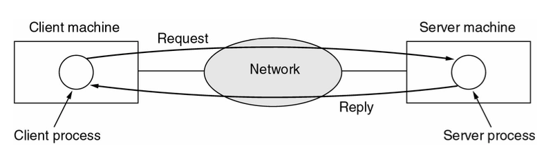
## Differentiating Factors of Networks
* Types of transmission technology
    * Broadcast link
        * Broadcast networks have a single communication channel shared bu all machines on a network. Packets sent by any machine are received by all others, an address field in the packet specifies the intended recipient. Intended recipients process the packet contents others simply ignore it.
        * Broadcasting is a mode of operation which allows a packet to be transmitted that every machines in the network must process
    * Point-to-point Links
        * Data from sender machine is not seen and process by other machines
        * Point to point networks consist of connections between individual pairs of machines. Packets travelling from source to destination must visit intermediate machines to determine a route or multiple routes of variant efficiencies are available and optimization is an important principle
        * Unicasting is the term where point-to-point networks with a single sender and receiver pair can exchange data
    * Multicasting
        * Transmission to a subset of the machines
### Differentiating by Scale
> |Interprocessor Distance|Processors located in same|Example|
>|----|----|----|----|
>|1m|Square Meter|Personal Area Network|
>|10m|Room|Local Area Network|
>|100m|Building|Local Area Network|
>|1km|Campus|Local Area Network|
>|10km|City|Metropolitan Area Network|
>|100km|Country|Wide Area Network|
>|1000km|Continent|Wide Area Network|
>|10000km|Planet|The Internet|
### Mixing taxonomies
* Local Area Networks can further be distinguished by three factors:
    * Size
    * Transmission Technology: Physically wired network
    * Topology:
        * Bus: Only a single machine on the network can transmit at any point in time requires a negotiation mechanism to resolve transmission conflicts: Ethernet is the most common bus network
        > Example of Bus network structure:
        >> 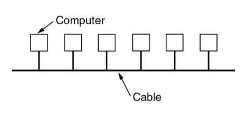
        * Ring: Each transmission bit is propagated individually and requires access control to resolve propagation queuing. E.g. Token Ring
        > Example of Ring network structure:
        >> 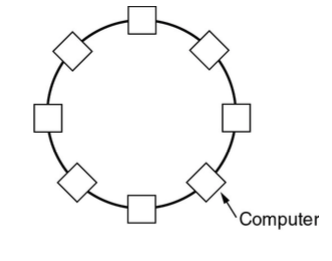
## Components of the Internet
* Protocols, Layers, and Services
    * Protocol Hierarchies
    * Design of Layer Models
    * Connection-Oriented and Connectionless Service Types
    * Service Primitives
    * Service and Protocols
* Network Reference Models
    * Open Systems Interconnect
    * TCP/IP
* Network Standards
## Protocol Hierarchies
* Consider the network as a stack of layers
* Each layer offers services to layer above it
* Inter-layer exchanges are conducted according to a protocol
> Example of a protocol hierarchies
>> 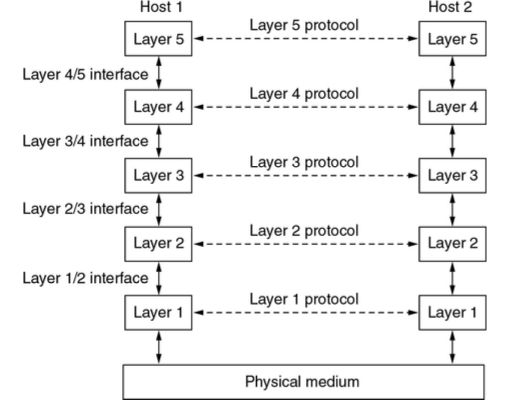
> Example of information flow supporting virtual communication in Layer 5
>> 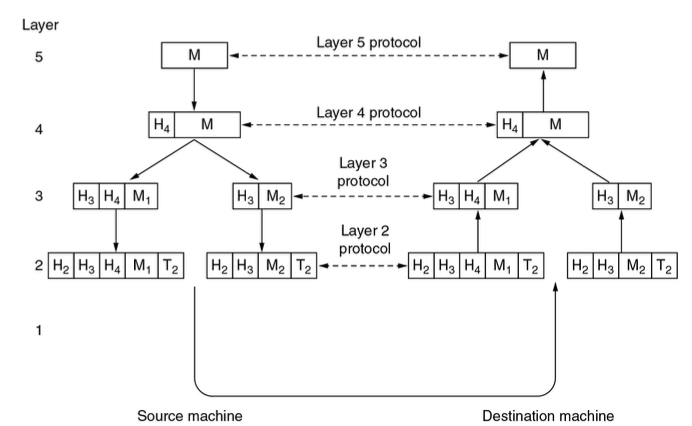
## Design Issues for the Layers
* Connection Oriented: Connect -> Use -> Disconnect (similar to telephone service)
    * Negotiation inherent in connection setup
* Connectionless: Just sent (similar to postal service)
* Choice of service type has corresponding impact on the reliability and quality of the service itself.
## Connection-Oriented and Connectionless services
* Six different types of services:
>|Type|Service|Example|
>|----|----|----|
>|Connection-Oriented|Reliable Message Stream|Sequence of pages|
>|Connection-Oriented|Reliable byte stream|Remote login|
>|Connection-Oriented|Unreliable connection|Digitized voice|
>|Connectionless|Unreliable datagram|Electronic junk mail|
>|Connectionless|Acknowledge datagram|Registered mail|
>|Connectionless|Request-reply|Database query|
## Service Primitives
* Primitives are formal set of operations for services
* The number and type of primitives in any particular context is dependent on nature of service itself - in general more complex services require more primitive service
* Six service primitive for implementing a simple connection-oriented service:
>|Primitive|Meaning|
>|----|----|
>|LISTEN|Block waiting for an incoming connection|
>|CONNECT|Establish a connection with a waiting peer|
>|ACCEPT|Accept an incoming connection from a peer|
>|RECEIVE|Block waiting for an incoming message|
>|SEND|Send a message to the peer|
>|DISCONNECT|Terminate a connection|
## Relationship of Services and Protocols
* Service is a set of primitives that a layer provides to a layer above it
    * Defines what operations the layer is prepared to perform on behalf of its users
    * It says nothing about how these operations are implemented
    * Interfaces between layers
* Protocol is a set of rules governing the format and meaning of packets that are exchanged by peers within a layer
    * Packets sent between peer entities
> The relationship between Services and Protocol:
>> 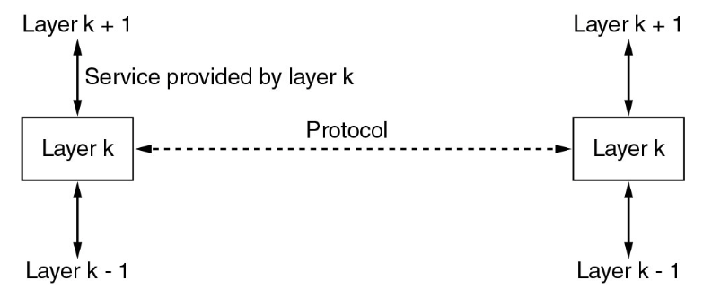
## Reference Models
* Example of reference model
    * The  OSI Reference Model
    * The  TCP/IP Reference Model
* A reference model provides a common baseline for the development of many services and protocols by independent parties
* Since networks are very complex systems, a reference model can serve to simplify the design process
* It's engineering best practice to have an abstract reference model, and corresponding implementations are always required for validation purposes. 
## OSI Reference Model
* Open Systems Interconnection
* Has 7 layers
* Layer divisions based on principled decisions
### OSI Layer Division Principles
1. A layer should be created where a different abstraction is needed
2. Each layer should perform a well defined function
3. The function of each layer should be chosen with a view toward defining internationally standardized protocols
4. The layer boundaries should be chosen to minimize the information flow across the interfaces
5. The number of layers should be large enough that distinct functions need not to be thrown together in the same layer out of necessity, and small enough that the architecture does not become unwieldy
> Structure of OSI Model
>> 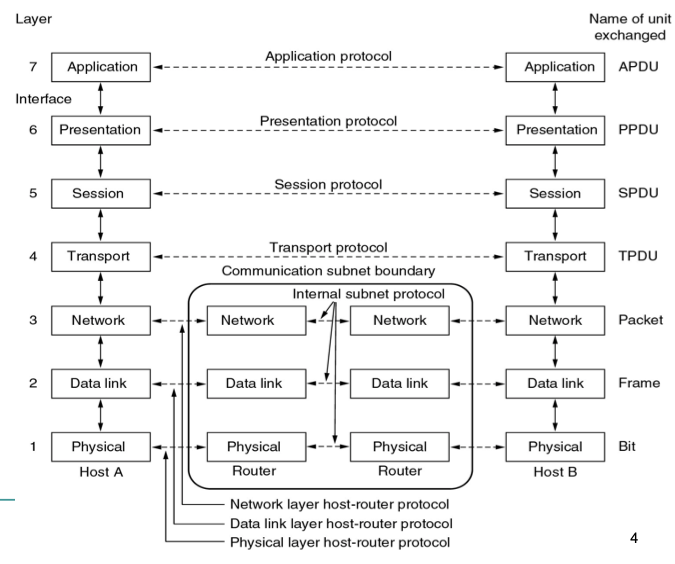
## TCP/IP Model
* Transmission Control Protocol/Internet Protocol
* Has 4 layers
> Structure of TCP/IP Model
>> 
## Comparison of OSI and TCP/IP Models
### Critique of OSI Model
* Bad Timing
* Bad Technology
* Bad implementations
* Bad politics
### Critique of TCP/IP Model
* Service, interface and protocol not distinguished 
* Not a general model
* Host-to-Network layer not really a lay but an interface between network and data link layers
* No mention of physical and data link layers
* Minor protocols deeply entrenched, hard to replace
## Hybrid model
* An hybrid model of OSI model and TCP/IP model
> Structure of the Hybrid Model
>> 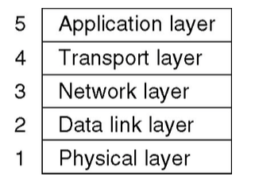
## Network Standardization
|Body|Area|Examples|
|----|----|----|
|ITU (International Telecommunication Union)|Telecommunications|ADSL, PON, MPEG4|
|IEEE (Institute of Electrical and Electronics Engineers)|Communications|Ethernet, WiFi|
|IETF (Internet Engineering Task Force)|Internet|HTTP/1.1, DNS|
|W3C (The World Wide Web Consortium)|Web|HTML5 standard|
<h1 id='Physical'>Physical Layer</h1>
## What is the Physical Layer
* The physical layer is the lowest layer in OSI model
* The physical layer's properties in TCP/IP model are in the host-to-network division
* The physical layer is concerned with the mechanical, electrical and timing interfaces of the network
* Various physical media can be sued to transmit data, but all of them are affected by a range of physical properties and hence have distinct differences
### Link Model
* Simplified Link Model: Consider the network as a connected link between computers.
> Example of Link Model
>> 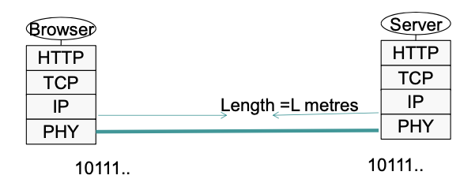
* Bandwidth is usually treated as rate of transmission in bits/second
* Delay (in seconds) is the time required for the first bit to travel from computer A to computer B.
## Message Latency
* Latency is the delay associated with sending a message over a link
* This is made up of two parts related to the link model:
    * Transmission delay:
        * T-delay = Message in bits / Rate of transmission = M/R (seconds)
    * Propagation delay:
        * P-delay = Length of the channel / speed of signals 
    * Latency = M/R + P-delay
## Twisted Pair
* Construction:
    * Two insulated copper wires, twisted in helical form
    * Twisting reduces radiance of waves from effectively parallel antennae
    * Distance up to < 5km, repeaters can extend this distance
    * Twisting reduces interference
* Properties and Types of Twisted Pair:
    * Bandwidth dependent on distance, wire quality/density
    * Cat 3: 2 wires, 4 pairs in sheath, 16 Mhz
    * Cat 5: 2 wires, 4 pair in sheath, more twists, 100 Mhz
    * Cat 6: 250 Mhz
## Coaxial Cable ("Co-ax")
* Better shielding than twisted pair = higher speeds
* Copper core with insulation, mesh, and sheath
* Bandwidth approaches 1 Ghz
* Still widely used for cable TV/Internet
## Fiber Optics
* Optical transmission has three components:
    * Light source
    * Transmission medium
    * Detector
* Semantics: light = 1, no light = 0 
* Data transmission over a fiber of glass
* A detector generates electrical pulse when light hits it
* Common for high rates and long distances
* Fiber has enormous bandwidth and tiny signal loss - hence high rates over long distances
* Types of Fiber Optics:
    * Single-mode:
        * Core so narrow light can't even bounce around
        * Used with laser for long distances
    * Multi-mode:
        * Other main type of fiber
        * Light can bounce
        * Used with LEDs for cheaper, shorter distance links
* Fiber optic connections:
    * Connector and Fiber sockets (10-20% loss, but easy to configure)
    * Mechanical Splice (10% loss, labor intensive)
    * Fusion (<1% loss, but very specialized)
* Fiber optic cable is a scalable network media - LAN, WAN
* Fiber optic cable can be considered either as a ring or as a bus network type
## Comparison of Wires and Fiber
|Property|Wires|Fiber|
|----|----|----|
|Distance|Short (100s of m)| Long (10s of km)|
|Bandwidth|Moderate|Very high|
|Cost|Inexpensive|More Expensive|
|Convenience|Easy to use|Harder to use|
|Security|Easy to tap|Hard to tap|
## Wireless Transmission
* Mobile users requires a mobility enabled network
* Wireless networks can provide advantages even in fixed location environments
* There are many types of wireless data transmission networks, but they all have a common basis: radio wave propagation
* Wireless signals are broadcasted over a region
* Potential signal collisions 
### Electromagnetic Spectrum
* Number of oscillations per second of a wave is called frequency , measured in Hz
* Distance between two consecutive minima or maxima is called wavelength
* All electromagnetic waves travel at same speed
* Fundamental relationship:
    * Wavelength * Frequency = Speed of Light
## Wireless vs. Wires/Fiber
* Wireless:
    * Easy and inexpensive to deploy
    * Naturally supports mobility
    * Naturally supports broadcast
    * Transmissions interfere and must be managed
    * Signal strengths hence data rates vary greatly 
* Wires/Fiber
    * Easy to engineer a fixed data rate over point-to-point links
    * Can be expensive to deploy
    * Does not readily support mobility or broadcast
## Communication Satellites
* Satellites are effective for broadcast distribution and anywhere/anytime communications
### Kinds of Satellites
* Geostationary Satellite (GEO):
    * 35000 km above a fixed location
    * VSAT computers can communicate with the help of a hub
    * Different bands in the GHz are in use but may be crowded or susceptible to rain
* Low-Earth Orbit Satellites (LEO)
    * Systems such as Iridium use many low-latency satellites for coverage and route communications via them
> Different Satellites' high distribution
>> 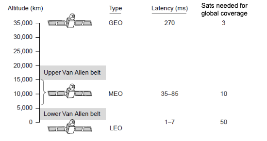
## Satellite vs. Fiber
* Satellite:
    * Can rapidly set up anywhere/anytime communications after satellites have been launched
    * Can broadcast to large regions
    * Limited bandwidth and interference to manage
* Fiber:
    * Enormous bandwidth over long distances
    * Installation can be more expensive/difficult
## Bits to a Link
* Model types:
    * Full-duplex Link: Used for transmission in both directions at once. E.g. Use different twisted pairs for each direction
    * Half-duplex Link: Both directions, but not at the same time. Senders take turns on a wireless channel
    * Simplex Link: Only one fixed directions at all times; Not very common
### Multiplexing
* When multiple sources want to put things onto a medium
    * Time Division Multiplexing:
        * Users can send according to a fixed schedule
        * Slotted access to the full speed of the media
        > Example of Time Division Multiplexing:
        >> 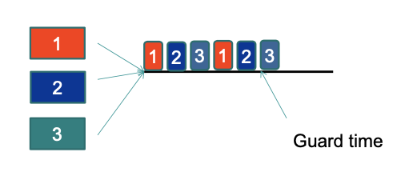
    * Frequency Division Multiplexing
        * Users can only use specific frequencies to send their data
        * Continuous access with lower speed
        > Example of Frequency Division Multiplexing:
        >> 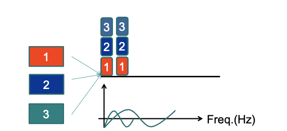
    * Statistical Multiplexing
    * Code Division Multiple Access
## How bits look as a signal
* Information on wire transmitted by variance of a physical property
* Generating a periodic function
* Three things can change the behaviour of the function: Amplitude, Frequency, and Phase
> Change in Amplitude, Frequency, and Phase of a function:
>> 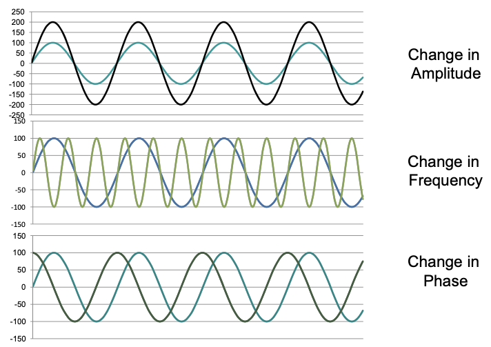
### Modulation Types
> Modulating the amplitude, frequency or phase of a carrier signal sends bits in a frequency range:
>> 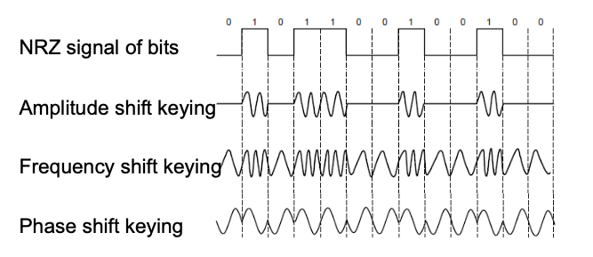
## Maximum Data Rate of a Channel
### Nyquist's theorem
* If a function contains no frequencies higher than B Hz then it is completely determined by looking at a set of points spaced 1/2B apart
* Nyquist's theorem relates the data rate to the bandwidth (B) in Hz of a signal and the number of signal levels V used:
> 
### Shannon's Theorem
* Shannon's theorem relates the data rate to the bandwidth (B) and signal strength (S) relative to the noise (N):
> 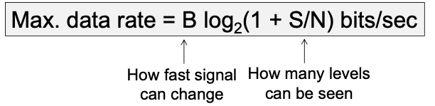
<h1 id='Data'>Data Link Layer</h1>
## The Data Link Layer in OSI and TCP/IP
* Reliable, efficient communication of frames between two adjacent machines
* Handles transmission errors and flow control
## Functions and Methods of the Data Link Layer
* Function of the data link layer:
    * Provide a well-defined service interface to network layer
    * Handling transmission errors
    * Data flow regulation
* Primary method: Take packets from network layer, and encapsulate them into frames. A frame contains a header, a payload and a trailer.
### Relationship between Packets and Frames
* Data Link layer accepts packets from the network layer, and encapsulates them into frames that it sends using the physical layer, reception is the opposite process
> Implementation of a Data Link Layer:
>> 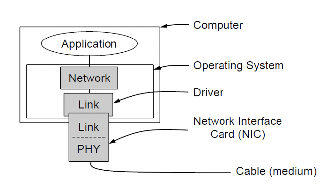
## Type of Services
* Connection-Oriented vs. Connectionless: Whether a connection is setup before sending a message
* Acknowledged vs Unacknowledged: Whether the service provider give the service user an acknowledgement upon delivering the message
## Service Provided to Network Layer
* Principal concern is transferring data from network layer on source host to network layer on destination host
* Services provided:
    * Unacknowledged connectionless service
        * Source host transmits independent frames to recipient host with no acknowledgement
        * No logical connection establishment or release
        * No lost frame recovery mechanism
        * E.g. Ethernet LANs
        * Real-time traffic
    * Acknowledged connectionless service
        * Source host transmits independent frames to recipient host with acknowledgement
        * No logical connection establishment or release
        * Each frame individually acknowledged and retransmission if lost or errors
        * E.g. Wireless(IEEE 802.11 WiFi)
    * Acknowledged connection-oriented service
        * Source host transmits independent frames to recipient host after connection establishment and with acknowledgement
        * Connection established and released. Communicate rate and details of message
        * Frames are numbered, counted, acknowledged with logical order enforced
        * Unreliable links such as statellite channel or long distance telephone circuit
## Framing
* Physical layer provides no guarantee a raw stream of bits is error free
* Framing is the method used by data link layer to break raw bit stream into discrete unites and generate a checksum for the unit
* Checksums can be computed and embedded at the source, then computed and compared at the destination. Checksum = f(payload)
* The primary purpose of framing is to provide some level of reliability over the unreliable physical layer
### Framing Methods
* Framing methods:
    * Character count
        * Use a field in the frame header to specify the number of characters in a frame
        > Example of character counts
        >> 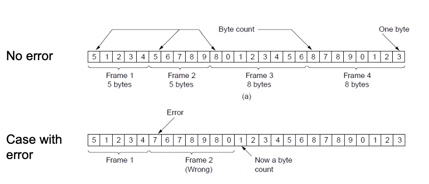
    * Flag bytes with byte stuffing
        * Each frame starts and ends with a special byte: flag byte
        > Example of flag bytes with byte stuffing
        >> 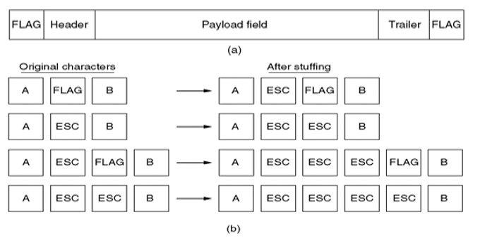
    * Start and end flags with bit stuffing
        * Frames contain an arbitrary number of bits and allow character codes
        * With an arbitrary number of bits per character
        * Each frame begins and ends with a special bit pattern
        > Start and end flags with bit stuffing
        >> 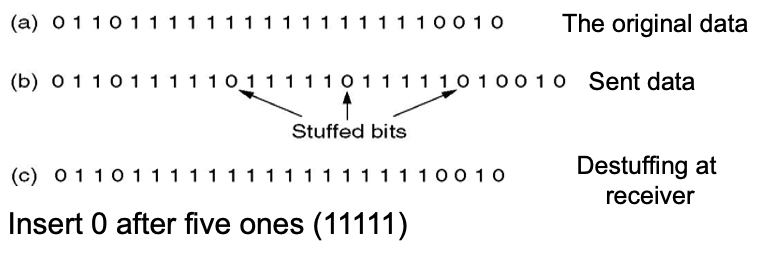
* Most data link protocols use a combination of character count and one other method
## Error Control
* Ensuring that a garbled message by the physical layer is not considered as the original message by the receiver by adding check bits
* Error control deals with:
    * Detecting the error 
    * Correcting the error
    * Re-transmitting lost frames
* Data link layer deals with bit errors
### Error Detection and Correction
* Physical media may be subject to errors
* Errors may occur randomly or in bursts
* Bursts of errors are easier to detect but harder to resolve
* Resolution needs to occur before handing data to network layer
* Key issues:
    * Fast mechanism and low computational overhead
    * Detection of different kinds of error
    * Minimum amount of extra bits send with the data
### Error Bounds: Hamming distance
* Code turns data of n bits into codewords of n+k 
* Hamming distance is the minimum bit flips to turn one valid codeword into any other valid one.
> Example with 4 codewords ob 10 bits (n=2, k=8)
> * 0000000000
> * 0000011111
> * 1111100000
> * 1111111111
> The Hamming distance is 5
* Bounds for a code with distance:
    * 2d+1 can correct d errors
    * d+1 can detect d errors
### Hamming Codes
* n = 2*k - k - 1 (n is the number of data, k is the check bits)
* Put check bits in positions p that are power of 2, starting with position 1.
> Example of Hamming Codes
> Data: 0101, Requires 3 check bits: n = 4, therefore:
> 4 = (2^3) - 3 - 1
> Example of Hamming Code
>> 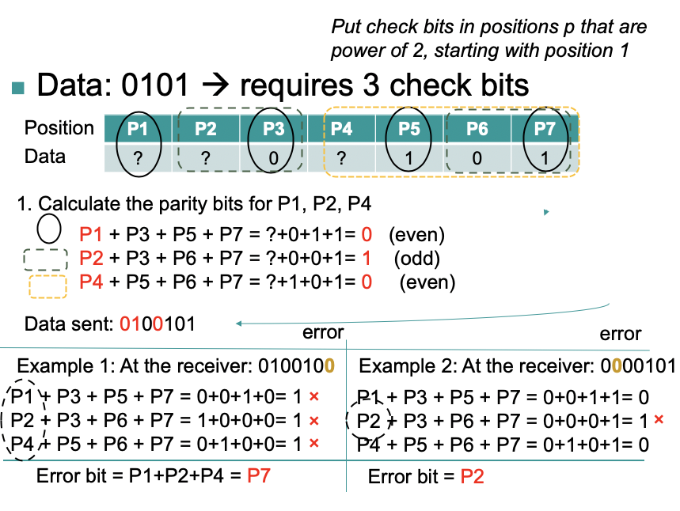
## Error Correcting Codes Key Points
* More efficient in noisy transmission media
* Challenge is that the error can be in the check bits
* Assumption on a specific number of errors occurring in transmission
## Error Detecting Codes
* More efficient in some transmission media
* Types of error detecting codes:
    * Parity (1 bit): Hamming distance = 2
    * Checksum (16 bits): Hamming distance = 2
    * Cyclical Redundancy Check (Standard 32 bit CRC): Hamming distance = 4
### How does error detecting codes works
* Sender calculates R check bits using a function of data bits
* Receiver receive the codeword and calculates the same function on the data and match the results with received data check bits
### Parity Bit
* E.g. 10001110 is data and count the number of 1s
> Received: 100011100(For even parity)/100011101(For odd parity) and then transfer
> Check the transferred data for errors on arrival and can catch:
>> 2 - 1 = 1 error bit can be detected 
>> and 
>> (2 - 1)/2 = 0.5 which not even 1 bit error can be corrected
## Checksum
* There are different variation of checksum
* Internet checksum (16-bit word): Sum modulo 2^16 and adding any overflow of high order bits back into low-order bits
> Example of Checksum for data 00110 10001 11001 01011
>> 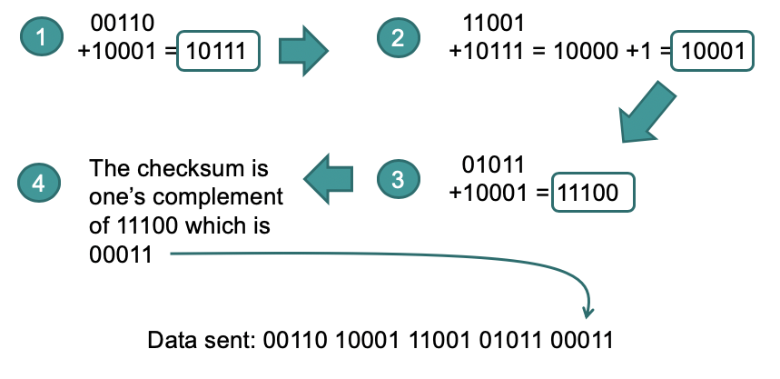
## Cyclic Redundancy Check 
* Based on a generator polynomial G(x)
> Example: G(x) = x^4 + x + 1(10011)
> * Let r be the degree of G(x) therefore r = 4. Append r zero bits to the low-order end of the frame so it now contains m + r bits and corresponds to the polynomial x^r * M(x)
> * Divide the bit string corresponding to G(x) into the bit string corresponding to x^r * M(x), using modulo 2 division
> * Subtract the remainder from the bit string corresponding to x^r * M(x) using modulo 2 subtraction. The result is the checksum frame to be transmitted. Call its polynomial T(x)
>> 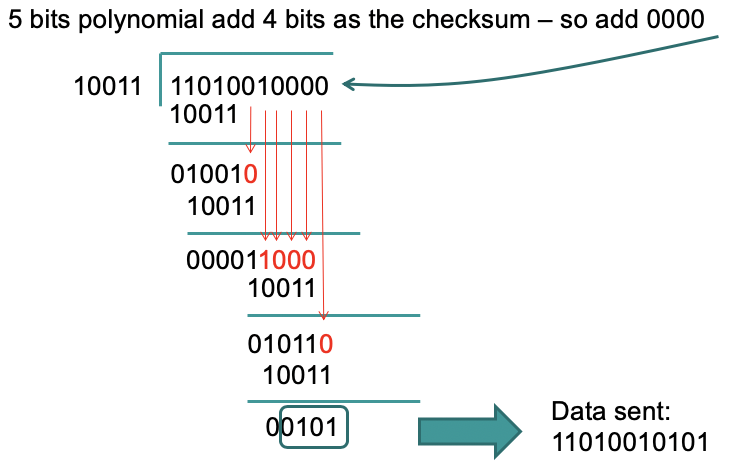
## Data Transmission
* A service to send message should have:
    * Reliability 
        * Each layer need to make sure the service provided to other layers is reliable
        * Retransmission with error detection is a way of ensuring reliability
        * Error correction is another way but has its own shortcomings
    * Flow Control
        * The fast sender vs. slow receivers requires a solution
        * Principles to control when sender can send next frame
            * Feedback based flow control is usually used in Data Link Layer
            * Rate based flow control
## Acknowledged transmission
* Data transmitted in one direction
* Time is relatively important, buffer space constrained        
> Example of Acknowledged Transmission
>> 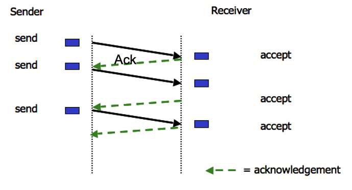
## Noisy Channel Protocol
* Frames can be lost either entirely or partially
* Requires distinction between frames already sent/received and those being re-transmitted
* Requires timeout function to determine arrival or non-arrival of complete frames
## Stop and Wait Protocol
* Concept of ARQ (Automatic Repeat reQuest)
    * Ack and Timeout
* Stop and Wait
    * One bit Ack
> Example of Stop and Wait Protocol
>> 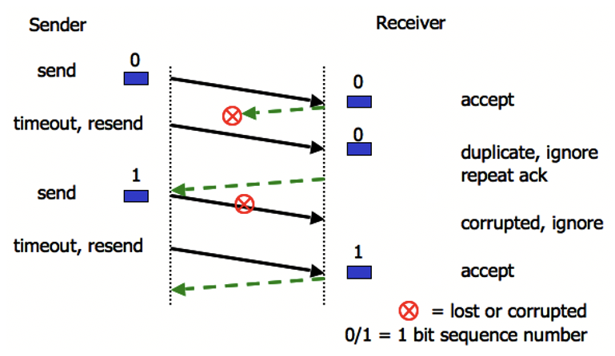
### Link Utilization 
* Principle of efficiency in communication is measured by Link Utilization (U)
> Let B be the bit-rate of the link and L be the length of the frame.
> Tf = Time needed to transmit a frame of length L
> Tp = Propagation delay of the channel
> Ta = Time for transmitting an Ack 
> So Tf = L/B. Assume that Ta = 0, Tt = Tf + 2 * Tp
> U = (Time of transmitting a frame)/(Total time for the transfer) = Tf/Tt = Tf / (Tf+2Tp) = (L/B)/(L/B + 2Tp) = L/(L + 2 * Tp * B)
## Sliding Window Protocols
* Data is commonly transmitted in both direction simultaneously
* Sender maintains a set of sequence numbers corresponding to frames it is allowed to send
* Receiver maintains a set of sequence numbers corresponding to frames it is allowed to accept
* Stop and Wait can be seen as a special case with window size 1
### Protocol Using Go-Back-N
* Long transmission times need to be taken into account when programming timeouts
* Senders don't need to wait for acknowledgement for each frame before sending next frame
> Example of Go-Back-N protocol
>> 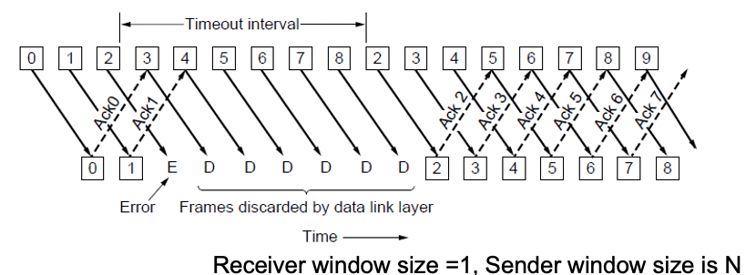
### Selective Repeat
* Receiver accepts frames anywhere in receive window
    * Cumulative ack indicate highest in-order frame
    * NAK (negative ack) causes sender retransmission of missing frame before a timeout resend window
> Example of Selective Repeat
>> 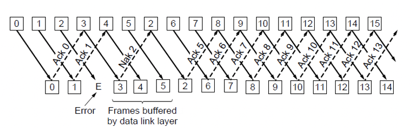
### Go-Back-N vs. Selective Repeat
* Go-Back-N: Receiver discards all subsequent frames from error point, sending no acknowledgement, until the next frame in sequence
* Selective Repeat: Receiver buffers good frames after an error point, and relies on sender to resend oldest unacknowledged frames
* Trade-off between efficient use of bandwidth and data link layer buffer space
## Packet over SONET
* Packer over SONET is the method used to carry IP packets over SONET optical fiber links
    * Uses PPP (Point-to-Point Protocol) for framing
> Structure of Packet over SONET
>> 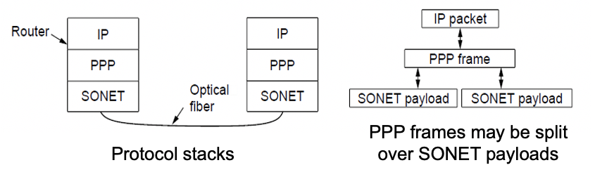
### PPP
* PPP (Point-to-Point Protocol) is a general method for delivering packets across links
    * Framing uses a flag (0x7E) and byte stuffing
    * Unnumbered mode (connectionless unacknowledged service) is used
    * Errors are detected with checksum
> Example of a PPP packet
>> 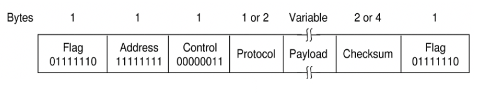
## ADSL
* Widely used for broadband Internet over local loops
    * ADSL runs from modem to DSLAM
    * IP packets are sent over PPP and AAL5/ATM
> Example structure of ADSL
>> 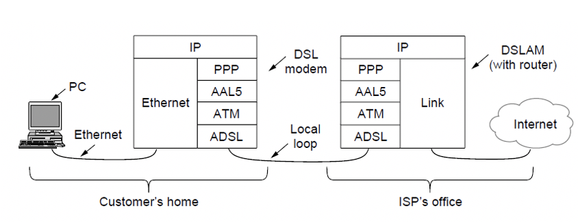
* PPP data is sent in AAL5 frames over ATM cells: 
    * ATM is a data link layer that uses short, fixed-size cells and each cell has a virtual circuit identifier
    * ALL5 is a format to send packets over ATM
    * PPP frame is converted to a AAL5 frame (PPPoA)
> Example of AAL5 Frame
>> 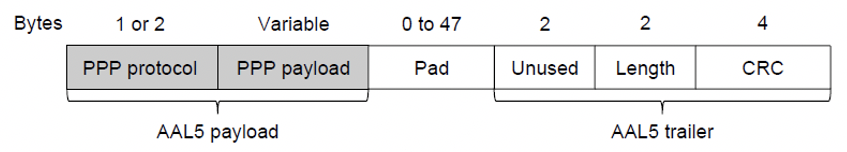
<h1 id='MAC'>MAC Sub-layer</h1>
## MAC Sub-layer
* On point to point networks, there are only singular sender and receiver pairs, eliminating transmission contention
* On broadcast networks, determining right to transmit is a complex problem
* Medium Access Control (MAC) sub-layer is used to assist in resolving transmission conflicts
## Channel Allocation Mechanisms
* Various methods exist for allocation a single broadcast channel amongst competing users
    * Static Channel Allocation
    * Dynamic Channel Allocation
### Static Channel Allocation
* Arbitrary division of a channel into segments and each user allocated allocated a dedicated segment for transmission
* Frequency Division Multiplexing (FDM) is typically used
* Significant inefficiencies arise when:
    * Number of senders is greater than allocated segments
    * Number of senders is not static
    * Traffic is bursty
* Downfalls:
    * Usually good for fixed number of users
    * Network traffic is busty
        * TDM and FDM try to give consistent access to the network leading to inefficiency in the use of network resources
## Dynamic Channel Allocation
* Channel segmentation is dynamic, segment allocation is dynamic
* Assumption for dynamic channel allocation:
    * Independent transmission stations
    * Single channel for all communication
    * Simultaneous transmission results in damaged frames
* Time
    * Transmission can begin at any time
    * Transmission can begin only within discrete intervals
* Carrier Sense
    * Detection of channel use prior to transmission
    * No detection of channel use prior to transmission
## Multiple Access Protocols
### ALOHA
* Users transmit frames whenever they have data. Users retry after a random time if there are collision
* Requires no central control mechanism
* Efficient under low load but inefficient under high traffic loads
* Slotted ALOHA: Allows the users to start sending only at the beginning of defined slots. Increase efficiency of pure ALOHA by reducing possibility of collisions
### Carrier Sense Multiple Access Protocols (CSMA)
* In networks which require transmission state detection to determine transmission rights dynamically, there are specific protocols which are used:
    * Persistent and Non-persistent CSMA
    * CSMA with Collision Detection
#### Persistent and Non-Persistent CSMA
* When a sender has data to transmit, first check channel to detect other active transmission
* 1-persistent CSMA: Wait until channel idle. Transmit one frame and check collisions. If collision, wait for a random time and repeat.
* Non-persistent CSMA: If channel busy, wait random period and check again. If not, start transmitting.
* P-persistent CSMA: If channel idle, transmit with probability p, or wait with probability (1-p), and check again
> Example binary tree of 1-persistent, non-persistent and p-persistent
>> 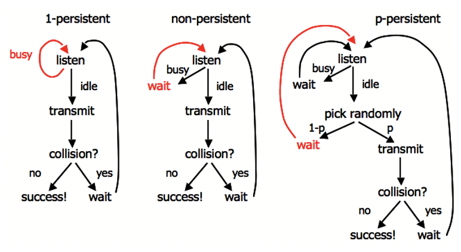
## CSMA with Collision Detection
* Principle that transmission aborted when collision detected:
    * After collision detected, abort, wait random period, try again
* Channel must be continually monitored
* Used in half-duplex system
## Classic Ethernet Minimum Packet Size
* Collisions can occur and take as long as 2 $\tau$ to detect 
    * $\tau$ is the time it takes to propagate over the ethernet
    * Leads to minimum packet size for reliable detection
> Illustration of the collision detecting time
>> 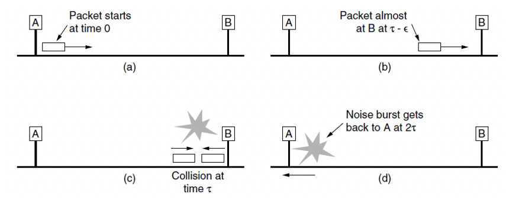
## Collision Free Protocols
### Bit Map Protocol
* Reservation-based protocol
* 1 bit per station overhead
* Division of transmission right, and transmission event. No collisions as this is a reservation based protocol
> Example of Bit Map Protocol
>> 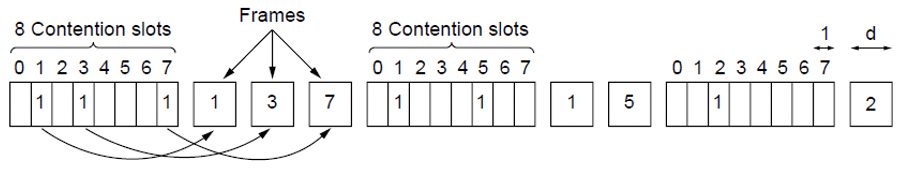
### Binary Countdown Protocol
* Avoid the 1 bit per station scalability problem by using binary station addressing
* No collisions as higher-order bit positions are used to arbitrate between stations wanting to transmit
* Higher numbered stations have a higher priority
* Process:
    * Stations send their address in contention slot (log N bits instead of N bits)
    * Channel medium ORs bits, stations give up when they send a 0 but see a 1
    * Station that ses its full address in next to send
> Example of Binary Countdown Protocol
>> 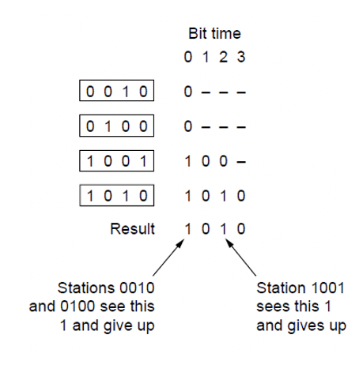
## Limited Contention Protocols
* Both contention and collision free become inefficient at different points
* Under low loads, collision free is less attractive because of a higher delay between transmissions
* Under higher loads, contention is less attractive because overhead associated with channel arbitration becomes greater
* Limited content protocols increase the probability of stations acquiring transmission rights by arbitrarily dividing stations and using a binary algorithm to determine rights allocation
### Adaptive Tree Walk Protocol
* All stations compete for right to transmit, if a collision occurs, binary division is used to resolve contention
* Tree divides stations into groups of nodes to pull
    * Depth First Search under nodes will poll collisions
    * Start search at lower levels if more than one station expected
> Example of Adaptive Tree Walk Protocol
>> 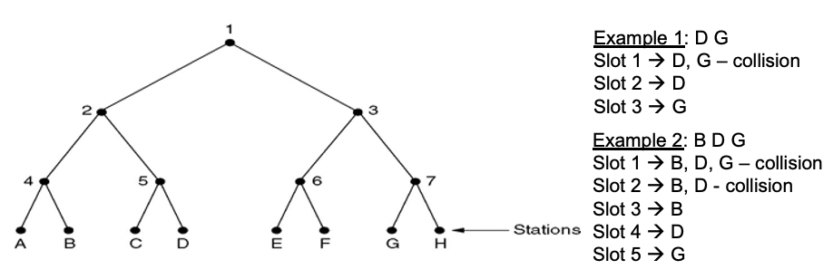
### Wireless LAN Protocols
* Wireless Complications: When a station is in the range of two transmitters or relays, interference affects signal reception
* This leads to hidden and exposed terminal problems
* Require detection of transmissions to receiver, not just carrier sensing
* Transmission Protocols for Wireless LANs (802.11)
    * Multiple Access with Collision Avoidance for Wireless (MACAW)
### Hidden and Exposed Terminals
* Hidden terminals are senders that cannot sense each other but nonetheless collide at intended receiver
* Want to prevent but will leads to loss efficiency
> Illustration of Hidden Terminals
>> 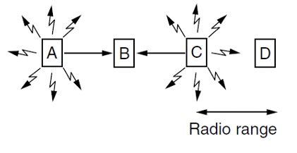
> A and C are hidden terminals when sending to B
* Exposed terminals are senders who can sense each other but still transmit safely to different receivers
> Illustration of Exposed Terminals
>> 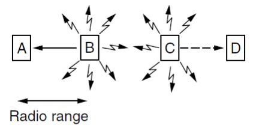
> B -> A and C -> D are exposed terminals
### Multiple Access with Collision Avoidance (MACA)
* Sender asks receiver to transmit short control frame
* Stations near receiver hear control frame
* Sender can then transmit data to receiver
> Illustration of MACA
>> 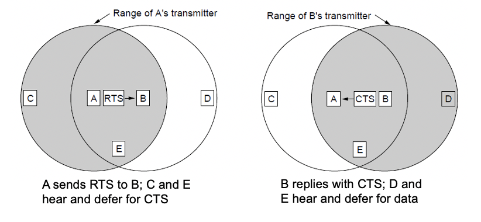
> MACA protocol grants access for A to send to B
> * A sends RTS to B; B replies with CTS
> * A can send with exposed but no hiddent terminals
## Classic Ethernet
* Each type of Ethernet has a maximum cable length per segment
* Multiple cable lengths can be connected by repeaters - a physical device which receives, amplifies and retransmits signals in both directions
> Construction of a classic Ethernet
>> 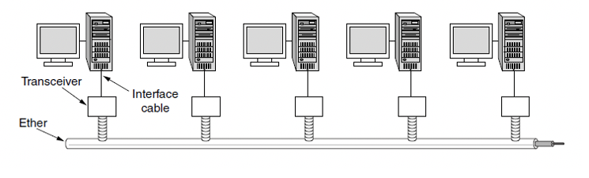
## Ethernet Frame Format
* MAC protocol is 1-persistent CSMA/CD
    * Random delay after collision is computed with BEB (Binary Exponential Backoff)
    * Frame format is still used in modern Ethernet
    > Example of Ethernet Frame Format
    >> 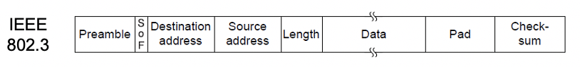
    > * Preamble (7B): Synchronization between sender and receiver
    > * Start of Frame (1B): FLAG bytes
    > * Destinations and Source Addresses: Identify who send, who receive
    > * Type and Length (2B): Specifies which process to give the frame to 
    > * Pad (0-46B): Minimum size of the message of the Ethernet
    > * CRC (4B): 32 bits checksum
## MAC Addressing
* Sources and destination addressing can be done at a local or global levels
* The MAC Address provides the unique identifier for a physical interface
* MAC Address is a 48-bit number encoded in the frame
* E.g. 00:02:2D:66:7C:2C
## Ethernet Performance
$$ Channel \ Efficiency = \frac{1}{1+\frac{2BLe}{cF}}$$
    * F: Frame Length
    * B: Band Width
    * L: Cable Length
    * c: Speed of Light 
    * Optimal case of e contention slow per frame
* When cF is large, the channel efficiency will be high
* Increasing network bandwidth or distance reduces the efficiency for a given frame size
## Switched Ethernet
* Hubs wire all lines into a single CSMA/CD domain
* Switches isolate each port to a separate domain
    * Much greater throughput for multiple ports
    * No need for CSMA/CD with full-duplex lines
> Illustration of Hubs and Switches
>> 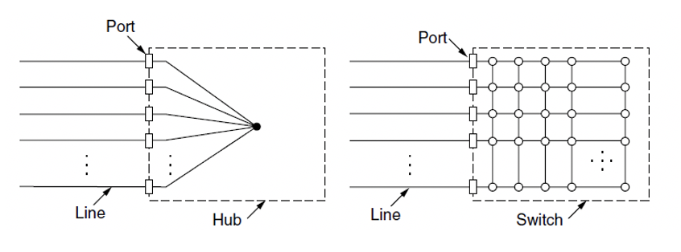
<h1 id='Network'>Network Layer</h1>
## Principles of Internet Design
1. Make sure it works
2. Keep it simple
3. Make clear choices
4. Exploit modularity
5. Expect heterogeneity
6. Avoid static options and parameters
7. Choose a good, but not necessarily perfect design
8. Be strict in sending and tolerant in receiving 
9. Consider scalability
10. Consider performance vs costs
## Network Layer in the Internet
* Internet is an interconnected collection of many networks of Autonomous systems that is held together by the IP protocol
## Internet Protocol (IP)
* The glue that holds the whole Internet together in the Network layer protocol, IP
* Provides a best-effort service to route datagrams from source host to destination host
* These hosts may be on the same network or different networks
* Each network is called an Autonomous System(AS)
## Service Provided to the Transport Layer
* Design goals:
    * Services should be independent of router technologies
    * Transport layer should be shielded from number, type, and topology of routers
    * Network addressing should use a uniform numbering plan
## Store and Forward Packet Switching
* Hosts generate packets and injects into the network
* Routers treat packets as messages, receiving them and then forwarding them based on how the message is addressed
* Router routes packets through the network
> Example of packets routing with datagram subnet
>> 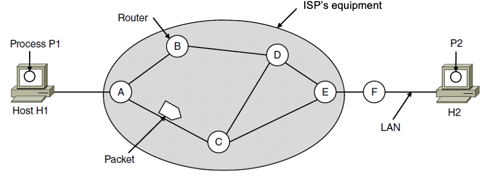
## Routing within a datagram subnet
* Post office model: Packets are routed individually based on destination addresses in them. Packets can take different paths
* Routing table can be fixed or change over time
* Routing algorithm manages the routing table
> Example of P1 sends a long message to P2
>> 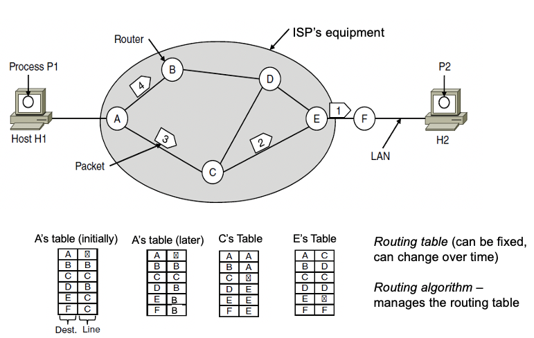
## Routing with virtual-circuit subnet
* Model is like a telephone network
    * Packets are routed through virtual circuits based on tag number (not full address but unique at a given link) in them.
    * Packets take the same path to avoid having to choose a new route for every packet sent
    * E.g. Multi-protocol Label Switching Network
> Example of routing with virtual-circuit subnet
>> 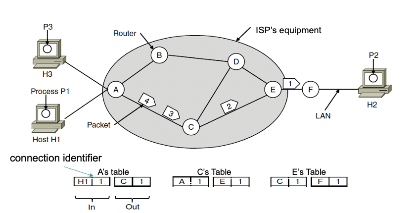
## Difference in Virtual Circuit and Datagram Subnets
|Issue|Datagram Network|Virtual-circuit Network|
|----|----|----|
|Circuit Setup|Not needed|Required|
|Addressing|Each packet contains the full source and destination address|Each packet contains a short VC number|
|State Information|Routers do not hold state information about connections|Each VC requires router table space per connection|
|Effect of router failures|Each packet is routed independently|Route chosen when VC is set up; All packets follow it|
|Quality of Service|Difficult|Easy if enough resources can be allocated in advance for each VC|
|Congestion control|Difficult|Easy if enough resources can be allocated in advance for each VC|
## Compromises of VC and Datagram Subnets
* Memories vs Bandwidth
    * VC require more space in router memory but save potential overhead in full addressing of each packet and computation of path
* Setup time vs Address Parsing Time
    * VC require setup time and resources, but packet transmission is very fast
* Amount of memory
    * Datagram subnets require large tables of every possible destination routes, whereas VC requires entry per link
* QoS and Congestion avoidance
    * VC can use tighter QoS to be able to reserve CPU, bandwidth, and buffer in advance
* Longevity
    * VC can exist for a long time 
* Vulnerability
    * VC particularly vulnerable to hardware/software crashes - all VC aborted and no traffic until they are rebuilt. Datagram uses an alternative route
## Issue of Internetworking
* Internetworking joins multiple, different networks into a single larger network
* Issues when connecting networks:
    * Different network types and protocols
    * Different motivations for network choices
    * Different technologies at both hardware and software levels
## Different Dealt at the Network Layer
|Item|Some Possibilities|
|----|----|
|Service Offered|Connectionless vs connection oriented|
|Addressing|Different sizes, flat or hierarchical|
|Broadcasting|Present or absent|
|Packet size|Every network has its own maximum|
|Ordering|Ordered and unordered delivery|
|Quality of service|Present or absent|
|Reliability|Different levels of loss|
|Security|Privacy rules, encryption|
|Parameters|Different timeouts, flow specifications|
|Accounting|By connect time, packet, byte or not at all|
## Tunneling
* Tunneling is a special case used when the source and destination are on the same network, but there is a different network in between
    * Source packets are encapsulated over the packets in the connecting network
> Example of Tunneling IPv6 packets through IPv4
>> 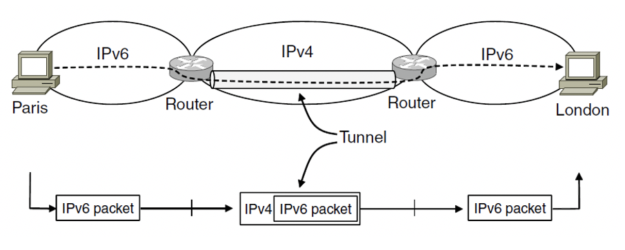
## Fragmentation
* All networks have a maximum size for packets, could be motivated by:
    * Hardware
    * Operating system
    * Protocols
    * Standards compliance
    * Desire to reduce transmissions due to errors
    * Desire for efficiency in communication channel
* Fragmentation is the division of packets into fragments. It allows network gateways to meet size constraints
## Types of Fragmentation
* Transparent: Packets fragmented and reassembled in each network. 
    * Route constrained, need more work
    > Example of transparent fragmentation
    >> 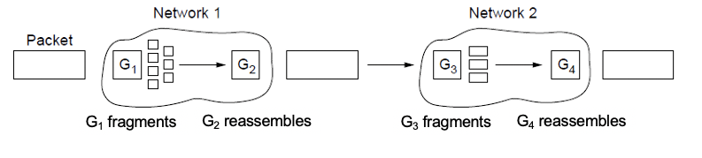
* Non-transparent: Fragments are reassembled at destination
    * Less work: packet number, byte offset, end of packet flag
    > Example of non-transparent fragmentation
    >> 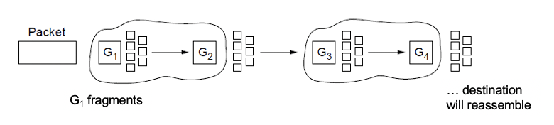
> Example of IP style fragmentation
>> 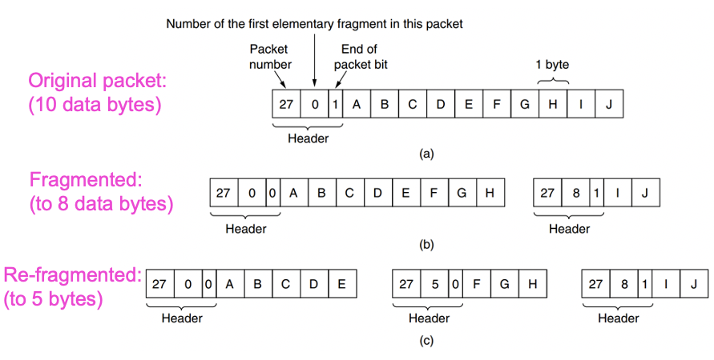
## Path MTU Discovery
* An alternative to fragmentation
* Advantage: The source now knows what length packet to send but if the routes and path MTU change, new error packets will be triggered and the source will adapt to the new path.
> Example of Path MTU Discovery
>> 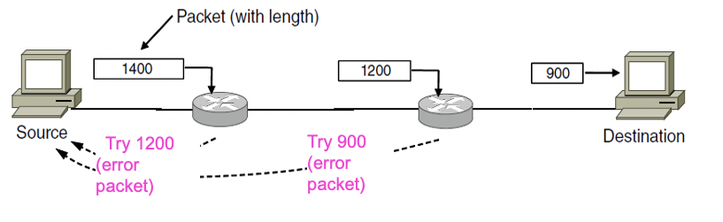
## IP Datagram
* IPv4 header is carried on all packets and has fields for the key parts of the protocol
> Example of IPv4 Datagram header
>> 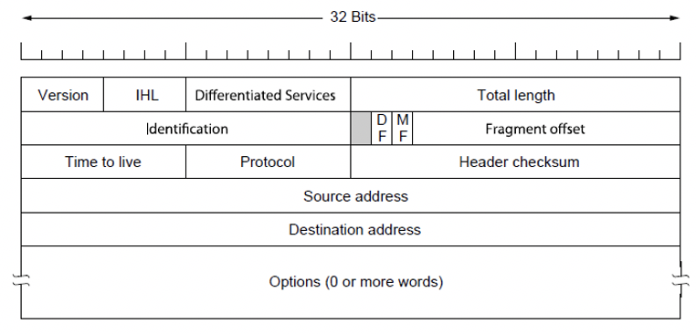
* IPv4 datagram consists of a header and some text
* Header is 20 byte fixed part + variable length optional part
* Version: IPv4 or IPv6
* IHL: Header Length, in 32bits units, min 5 and max 15
* Type: Differentiates different classes of service
* Total Length: Header and payload, maximum length 65535 bytes
* Identification: Allows host to determine which datagram the new fragment belongs to - all fragments of same datagram have same ID
* DF: Don't Fragment Byte
* MF: More Fragment Byte, determine whether it is the last one or not
* Fragment offset: Where in the datagram the current fragment belongs
* TTL: Limits packet lifetimes, hops or seconds
* Protocol: TCP, UDP, or others
* Header Checksum: verifies the header only
* Source Address: IP, host/network
* Destination Address: IP, host/network
* Options: Security, strict vs loose source routing, record route, timestamp
## Routing Algorithms
* Consider the network as a graph of nodes and links:
    * Decide what to optimize
    * Update routes for changes in topology
    * Routing is the process of discovering network path
* The routing algorithm is responsible for deciding on which output line an incoming packet should be transmitted
* Non-adaptive Algorithms
    * Static decision making process
* Adaptive Algorithms
    * Dynamic decision making process
    * Changes in network topology, traffic
## Sink Tree/Spanning Tree
* Sink Tree/Spanning Tree: The set of optimal routes from all sources to a given destination form a tree rooted at the destination 
* The goal of a routing algorithm is to discover and utilize the spanning trees for all routers
> Example of a spanning for a graph of routers
>> 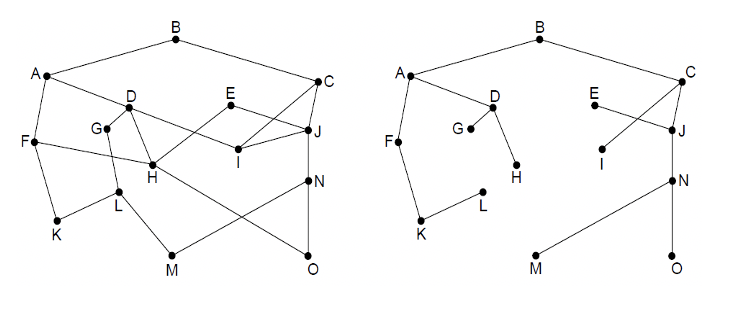
## Shortest Path Routing
* A non-adaptive algorithm
* Shortest path can be determined by building a graph with each node representing a router, and each edge representing a communication link
* To choose a path between 2 routers, the algorithm finds the shortest path between them on the graph
## Dijkstra Algorithm
* Dijkstra algorithm computes a spanning tree on the graph:
    * Each link is assigned a non-negative weight/distance
    * Shortest path is the one with lowest total weight
    * Using weights of 1 gives paths with fewest hops
* Algorithm:
    * Start with sink, set distance at other nodes to infinity
    * Relax distance to other nodes
    * Pick the lowest distance node, add it to the spanning tree
    * Repeat until all nodes are in the spanning tree
> Example to Dijkstra Algorithm
>> 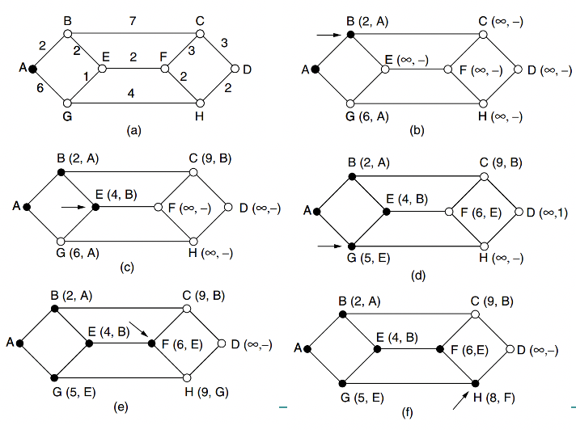
## Flooding
* A non-adaptive algorithm
* Every incoming packet is sent out on every outgoing line except the one on which it arrived
* Generates a large number of duplicate packets, so it is inefficient
* Selective flooding is routers send packets only on links which are in approximately the right direction. This is an improved variation.
> Example of Flooding
>> 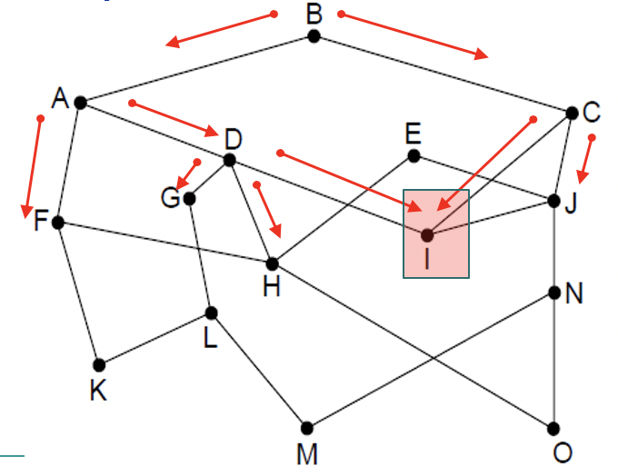
## Distance Vector Routing
* A dynamic algorithm
* Each router maintains a table which includes the best known distance to each destination and which line to use to get there
* Tables are exchanged with neighboring routers
* Global information shared locally
* Algorithm:
    * Each node knows distance of links to its neighbors
    * Each node advertises vector of lowest known distances to all neighbors
    * Each node uses received vectors to update its own
    * Repeat periodically
> Example of Distance Vector Routing
>> 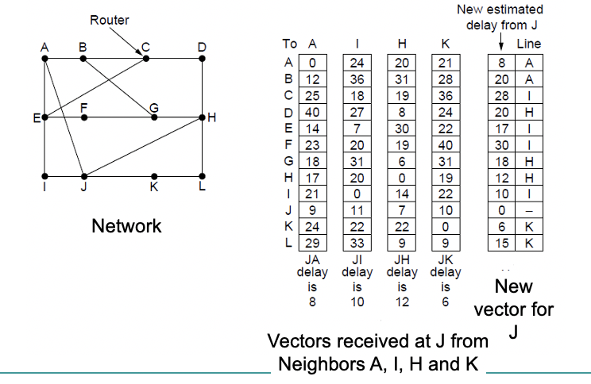
## Link State Routing
* A dynamic algorithm
    * An alternative to distance vector
    * DV: primary problem that caused its demise was that the algorithm often took too long to converge after the network topology changed
    * Widely used in the Internet
    * More computation but simpler dynamics
* Each router has to do 5 steps:
    1. Discover neighbors  and learn network addresses
    2. Measure delay or cost to each neighbors
    3. Construct packet resulting from previous steps
    4. Send this packet to all other routers
    5. Compute the shortest path to every other router
### Building link state packets
* LSP for a node lists neighbors and weights of links to reach them
* The hard part is determining when to build LSP
* Periodically at regular intervals
* Build them when some significant event occurs, such as a line or neighbor going down or coming back up again or changing its properties appreciably
> Example of Link State Packet
>> 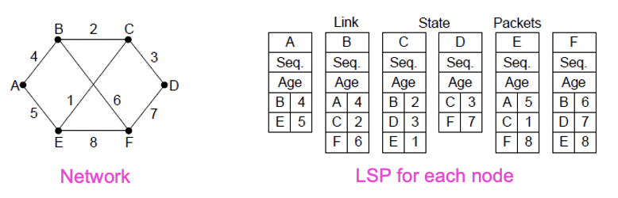
## Hierarchical Routing
* As networks grow in size, routing tables expand but this impacts CPU and memory requirements
* Dividing all routers into regions allows efficiencies
    * Each router knows everything about other routers in its region but nothing about routers in other regions
    * Router which connect to two regions act as exchange points for routing decisions
* Hierarchical routing reduces the work of route computation but may result in slightly longer paths than flat routing 
> Example of Hierarchical Routing
>> 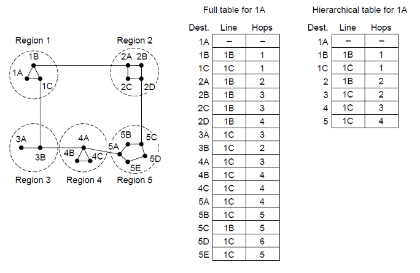
## Broadcast Routing
* Broadcast routing allows hosts to send messages to many or all other hosts
    * Single distinct packet 
        * Inefficient, sources, needs all destination addresses
    * Flooding
    * Multi-destination routing
        * Efficient but source needs to know all the destinations
    * A router receives a single packet which encapsulates the list of destinations, and then constructs a specific packet for each one
        * Acts as a relay
* Reverse path forwarding
    * When a broadcast packet arrives at a router, the router checks to see if the packet arrived on the line normally used for sending packets to use broadcast. If so there is a high probability that the route used to transmit the received packet is the best route. The router then to forwards the packet onto all other lines.
    * If the broadcast packet arrived on a link other than the preferred one for reaching the source, the packet is discarded as a likely duplicate. 
## Multicast Routing
* A routing algorithm used to send a message oto a well-defined group within the whole network
* Each router computes a spanning tree covering all other routers: The first router to receive the packet prunes the spanning tree to eliminate all lines which do not lead to members of the group
## Addressing
* Routing tables needs addressing to work/route
* IP addresses are used for this purpose
* They are hierarchical 
* There is a network portion to an address
* And also a host portion
* The network portion is same for all hosts on a network
* The host portion grabs a continuous block of addresses and is called the prefix
## IP Addresses
* Addresses are allocated in prefixes
    * Prefix is determined by a LAN
    * IP addresses are written in dotted decimals
    * 4 bytes * 4 = 32 bit addresses
    * Written as lowest address + length
        * E.g. 18.0.31.0/24
        * /24 states the length of the network part in bits, so here 8 bits are left for hosts
* Overall IP allocation responsibility of Internet Corporation for Assigned Names and Numbers (ICANN) by delegation to Internet Assigned Numbers Authority (IANA) and Regional Internet Registries (RIR's)
> Example of IP Address
>> 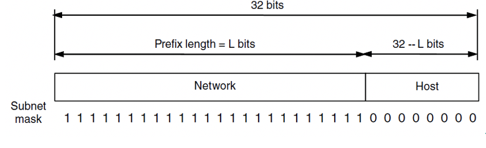
## Subnets
* Subnetting allows networks to be split into several parts for internal used whilst acting like a single network for external use
> Example of Subnets
>> 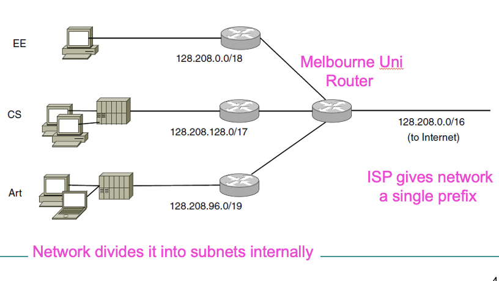
## IP Addressing and Routing Tables
* Routing tables are typically based around a triplet:
    * IP Address
    * Subnet Mask
    * Outgoing Line (Physical or virtual)
> Example of a routing table
>> 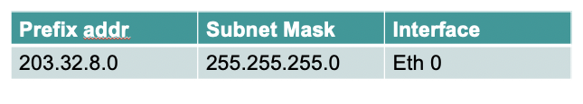
## Aggregation of IP addresses
* Backbone router connection networks around the world 
* Aggregation: Process of joining multiple IP prefixes into a single larger prefix to reduce size of routing table
> Example of Aggregation of IP Addresses
>> 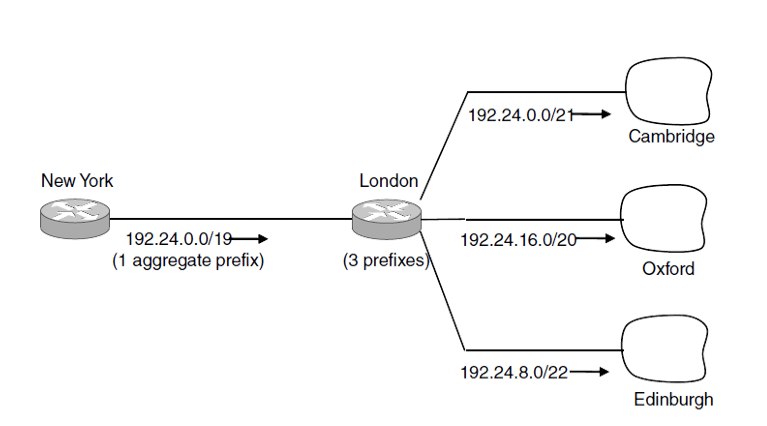
### Longest Matching Prefix
* Packets are forwarded to the entry with the longest matching prefix or smallest address block
    * Complicates forwarding but adds flexibility
* Processes:
    1. Check address whether matches the longest prefix
    2. If not then see if it matches others
> Example of Longest Matching Prefix
>> 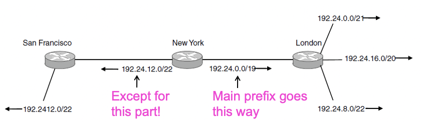
## Classful Addressing
* Part of history now-old addresses came in blocks of fixed size (A, B, C)
    * Carries size as part of address, but lacks flexibility
    * Called classful addressing
> Class of Addresses
>> 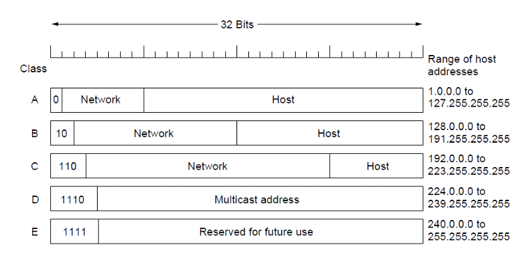
## Private IP Ranges
* Range of IP addresses that cannot appear in the Internet
* Only for private networks
    * 10.0.0.0/8
    * 172.16.0.0/12
    * 192.168.0.0/17
## Network Address Translation (NAT)
* NAT box maps one external IP address to many internal IP addresses
    * Uses TCP/UDP port to tell connections apart
    * Violates layering; Very common in homes
> Example of NAT
>> 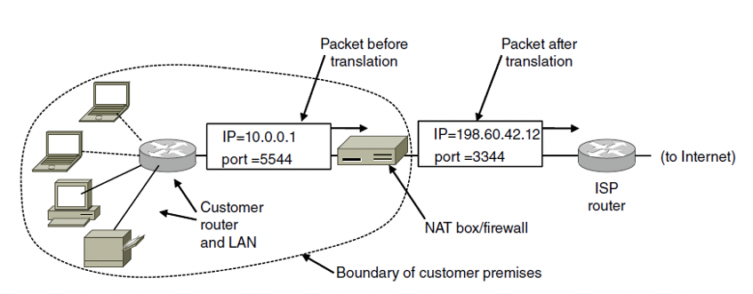
## Internet Control Protocols
* IP works with the help of several control protocols:
    * ICMP is a companion to IP that returns error info
        * Required and used in many ways
    * ARP finds MAC address of a local IP address
        * Glue that is needed to send any IP packets
        * Host queries an address and the owner replies
    * DHCP assigns a local IP address to a host
        * Gets host started by automatically configuring it
        * Host sends request to server, which grants a lease
## Mobile IP
* Handle it at data link layer
* For IPv4 the solution is through ICMP
## ICMP
* Internet Control Message Protocol
* Used for testing and monitoring ambient conditions between hosts and routers
>|Message Type|Description|
>|----|----|
>|Destination unreachable|Packet could not be delivered|
>|Time exceeded|Time to live field hit 0|
>|Parameter problem|Invalid header field|
>|Source quench|Choke packet|
>|Redirect|Teach a router about geography|
>|Echo and Echo reply|Check if a machine is alive|
>|Timestamp request/reply|Same as Echo, but with timestamp|
>|Router advertisement/solicitation|Find a nearby router|
## Other Considerations
* Congestion Control Algorithms
* Quality of Service
<h1 id='Transport'>Transport Layer</h1>
## Transport Layer Function
* Main function: Provide efficient, reliable and cost-effective data transmission service to the processes in the application layer. Independent of physical and data networks
# Transport Layer services
* Transport layer services provide interfaces between the application lay and the network layer
* Transport entities is the hardware or softeware which actually does the work. It can exist in multiple locations:
    * OS kernel
    * System Library
* But not so much in:
    * User process
    * Network interface card
* Transport layer adds reliability to the network layer
    * Offers connectionless in addition to connection-oriented services to applications
> Relationship between network, transport and application layes:
>> 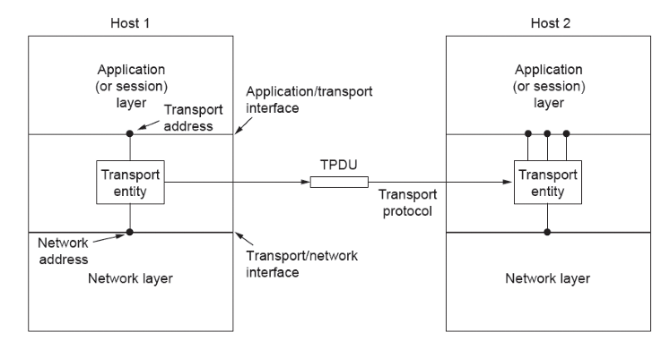
## Transport Layer and Network Layer Service Comparison
* Transport layer code runs entirely on hosts. Network layer code runs almost entirely on routers
* Users have no real control over the network layer. But can improve QoS in transport layer.
* Transport layer fixes reliability problems caused by the network layer
## Position of the Transport Layer
* The transport layer occupies a key position in the layer hierarchy because it clearly delineates
    * Providers of data transmissions services are at the network, data link, and physical layers
    * Users of reliable data transmission services are at the application layer
* In particular, users commonly access connection-oriented transport services for a reliable service on top of an unreliable network
## Features of a simple transport layer
* Abstraction and primitives provide a simpler API for application developers independent of network layer
> |Primitive|Meaning|
> |----|----|
> |LISTEN|Block waiting for an incoming connection|
> |CONNECT|Establish a connection with a waiting peer|
> |RECEIVE|Block waiting for an incoming message|
> |SEND|Send a message to the peer|
> |DISCONNECT|Terminate a connection|
## Transport Layer Encapsulation
* Abstract representation of messages sent to and from transport entities: Transport Protocol Data Unit (TPDU)
* Encapsulation of TPDUs transport layer unites to network layer units to frames in data layer units
> Example of Transport Layer Encapsulation
>> 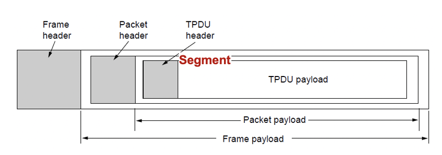
## Transport Services Primitives/Segments
* Primitives that applications might call to transport data for a simple connection-oriented service:
    * Server executes LISTEN
    * Client executes CONNECT
        * Sends CONNECTION REQUEST TPDU to server
        * Receives CONNECTION ACCEPTED TPDU to client
    * Data exchanged using SEND and RECEIVE
    * Either party executes DISCONNECT
> |Primitive|Segment sent|Meaning|
> |----|----|----|
> |LISTEN|(none)|Block until some process tries to connect|
> |CONNECT|CONNECTION REQ|Actively attempt to establish a connection|
> |SEND|DATA|Send Information|
> |RECEIVE|(none)|Block until a DATA packet arrives|
> |DISCONNECT|DISCONNECTION REQ|This side wants to release the connection|
> Illustration of a Simple Connection
>> 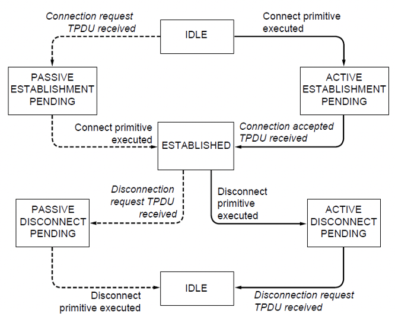
> * Solid lines show client state sequence
> * Dashed lines show server state sequence
> * Transitions in italics are due to segments arrivals
## Elements of Transport Protocols
* Connection establishment
    * When networks can lose, store and duplicate packets, connection establishment can be complicated:
        * Congested networks may delay acknowledgements
        * Incurring repeated multiple transmissions
        * Any of which may not arrive at all or out of sequence: Delayed duplicates
        * Application degenerate with such congestion
* Reliable Connection Establishment
* Key challenge is to ensure reliability even though packets may be lost, corrupted, delayed and duplicated
    * Don't treat an old or duplicate packet as new
* Approach:
    * Don't reuse sequence numbers within maximum segment lifetime
    * Use a sequence number space large enough that it will nor wrap, even when sending at full rate
    * Three-way handshake for establishing connection
    ### Three Way Handshake
    * Three-way handshake used for initial packet
        * Since no state from previous connection
        * Both hosts contribute fresh sequence numbers
        * CR = Connect Request
    > Example of Three Way Handshake
    >> 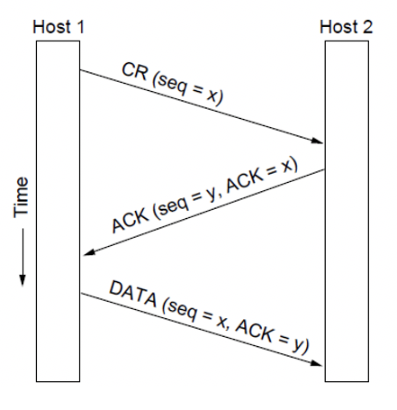
* Connection Release
    * Asymmetric Disconnection
        * Either party can issue a DISCONNECT, which results in DISCONNECT TPDU and transmission ends in both directions
    * Symmetric Disconnection
        * Both parties issue DISCONNECT, closing only one direction at a time. Allows flexibility to remain in receive mode.
    * Asymmetric release may result in data loss hence symmetric release is more attractive
    * Symmetric release works well where each process has a set amount of data to transmit and knows when it has been sent. 
## Strategies for Connection Release
* Three way handshake
* Finite retry
* Timeouts
* Normal release sequence initiated by transport user on sender host
    * DR = Disconnect Request
    * Both DRs are ACKed by the other side
> Examples of error cases for Connection Releases
>> 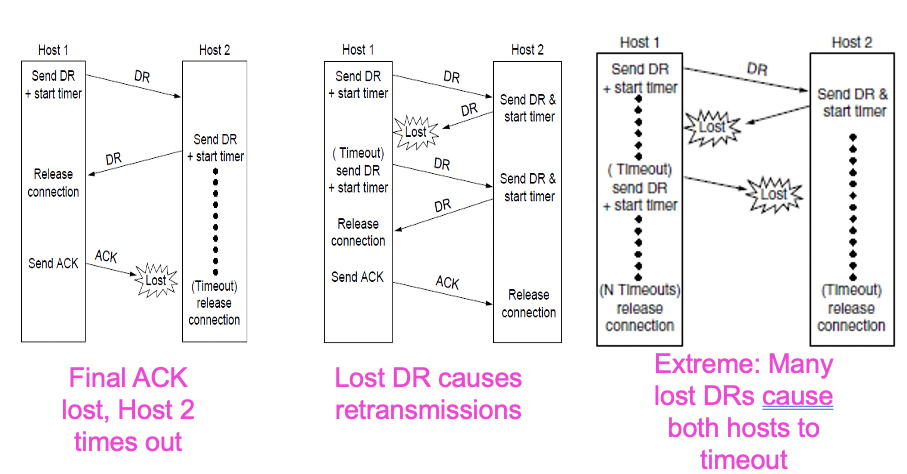
## Addressing
* Specification of remote process to connect to is required at application and transport layers
* Addressing in transport layer is typically done using Transport Service Access Points (TSAPs)
    * On the Internet, a TSAP in commonly referred to as a port
* Addressing in the network layer is typically done using Network Service Access Points (NSAPs)
    * On the Internet, the concept of an NSAP is commonly interpreted as simply an IP address
> Illustration of TSAP and NSAP
>> 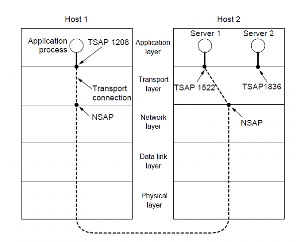
### Type of TSAP Allocation
* Static: Well known services have standard allocated TSAPs/ports, which are embedded in OS
* Directory Assistance - Port-mapper:
    * A new service must register itself with the portmapper, giving both its services name and TSAP
* Mediated:
    * A process server intercepts inbound connections and spawns requested server and attaches inbound connection
## Sockets
* Sockets widely used for interconnections
    * Berkeley sockets are predominant in internet applications
    * Notion of sockets as transport endpoints
    * Like the simple set plus SOCKET, BIND, ACCEPT
>|Primitive|Meaning|
>|----|----|
>|SOCKET|Create a new communication end point|
>|BIND|Associate a local address with a socket|
>|LISTEN|Announce willingness to accept connections; give queue size|
>|ACCEPT|Passively establish an incoming connection|
>|CONNECT|Actively attempt to establish a connection|
>|SEND|Send some data over the connection|
>|RECEIVE|Receive some data from the connection|
>|CLOSE|Release the connection|
## UDP
* User Datagram Protocol 
* Does not add much to the Network Layer functionality
* TCP just does the realiability for this layer
* UDP remove connection primitives to use it in a program
* UDP is good for apps like video streaming and gaming regularly
* The reliability issue is left to the application layer. Retransmission decision as well as congestion control
* Provides a protocol whereby applications can transmit encapsulated IP datagrams without a connection establishment
* UDP transmits in segments consisting of an 8-byte header followed by the payload
* UDP headers contain source and destination ports
* Payload is handed to the process which is attached to the particular port at destination
* The main advantage of using UDP over raw IP is the ability to specify ports for source and destination pairs
* Both source and destination ports are required. Destination allows for incoming segments, sources allows reply for outgoing segments
> Example of a UDP header
>> 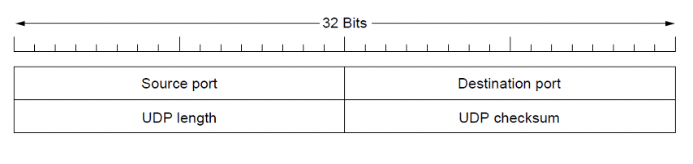
### Strengths and Weakness of UDP
* Strength: Provides an IP interface with multiplexing/de-multiplexing capabilities and related transmission efficiencies
* Weakness: UDP does not include support for flow control, error control/retransmission of bad segments
* Where applications require a precise level of control over packet flow/error/timing, UDP is good choice as application layer can make choices. 
## Remote Procedure Call
* Sending a message and getting a reply back in analogous to making a function all in programming languages
* To call a remote procedure, the client is bound to a small library call the client stub that represents the server procedure in the client's address space
* Similarly the server is bound with a procedure call the server stub
* These stubs hide the fact that the procedure itself is not local
> Illustration of RPC
>> 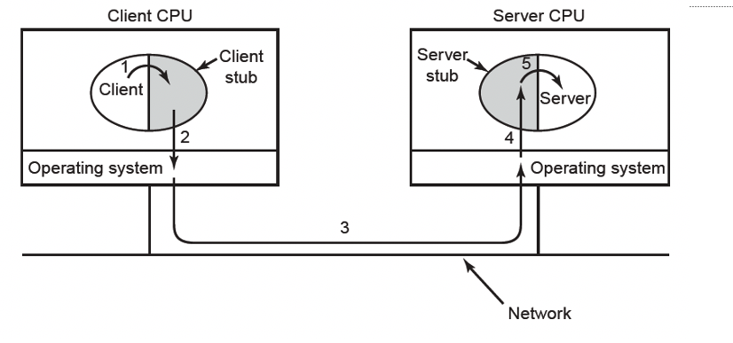
## Transmission Control Protocol (TCP)
* Provides a protocol by which application can transmit IP datagrams within a connection-oriented framework, thus increasing reliability
* TCP transport entity manages TCP streams and interfaces to the IP layer - can exist in numerous locations (kernel, library, user process)
* TCP entity accepts user data streams, and segments them into pieces < 64KB (Often at a size in order so that the IP and TCP headers can fit into a single Ethernet frame), and sends each piece as a separate IP datagram.
* Recipient TCP entities reconstruct the original byte streams from the encapsulation
## The TCP service Model
* Sender and receiver both create sockets, consisting of the IP address of the host and a port number.
* For TCP Service to be activated, connections must be explicitly established between a socket at a sending host and a socket at a receiving host
* Special one-way server sockets may be used for multiple connections simultaneously
> Example of TCP Service model
>> 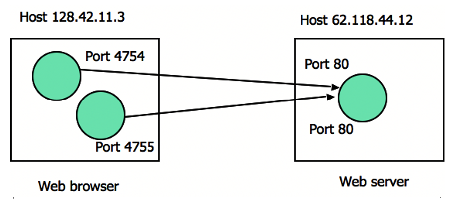
### Port Allocations
* Port numbers can range from 0 to 65535
* Port numbers are regulated by IANA
* Ports are classified into segments
    * Well Known Ports (0-1023)
    * Registered Ports (1024-49151)
    * Dynamic Ports (49152-65535)
>|Port|Protocol|Use|
>|----|----|----|
>|20, 21|FTP|File transfer|
>|22|SSH|Remote login, replacement for Telnet|
>|25|SMTP|Email|
>|80|HTTP|World Wide Web|
>|110|POP-3|Remote email access|
>|143|IMAP|Remote email access|
>|443|HTTPS|Secure Web|
>|543|RTSP|Media Player Control|
>|631|IPP|Printer|
### Socket Library: Multiplexing
* Socket library provides a multiplexing tool on top of TSAPs to allow servers to service multiple clients
* It simulate the server using a different port to connect back to the client
> Example of Socket Library
>> 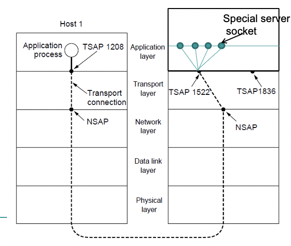
### Features of TCP Connections
* Full duplex: Data in both directions simultaneously
* Point to point: Exact pairs of senders and receivers
* Byte streams, not message streams: Message boundaries are not preserved
* Buffer options: TCP entity can choose to buffer prior to sending or not depending on the context
### TCP entities
* Data sent between TCP entities in segments: a 20 byte header plus zero or more data bytes
* TCP entities decide how large segments should be mainly with 2 constraints:
    * 65515 byte IP payload
    * Ethernet unit size, generally 1500 bytes
* Sliding window:
    * Sender transmits and starts a timer
    * Receiver sends back an acknowledgement which is the next sequence number expected. If sender's timer expires before acknowledgement, then the sender transmits the original segment again
### TCP Segment Header
* TCP header includes addressing (ports), sliding window (seq/ack), flow control (window), error control (checksum) and more
> Example of TCP header
>> 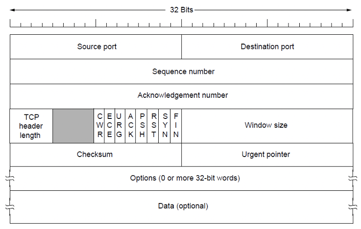
> * Source port and destination port: Identify the local end points of the connection
> * Sequence number and Acknowledgement number: Perform their usual functions
> * TCP header length: Tells how many 32-bit words are contained in the TCP header
> * Window size: Tells how many bytes may be sent starting at the byte acknowledged
> * Checksum: Provided for extra reliability. It checksums the header, the data
> * Options: Provides a way to add extra facilities not covered by the regular header
> * URG: Set to 1 if the Urgent pointer is in use. The Urgent pointer is used to indicate a byte offset from the current sequence number at which urgent data are to be found
> * CWR and ECE: Used to signal congestion when ECN (Explicit Congestion Notification) is used
> * ECE: Set to signal an ECN-Echo to a TCP sender to tell it to slow down when the TCP receiver gets a congestion indication from the network
> * CWR: Set to signal Congestion Window Reduced from the TCP sender to the TCP receiver so that it knows the sender has slowed down can stop sending the ECN-Echo
> * ACK: Set to 1 to indicate that the Acknowledgment number is valid. This is the case for nearly all packets. 0 means ignore ACK number field
> * PSH: Indicates PUSHed data. The receiver is hereby kindly requested to deliver the data to application upon arrival and not buffer it until a full buffer has been received
> * RST: Used to abruptly reset a connection that has become confused due to a host crash or some other reason. It is also used to reject an invalid segment or refuse an attempt to open a connection
> * SYN: Used to establish connections. The connection request has SYN=1 and ACK=0. The connection reply does bear an acknowledgement, so it has SYN=1 and ACK=1. The SYn bit is used to denote both CONNECTION REQUEST and CONNECTION ACCEPTED, with the ACK bit used to distinguish between these two possibilities
> * FIN: Used to release a connection. It specifies that the sender has no more data to transmit. However, after closing a connection, the closing process may continue to receive data. 
### TCP Connection Establishment and Release
* Connections established using three-way handshake
* Two simultaneous connection attempts reults in only one connection uniquely identified by end points
* Connections released with symmetric release
* Timers used for lost connection release
### TCP Connection Management
* The full TCP connection finite state machine has more states than the simple example from earlier
>|State|Description|
>|----|----|
>|CLOSED|No connection is active or pending|
>|LISTEN|The server is waiting for an incoming call|
>|SYN RCVD|A connection request has arrived; Wait for ACK|
>|SYN SENT|The application has started to open a connection|
>|ESTABLISHED|The normal data transfer state|
>|FIN WAIT 1|The application has said it is finished|
>|FIN WAIT 2|The other side has agreed to release|
>|TIME WAIT|Wait for all packets to die off|
>|CLOSING|Both side have tried to close simultaneously|
>|CLOSE WAIT|The other side has initiated a release|
>|LAST ACK|Wait for all packets to die off|
### TCP Transmission Policy
* TCP acknowledges bytes
* Receiver advertises window based on available buffer space
> Example of TCP Transmission
>> 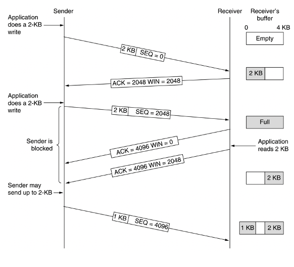
## Congestion
* Congestion results when too much traffic is offered; Performance degrades due to loss/retransmissions
> Illustration of Congestion
>> 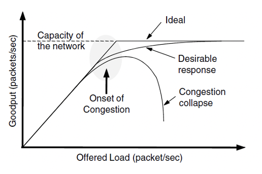
### Congestion Control vs. Flow Control
* Flow control is an issue for point to point traffic, primarily concerned with preventing sender transmitting data faster than receiver can receive it
* Congestion control is an issue affecting the ability of the subnet to actually carry the available traffic in a global context
## Load Shedding
* When congestion control mechanisms fail, load shedding is the key remaining possibility.
* In order to ameliorate impact, applications can mark certain packets as priority to avoid discard policy
## Key problem if network is not delivering properly
* Quality of Service becomes low
* Expected network performance is an important criterion for a wide range of network applications
* Some engineering techniques are available to guarantee QoS
* Four things to watch out for: Bandwidth, reliability, delay, jitter
## Jitter
* Jitter is the variation in packet arrival times
> Example of High Jitter
>> 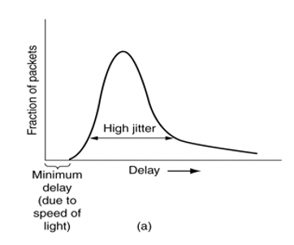
> Example of Low Jitter
>> 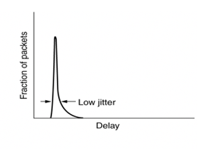
* Jitter is an issue for some applications
* Jitter can be contained by determined the expected transit time of a packet
* Packets can be shuffled at each hop in order to minimize jitter: Slower packets sent first, faster packets wait in a queue.
* For certain applications jitter control is extremely important as it mainly directly affects the quality perceived by the application user
## QoS Requirements
* Different applications care about different properties
>|Application|Bandwidth|Delay|Jitter|Loss|
>|----|----|----|----|----|----|
>|Email|Low|Low|Low|Medium|
>|File Sharing|High|Low|Low|Medium|
>|Web Access|Medium|Medium|Low|Medium|
>|Remote Login|Low|Medium|Medium|Medium|
>|Audio on demand|Low|Low|High|Low|
>|Video on demand|High|Low|High|Low|
>|Telephony|Low|High|High|Low|
>|Videoconferencing|High|High|High|Low|
## Techniques for Achieving QoS
* Over-provisioning: More tha adequate buffer, router CPU, and bandwidth
* Buffering: Buffer received flows before delivery: Increase delay, but smoothes out jitter, no effect in reliability or bandwidth
* Traffic Shaping: Regulate the average rate of transmission and burstiness of transmission
    * Leaky Bucket
    * Token Bucket
* Resource reservation: Reserve bandwidth, buffer space, CPU in advance
* Admission Control: Routers can decide based on traffic patterns whether to accept new flows, or reject/reroute them
* Proportional routing: Traffic for same destination split across multiple routes
* Packet scheduling: Create queues based on priority. 
    * Fair queuing, weighted fair queuing
### Leaky Bucket
* Large bursts of traffic is buffer and smoothed while sending
> Illustration of Leaky Bucket
>> 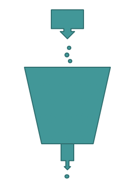
## TCP Congestion Control
* When networks are overloaded, congestion occurs, potentially affecting all layers. Although lower layers attempt to ameliorate congestion, in reality TCP impacts congestion most significantly because TCP offers best methods to reduce the data rate, and hence reduce congestion 
* TCP adopts a defensive stance:
    * At connection establishment, a suitable window size is chosen by the receiver based on its buffer size
    * If the sender is constrained to this size, then congestion problems will not occur due to overflow at the receiver itself, but may still occur due to congestion within the network
### Design of Congestion Control
* Two different problems exist
    * Network capacity and receiver capacity
    * These should be dealt with separately, but compatibly
* Sender maintains two windows:
    * Window described by the receiver
    * Congestion window
* Each regulates the number of bytes the sender can transmit. The maximum transmission rate is the minimum of the two windows
## Slow Start
* On connection establishment, the sender initializes the congestion window to a size, and transmits one segment
* If this segment is acknowledged before the timer expires, the sender adds another segment's worth of bytes to the congestion window, and transmits two segments
* As each new segment is acknowledged, the congestion window is increased by one more segment
* In effect, each set of acknowledgements doubles the congestion window which grows until either a timeout occurs or the receiver's specified window is reached.
> Illustration of Slow Start
>> 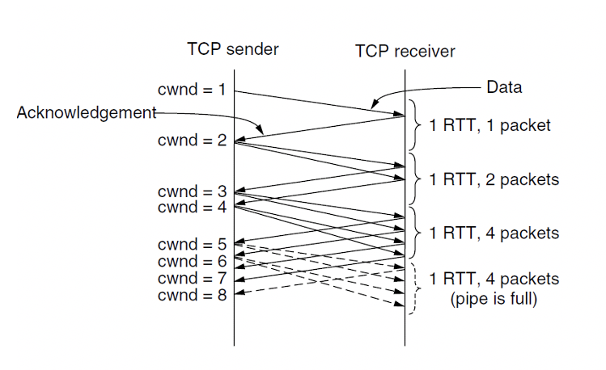
### Additive Increase
> Illustration of Additive Increase
>> 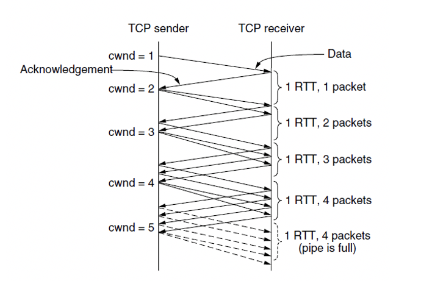
### TCP Tahoe
* Slow start followed by additive increase.
* Threshold is half of previous
> Illustration of TCP Tahoe
>> 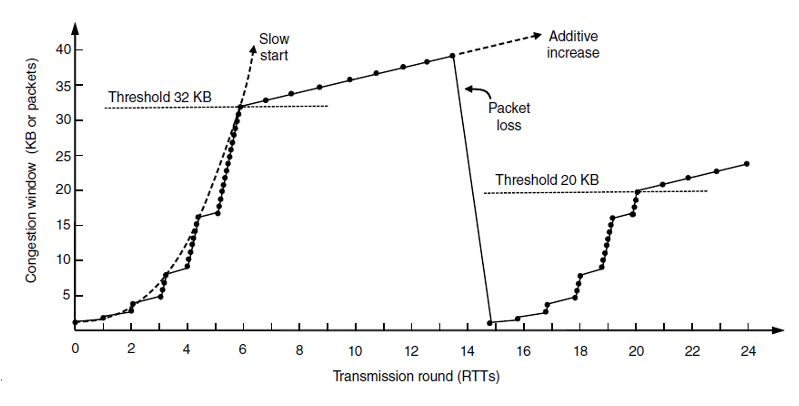
### TCP Reno
> Illustration of TCP Reno
>> 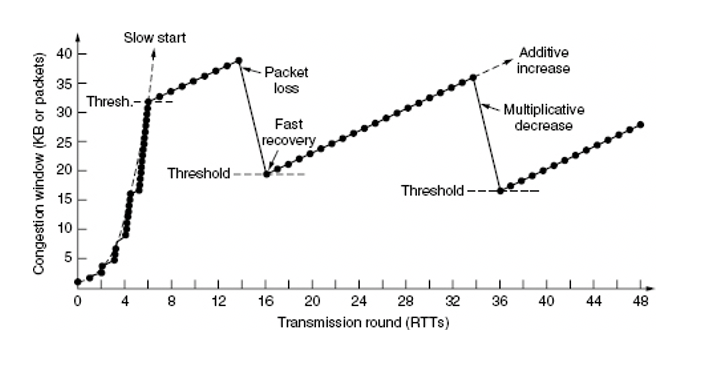
## Congestion Control and Wireless
* Much harder to deal with:
    * Things are increasingly wireless
    * Not everything is wireless, but parts of a path
    * More variety on wireless links as well
    * SNR varies when people more
    * Delay is different if it is WiFi
## TCP Timer
* A key worry is when timers go out
* Too early means too many resends
* Too late means reliability comes with more additional cost
* Solutions rely on dynamicity as network conditions change
* One needs to measure network performance and adapt timers
<h1 id='Application'>Application Layer</h1>
## Domain Name System (DNS)
* Distributed database implemented in a hierarchy of many name servers
* Application Layer protocol that allows a host to query the database in order to resolve names
* Used by application layer protocols (http, ftp, smtp)
### DNS Defined
* Number of RFSs are directly related to DNS:
    * RFC 1034: Domain Names: Concepts and Facilities
    * RFC 1035: Domain Names: Implementation and Specification
    * RFC 1519: Domain Name System Structure and Delegation
    * RFC 2219: Use of DNS Aliases for Network Services
    * RFC 2606: Reserved Top Level DNS Names
    * RFC 3647: Role of the Domain Name System
### Conceptual Divisions of DNS Namespace
* A hierarchical naming convention
* The top of the hierarchy is managed by ICANN (The Internet Corporation for Assigned Names and Numbers)
> Example of DNS Namespace
>> 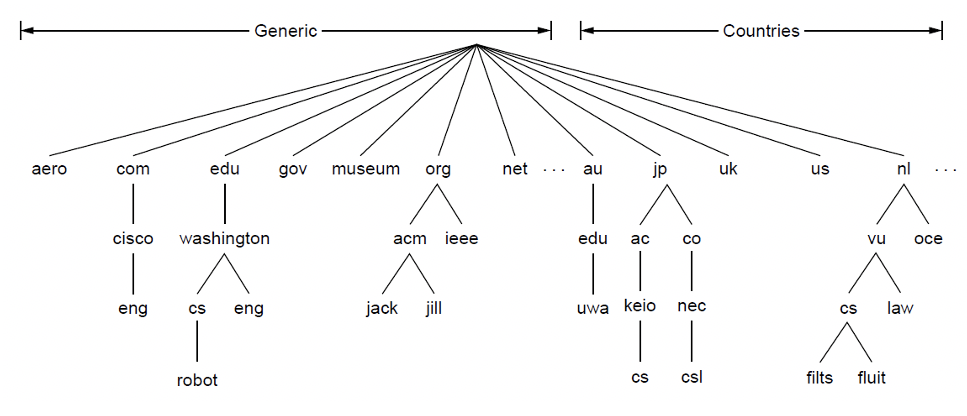
### Why note centralize DNS
* Single point of failure
* Traffic volume
* Distant centralized database
* Maintenance
* Doe not scale well
### DNS Services
* Hostname to IP address translation
* Host aliasing: Alias names for canonical names
    * E.g. Canonical relay1.westcoast.enterprise.com -> www.enterprise.com
* Mail server aliasing
    * E.g. Bob@relay1.westcoast.hotmail.com -> Bob@hotmail.com
* Load distribution
    * Busy sites are replicated over multiple servers
    * A set of IP addresses is associated with one canonical name
    * DNS server rotates the order of the addresses to distribute the load
## Domain Name Characteristics
* Domain Name:
    * Are case insensitive
    * Can have up to 63 characters per constitute
    * Can have up to 255 chars per path
    * Can be internationalized
* Naming conventions usually follow either organizational or physical boundaries
* Absolute domain names ends in a .
* Relative domain names partially specify the location and can be used only within the context of an absolute domain name
## Zone Name Servers
* DNS namespace divided non-overlapping zones
* Each zone contains a part of the DNS tree and also name servers authoritative for that zone
    * Usually 2 name servers for a zone
    * Sometimes secondary is actually outside the zone
* Name servers are arranged in a hierarchical manner extending from a set of root servers
## Root Name Servers
* The root servers form the authoritative cluster for enquiry in the event of locally unresolvable name queries
* There are 13 root servers globally
## Resource Records
* The resources records are the key objects in the Domain Name System
* A RR consists of a domain name, TTL, class, type, value
    * Domain name: Which domain this record applies to
    * TTL: Indicates stability or temporal extent of the record
    * Class: IN for internet
    * Type: a closed vocabulary of the following:
        * A: The Internet address of the host
        * CNAME: The canonical name of an alias
        * MX: The mail exchanger
        * NS: The name server
        * PTR: The host name if the query is in the form of an Internet address; Otherwise the pointer to other information
        * SOA: The domain's start-of-authority information
    * Value: data
### Example of asking for domain name
1. User machine runs the client side of the DNS software
2. Browser extracts the hostname from the URL, and passes it to the client-side of the DNS application
3. DNS client send a query containing the hostname to a DNS server
4. DNS client eventually receives a reply containing the IP address for the hostname
5. Browser initiates a TCP connection to the process located at port 80 at the IP address
## DNS in Action
* Finding the IP address for a given hostname is called name resolution and is done with the DNS protocol
* Resolution:
    * Computer requests local name server to resolve
    * Local name server asks the root name server
    * Root returns the name server for a lower zone
    * Continue down zones until name server can answer
* DNS protocol:
    * Runs on UDP port 53, retransmits when lost messages
    * Caches name server answers for better performance
> Example of resolution
>> 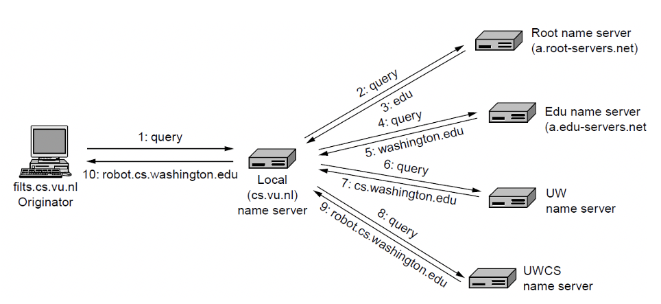
* Iterated query: Contacted server replies with name of server to contact
* Recursive query: Server obtains mapping on client's behalf
## DNS Caching and Updating Records
* Once name server learns a mapping, it caches the mapping
    * IP addresses of TLD servers typically cached in local name servers
    * Cache entries timeout after some time
## World Wide Web (WWW)
* Client and server software:
    * Firefox is the client software for web access where Apache is on the  server side
* Web markup languages:
    * HTML is how webpages are coded
* Web scripting languages:
    * Javascript adds more dynamicity to web webpages
* HTTp is about how to transfer
## Web Access
* A web page consists of objects
* An object can be HTML file but also JPEG image, Java applet, audio file
* A web page consists of a base HTML file which includes several referenced objects
* Each object is addressable by a URL (Uniform Resource Locator)
> Example of a URL:
>> 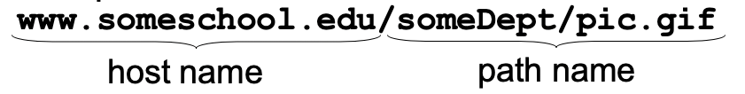
## Hypertext Transfer Protocol (HTTP)
* HTTP is at the application layer
* Client/Server Model
    * Client: Browser that requests, receives and displays Web objects
    * Server: Web server sends object in response to requests
> Illustration of HTTP
>> 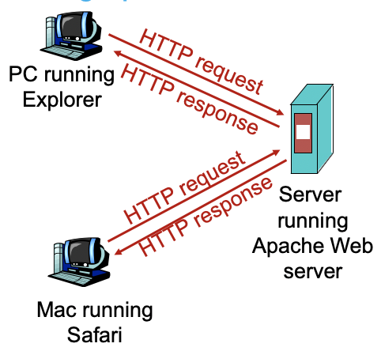
### HTTP Connections
* Non-persistent HTTP: at most one object sent over a TCP connection
* Persistent HTTP: Multiple objects can be sent over a single TCP connection between client and server
### Non-persistent HTTP
* Example of visiting www.someSchool.edu/someDepartment/home.index:
    1. a) HTTP clients initiates TCP connection to HTTP server process at www.someSchool.edu on port 80 \
    b) HTTP server at host www.someSchool.edu waiting for TCP connection at port 80. Accepts connection and notify client
    2. HTTP client sends a HTTP request message, containing URL, into TCO connection socket. Message indicates that client wants object someDepartment/home.index
    3. HTTP server receives request message, form response message containing requested object, and sends message into its socket
    4. HTTP client receives response message containing HTML file
    5. HTTP server closes TCP connection
    6. Parses HTML file and finds 10 referenced jpeg objects
    7. Steps 1-6 repeated for each pf the 10 jpeg objects
### Response Time
* Round Trip Time (RTT): Time for a small packet to travel from client to server and back
* Response time: 
    * One RTT to initiate TCP connection
    * One RTT for HTTP request and first few bytes of HTTP response to return
    * File transmission time
* Total Response time = 2 RTT + file transmission time
> Illustration of HTTP response 
>> 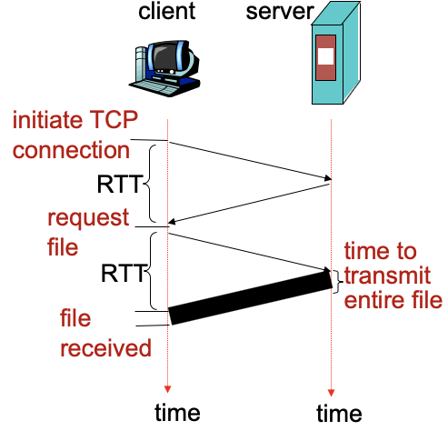
### Non-persistent HTTP issues
* Requires new connection per requested object
* OS overhead for each TCP connection
* Delivery delay of 2 RTTs per requested object
### Persistant HTTP
* Server leaves connection open after sending response
* Subsequent HTTP messages between same client/server sent over open connection
* Pipelining: Client sends request as soon as it encounters a referenced object
    * As little as one RTT for all the referenced objects
* Server closes a connection if it hasn't been used for some time
### HTTP Request Methods
|Method|Description|
|----|----|
|GET|Request to read a web page|
|HEAD|Request to read a web page's header|
|PUT|Request to store a web page|
|POST|Append to a named resource|
|DELETE|Remove the web page|
|TRACE|Echo the incoming request|
|CONNECT|Reserved for future use|
|OPTIONS|Query certain options|
### HTTP Error Codes
|Code|Meaning|Examples|
|----|----|----|
|1xx|Information|100 = server agrees to handle client's request|
|2xx|Success|200 = request succeeded; 204 = no content present|
|3xx|Redirection|301 = page moved; 304 = cached page still valid|
|4xx|Client error|403 = forbidden page; 404 = page not found|
|5xx|Server error|500 = internal server error; 503 = try again later|
## Cookies
* The http servers are stateless
* Cookies to place small amount of info on users computer and reuse deterministically
* Questionable mechanism for tracking users
* Advantages:
    * Authorization
    * Shopping carts
    * Recommendations
    * User session state
### Cookies vs. Sessions
|Sessions|Cookies|
|----|----|
|Sessions information regarding visitor's interaction stored at the server side: upto some hours|Cookies are transferred between server and client|
|When user closes the website, the session ends|Cookie information stored at both client and server|
|Sessions information size can be large|Maintain client information until deleted|
||Cookies information size limited|
## Web Caches (Proxy Server)
* Goal is to satisfy client request without involving origin server
* User sets browser to access web via cache
    * Browser sends all HTTP requests to cache
    * If object in cache, cache returns object, else cache requests object from origin server, then returns object to client
* Cache acts as both client and server
* Typically cache in installed by ISP
* Causes problems for frequently changing data
* Advantages:
    * Reduce response time for client request
    * Reduce traffic on an institution's access link
## Dealing with Multimedia Data
* Higher bandwidth requirements
* Higher QoS requirement
* Separate providers
    * Not all communication is one-to-one. Many is multicast/broadcast which is different to most traffic
    * Specialized infrastructure also needs special attention
## A basic model for multimedia on the web
> Illustration of the multimedia basic model
>> 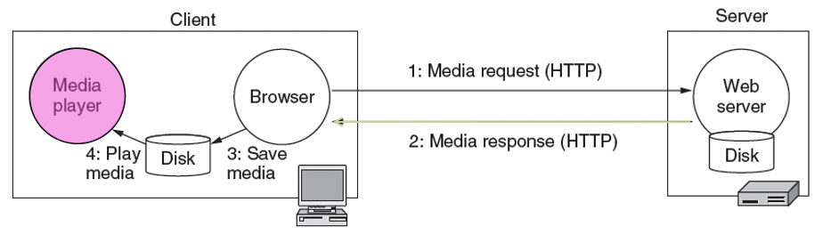
* Problems:
    * The entire media file must be transmitted over the network before playback starts
    * Basic model assumes mainly point-to-point data distribution rather than a point-to-multipoint distribution model
    * Basic model relies on simple browser/plugin/helper integration and traditional service types
## Streaming Media Protocols
* HTTP
* RTP: Real-time Protocol
* MPEG-4
* Microsoft's Windows Media
## Specialized Multimedia Software
* 4 main tasks of the multimedia playback software:
    * To deal with the user interface side:
        * Functions such as volume control, playback, next
    * Handle transmission errors in conjunction with transport protocols
        * Using RTP/UDP errors will likely occur, playback software must manage/mask them gracefully
    * Eliminate jitter
        * Small buffer, quick playback but susceptible to jitter/delay
        * Large buffer, delay at start of playback while buffer fills, but less susceptible to delay/jitter
    * Sometimes compress and almost always decompress the multimedia files to reduce size
> Specialized Model
>> 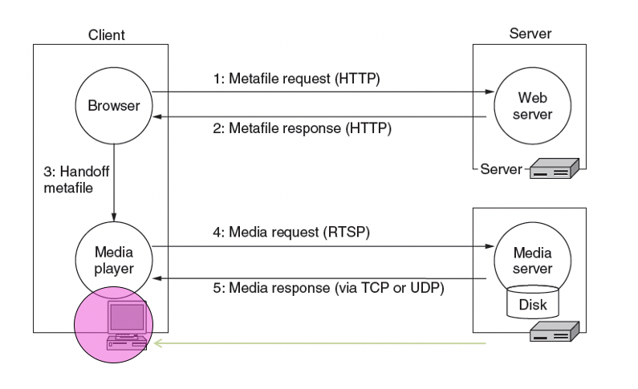
## Handling Errors
* Forward Error Correction: The error-correcting encoding of data. For every X data packets Y new packets are added similar to methods. These contains redundant bits that are used to deal with errors
    * Methods used parity or exclusive-OR sums of the bits in each of the data packets but are more complex
* Error Resilience: Remarking for re-sync so that a packet loss does not create a total loss, mainly on sender side
* Error Concealment: Done by the receiver
* Retransmission: Less meaningful for streaming data but for watching a movie. This can be deployed for lost packets of the movie.
## Jitter management
* Jitter happens because of variable bandwidth and loss/retransmissions. Therefore, we use buffers.
> Illustration of buffers
>> 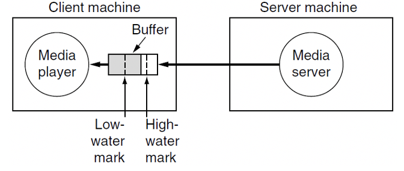
## Compression
* ADC (Analog-to-Digital Converter) produces digital data
> Example of ADC
>> 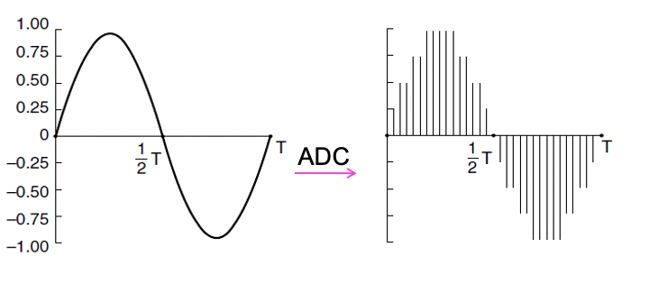
### Audio compression
* Use Nyquist and Shannon theorems to convert analog data to digital. Then apply techniques to eliminate some data
* E.g. 
    * Perceptual coding is that some data can mask other data
    * Frequency masking: Some sounds mask/hide others so there is no point encoding them
    * Temporal masking: Human ears can miss soft sounds immediately after loud sounds, takes time for ear to adjust, no need to store them.
### MP3
* MP3 is MPEG Audio Player 3
* MP3's compression is based on perceptual coding
* MP3 audio compression results in significant file size savings without a perceived loss of audio quality
* Typical MP3 audio compression rates for CS quality audio reduce the need for bandwidth for 1.4 Mbps for stereo down to 96-128 Kbps
### For digital video
* Video is digitized as pixels
* Video is sent compressed due to its large bandwidth requirements
    * Lossy compression exploits human perception
    * Large compression ratios achieved
### JPEG
* JPEG is lossy compression
* JPEG often provides compression ratios of 20:1
* JPEG compression is symmetric, decoding takes as long as encoding
### MPEG 
* MPEG is Motion Picture Experts Group
* MPEG can compress both audio and video together
* The evolution of MPEG:
    * MPEG-1: VCR quality at 1.2 Mbps (40:1)
    * MPEG-2: Broadcast quality at 4-6Mbps (200:1)
    * MPEG-4: DVD quality at 10Mbps (1200:1)
## Email 
* User Agent: Thunderbird
* Message Transfer Agent: Exchange
* Message Transfer Protocol
## Email Services
* Standards for Internet-enabled email are based on 2 RFC's
    * RFC 821 (transmission)
    * RFC 822 (message format)
    * RFC 2821 and RFC 2822 (revised versions of earlier RFCs)
## Architecture and Services of Email
* User agents: Allow user to read and send mail
* Message transfer agents: Transport messages from source to destination
* Simple Mail Transfer Protocol (SMTP): Used to send messages from the sender
    * Mail server to the receiver's mail server
    * User agent to the sender's mail server
> Architecture of Email Service
>> 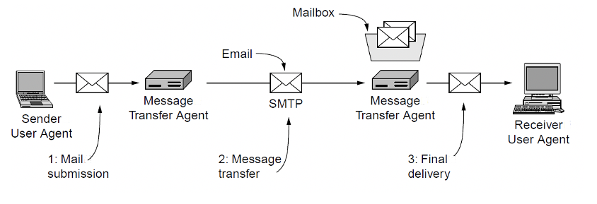
## User agent
* Basic functions: compose, report, display and dispose
* Envelope and contents: encapsulation of transport related information
    * Envelope: Destination address, priority, and security level, all of which are distinct from the message itself
    * Mail servers use the envelope for routing
* Header and body:
    * Header: User agent control info
    * Body: For human recipient
    * Contains contains control information for the user agents
* User must provide message, destination, optional other parameters
## RFC 822: Message
* RFC 822 doesn't distinguish header and envelope fields
* RFC 822 allows users to invent new headers for private use but they must start with X-
## Multipurpose Internet Mail Extensions (MIME)
* RFC822  was enough for these simple constraints
* In time the inadequacy of RFC822 became apparent
    * Languages with accents
    * Non-Latin alphabets
    * Non-alphabetic language
    * Messages with content other than text
* As a result, MIME (RFC 1341) was written
* MIME retains RFC822 format but adds structural elements to the message body and defines encoding rules for non-ASCII messages
* MIME has 5 additional message headers:
    * MIME-Version: Identifies the MIME version
    * Content-Description: Human readable describing contents
    * Content-Id: Unique Identifier
    * Content-Transfer-Encoding: How body is wrapped for transmission
    * Content-Type: Type and format of content
### MIME Types and Subtypes
|Type|Example subtypes|Description|
|----|----|----|
|text|plain, html, xml, css|Text in various formats|
|image|gif, jpeg, tiff|Pictures|
|audio|basic, mpeg, mp4|Sounds|
|video|mpeg, mp4, quicktime|Movies|
|model|vrml|3D model|
|application|octet-stream, pdf, javascript, zip|Data produced by applications|
|message|http, rfc822|Encapsulated message|
|multipart|mixed, alternative, parallel, digest|Combination of multiple types|
## Message Transfer
* Transfer: SMTP (Simple Message Transfer Protocol)
* Delivery:
    * POP3 (Post Office Protocol 3): Download to a single device
    * IMAP (Internet Message Access Protocol): Designed with multiple devices in mind
## SMTP
* Simple Message Transfer Protocol
* Simple ASCII protocol, operating on TCP port 25
* RFC 821: Simple Mail Transfer Protocol
* RFC 2821: Extended Simple Mail Transfer Protocol
* Basic steps:
    * User agent submits to mail transfer agent on port 587
    * One mail transfer agent to the next one on port 25
    * Other protocols used for final delivery (IMAP, POP3)
## IMAP
* Used for final delivery
* Internet Message Access Protocol
* RFC 3501 defines version 4
* User agent runs an IMAP client for this
* Protocol has command like: Login, List, Copy, Create, Delete
* Main difference with POP3 is mail remains on server
* Complex protocol but makes mail machine independent
## POP3
* Email is taken into the user computer
* Simpler protocol
* Ties emails to one's machine
## Webmail
* Gmail and alike
* A service run by a company server
* An interface to managing email over the Web
* Mainly it is an user interface
## Spam
* Unwanted email
* Main countermeasures are:
    * Filters based on email content
    * Blacklisting known spam addresses
    * Parking email from unknown sources
    * Collection spam and creating a knowledge-base
    * Detecting mass emails
# Other Layers
## Two more layers from the OSI model
* Presentation layer
* Session layer
* They did not see a distinct use and labeling
## Presentation Layer
* Formatting related issues
* Encryption and Decryption
    * Should be done in presentation layer as well although it is commonly done at application layer
* Compression
    * It should be done at this layer rather than in application layer
### Why not have an explicit presentation layer
* Internet does not have this clear distinction
* A key reason is many presentation layer list of things to do that is considered to be application specific. Thus, application layer and presentation layer is not explicitly separated for internet
## Session layer
* Common service of this layer:
    * Authentication
    * Session management
        * Monitoring connections
        * Disconnect if not used
        * Reconnect if needed
* These are also seen as a part of the application layer duties today depending on different requirements of applications of today's Internet
* A few are done at Transport layer
* Especially session management in a simple client server architecture is trivial
## Existence of these layers
* If you have need to do compression, session management, then think before implementing
* You should probably create a better software design by creating your own little session layer as a separate layer in your software architecture
* This is what most software architects do: Create a middleware layer in their software
## P2P systems
* Client server systems dominated the Internet for a while because they are simple to implement
* Peer-to-Peer systems (P2P) are more complex:
* A P2P system:
    * Does not have client and server but just peers
    * Does not have a central point of control
    * Advantages:
        * No central point of control or failure
        * Potential to scale without a bottleneck
    * Disadvantages:
        * Harder to develop applications on a dynamic platform where PCs come and go
    * Not all peers can know about all others in a large system. 
> Example P2P system
>> 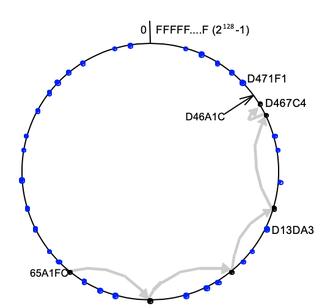
> * The black dots depict live nodes. The blue ones are files. The address space is considered as circular: node 0 is adjacent to node $(2^{128}-1)$. The diagram illustrates the routing from node 65A1FC to D46A1C. This happens at application layer at each PC
<h1 id='Security'>Security</h1>
## What is network security
* Network security is a combo of 4 related areas:
    * Secrecy: Keep information hidden from a general audience
    * Authentication: Ensuring the user you are giving content to has valid credentials
    * Non-repudiation: Prove a content was created by a named user
    * Integrity control: Ensure that a content has not been tampered with
* All of those are equally valid and has been around for all systems for some time, but have different and sometimes more challenging implications in a networked environment
* Aspects of security can be found at all layers of a protocol stack, there is no way to secure a network by building security into one layer only
* Most security implementations are based on common cryptographic principles and appear on almost all layers
## Cryptography
* A key area/set of algorithms for creating secrets, authenticating users, making sure messages are not tampered with, and edits are not denied by the original author
## Encryption
> Encryption Model
>> 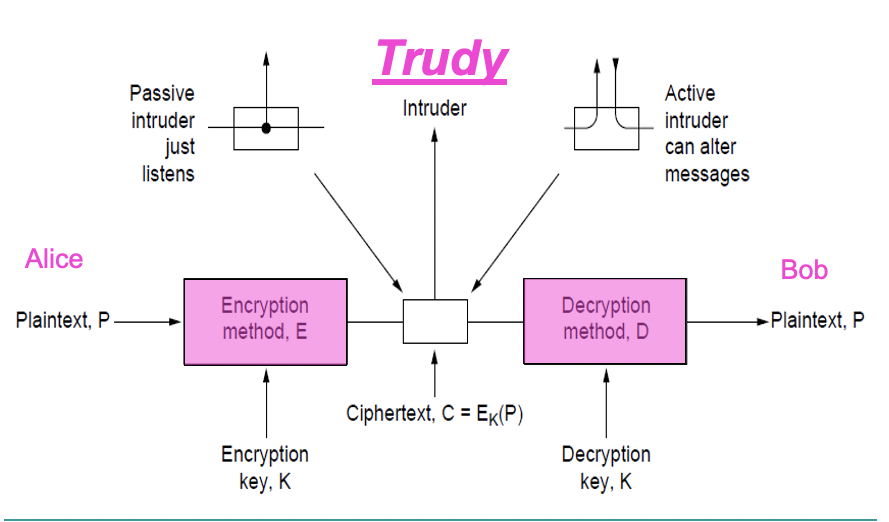
### Key Cryptography Concepts
* Three foundations:
    * Plaintext: Messages to be encrypted can be transformed by a function.
    * Key: A function that parameterized the transformation
    * Ciphertext: The output of the transformation process
* Kerckhoff's principle: Cryptographic algorithms and related functions (E, D) are public; Only the keys (K) are secret
### The notations
* C = Ciphertext
* P = plaintext
* E = Encryption
* D = Decryption
* K = Key
### Keys
* A key is a string that allows the selection of one of many potential encryptions
* The key can be changed as often as required
* Algorithms are more likely to be at the hands of attackers anyhow, not changed as frequently
* Cipher is a term commonly used as the term for algorithm
* The size of the overall key space is determined by the number of bits in the key string
* The longer the key, the more effort is required to break a given encryption
### XOR
* An XOR is an exclusive or function used regularly
* A XOR B means A or B, but not both
* XOR is commonly used in cryptography
> Exclusive ORs
>> 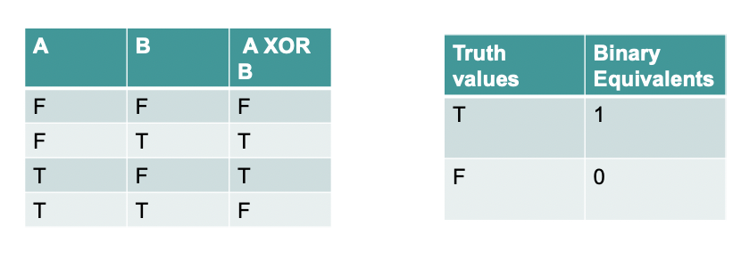
## Main Types of Ciphers
* Substitution cipher: Each letter of group of letters is replaced systematically by other letters or groups of letters
* Transposition cipher: All letters are re-ordered without disguising them
* One-time pad: 
    * Uses a random bit string as the key: convert the plaintext into a bit string, then XOR the two strings bit by bit
    * Harder to break
# Key-based Algorithms
* Symmetric key algorithms: Use the same key for both encryption and decryption. Symmetric key algorithms can use permutation, substitution and a combination of both to encrypt and decrypt
    * 2 Symmetric Key Algorithms:
        * Data Encryption Standard (DES)
            * Uses 64 bit blocks and 56 bit keys
            * $2^{56}$ key space
            * Triple DES has a $3*2^{56}$ key space
        * Advance Encryption Standard(AES)
            * Uses 128 bit blocks and 128 bit keys
            * $2^{128}$ key space
            * Still substitution and permutation based with multiple rounds
## Cipher Block Chaining Mode
* Same text leads to same ciphertext unless something else is done
* In block chaining mode, each plaintext block is XOR with the previous ciphertext block being encrypted
> Example of CBC
>> 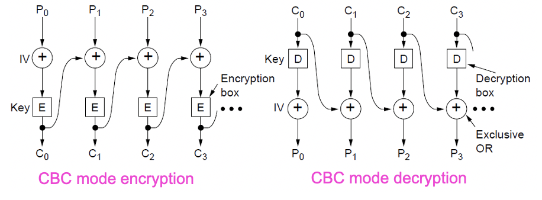
## Cipher Feedback Mode
* In cipher feedback mode, byte-by-byte encryption is used rather than block-by-block encryption
* Good for things like encryption someones key strokes on a keyboard where a lot of data is not immediately available
## Stream Cipher Mode
* In stream cipher mode, recursive sequential block encryption is sued has one-time pad, and XOR with plaintext to generate ciphertext
> Illustration of Stream Cipher Mode
>> 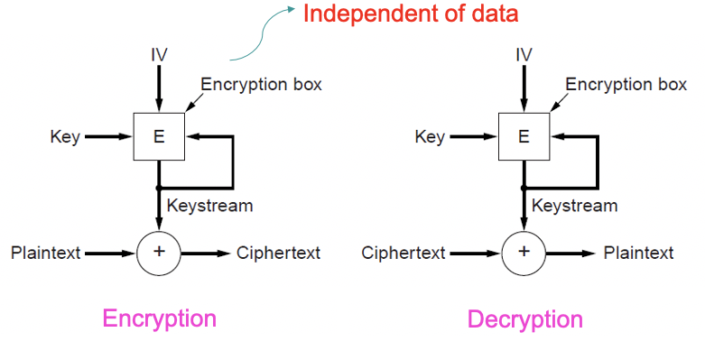
## Counter mode
* In counter mode, plaintext is not directly encrypted, but an initialization parameter plus an arbitrary constant is encrypted and the resulting ciphertext is XOR with plaintext
> Illustration of Counter Mode
>> 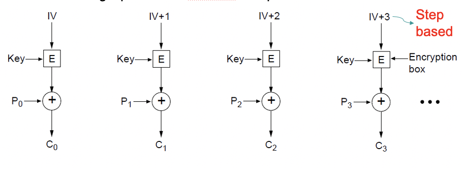
## Symmetric Key Algorithms
|Cipher|Author|Key Length|Comments|
|----|----|----|----|
|Blowfish|Bruce Schneier|1-448 bits|Old and Slow|
|DES|IBM|56 bits|Too weak to use now|
|IDEA|Massey and Xuejia|128 bits|Good, but patented|
|RC4|Ronald Rivest|1-2048 bits|Some keys are weak|
|RC5|Ronald Rivest|128-256 bits|Good, but patented|
|Rijndael|Daemen and Rijmen|128-256 bits|Best choice|
|Serpent|Anderson, Biham, Knudsem|128-256 bits|Very strong|
|Triple DES|IBM|168 bits|Second best choice|
|Twofish|Bruce Schneier|128-256 bits|Very strongly; Widely used|
## Public Key Algorithms
* Fundamentally different to symmetric key ones
* Difff & Hellman proposed the new mode: Asymmetric Keys:
    * Two keys are used
    * Not easily derivable from each other
    * Hence addressing a fundamental issue of key sharing 
## Asymmetric Keys
* Key 1, public key: Usable by anyone to encrypt messages to the owner of the key, this key known to all
* Key 2, private key: Required to decrypt the message and know only by the owner of this key
## The process of asymmetric keys
* C = ciphertext, P = plaintext, E = Encryption, D = Decryption, K1, K2 = keys
### RSA Algorithm
* Key generation:
    * Choose two large primes, p and q
    * Compute n = p * q and z = (p-1) * (q-1)
    * Choose d to be relatively prime to z which means no common factors
    * Find e such that: (d * e) mod z = 1
    * Public key is (e, n) and private key is (d, n)
* Encryption: C = $P^e \ mod \ n$
* Decryption: P = $C^d \ mod \ n$
### RSA Security
* RSA's security is based on the difficulty involved in factoring large numbers in math theory: Approximately $10^25$ years to factor a 500 digit number and RSA uses 1024 bits
* Disadvantage: Too slow for encrypting/decrypting large volumes of data
* RSA is widely used for other things such as secure key distribution
## Digital Signatures
* Cryptographic approaches can also be used to ensure authenticity and allow for non-repudiation
* Requirements:
    * Receiver can verify the claimed identity of the sender
    * Sender cannot deny the created contents of the message
    * Receiver cannot have derived the message themselves
* Approaches:
    * Using symmetric keys via an intermediary
    * Using public keys as individuals
## Signatures with Message Digests
* Basic concept of a message digest is to use a one-way hash function for an arbitrary length of plaintext, so that it becomes a unique small fixed-length bit string
* Thus no need to deal with huge message text and encryption just for authentication purposes
* A message digest (MD) has four important properties:
    1. Given P, it is easy to compute MD(P)
    2. Given MD(P), it is effectively impossible to find P
    3. Given P, no one can find P' such that MD(P') = MD(P)
    4. A change in even a single bit of input produces a very different output
* Famous Message Digest Algorithms:
    * MD5
    * SHA-1
## Public Key Management
* There is specific PK infrastructure to avoid compromising the security of PK's during the initial distribution process
* Certification Authority (CA): A trust intermediary who uses non-electronic identification to identify users prior to certifying keys and certificates
* X.509: An international standard for certificate expression
* PKI (Public Key Infrastructure): Hierarchically structured certificate authorities allow for the establishment of a chain of trust or certification path
## Authentication
* Authentication is a primary tenet of network security
* Authentication process itself needs to be secure also.
* A fundamental principle: Minimize the use of permanent keys in establishment of secure connections. The less packets are exchanged using such keys, the less exposure to potential attackers
* Four methods in common use:
    * Shared keys
    * Key distribution
    * Kerberos
    * Public keys
## Shared Secret Key
> Illustration of Shared Secret Key
>> 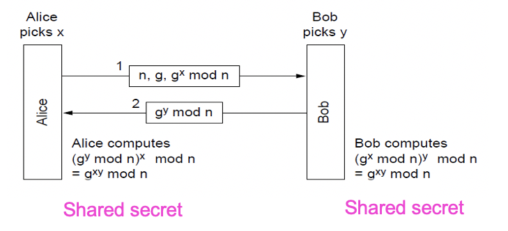
## Key Distribution Center
* A trusted intermediary is used to facilitate
* Users each share a key with a central key distribution center, and authenticate to the KDC directly
* The KDC acts as a relay between the two parties
* Issues: Replay-attack
    * Solution: Timestamps
## Kerberos
* Similar to KDC, Kerberos is a popluar emerged and in frequent use
* A multi-component system is required:
    * Authentication Server
    * Ticket Granting Server (TGS)
    * Recipient
* Authentication is managed centrally, and then party to party communication is facilitated by single use tickets
* Disadvantages: Does not scale to large numbers. Different businesses need to trust each other's TGSs
## Public Keys Cryptography
> Illustration of public key 
>> 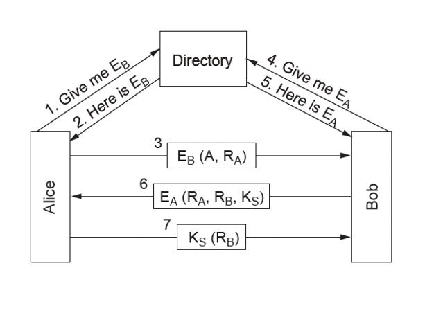
## IPSec
* Position of security: Should be in multiple layers
* One can put security at application level but also other layers
* IPSec (RFC 2401) puts at the network level as well
* In the IPSec model, encryption is compulsory, but a null encryption algorithm can be used between points 
* The main IPSec framework features are secrecy, data integrity, and replay attack protection
* the IPSec framework allows multiple algorithms and multiple levels of granularity, connection-oriented
### Implementation
* IPSec has two main implementation components:
    * Things being added to packets in transit
    * ISAKMP key management: Internet Security Association and Key Management Protocol for establishing keys
* IPSec has 2 modes
    * Transport mode: Uses header insertion after IP header
    * Tunnel mode: Uses packet encapsulation
## Virtual Private Networks
* Unlike a physical network based on leased lines between locations for which secure transit is required
* A virtual private network (VPN) is a virtual layer on top of an IP network which provides a secure end-to-end connection over public infrastructure
* A common VPN implementation model:
    * Use a firewall at each end of a connection
    * Setup a SA to create an IPSec tunnel between the two end points
* Communication on this infrastructure is transparent to end users
> Illustration of VPN
>> 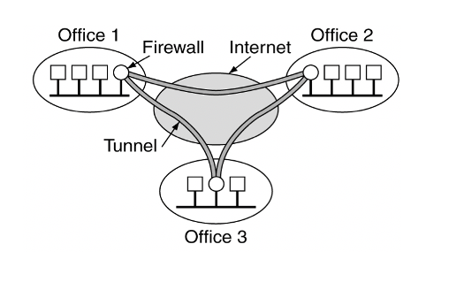
## Firewalls
* While IPSec ensures security in transit, a firewall ensures security at the network perimeter
* Firewalls are positioned at the network boundary, and provide a controlled series of routes between the internal and external networks
* Three characteristics of firewalls:
    * All inbound and outbound traffic must transit the firewall
    * Only authorized traffic must pass through the firewall
    * Firewalls should be immune to penetration themselves
### Firewall scope
* Check packets for bad packets
    * Administrators can write rules for this
* Not everything is inside the wall
* Web servers and email servers need to be exposed to allow more open communication
    * Best firewall is not disconnection everything from the internet
* Through further rules packets go in-between this gray area and the LAN
* Firewalls do not provide protection against inhouse threats
* Applications can still distribute viruses via bad attachments
## Wireless Security Context
* Wired networks are relatively easy to secure because they require physical access to intercept traffic
* Wireless networks are more difficult to secure because of omnidirectional signal propagation
* Additionally by default most wireless network equipment operates in an insecure and promiscuous manner
* 802.11 has a native secure protocol, Wired Equivalency Protocol, which is a 40-bit encryption based on RC4 algorithm
* Two inherent insecurities:
    * 40 bit encryption is breakable with low-moderate computational resources
    * RC4 re-uses keys, so capturing a small volume of encrypted traffic will guarantee key identification
* Additional encryption (128 bit WEP)
    * Increased security through longer key lengths
* MAC Address Filtering
    * Only allow specified MAC interfaces to establish connection
* WPA2
* Multilayered security