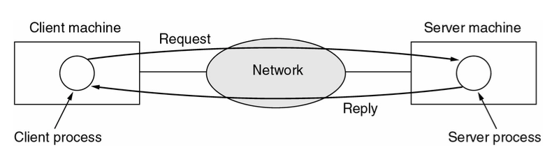
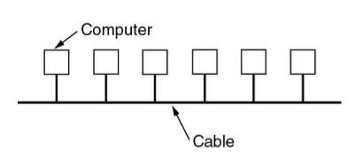
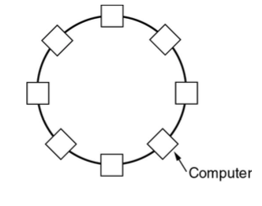
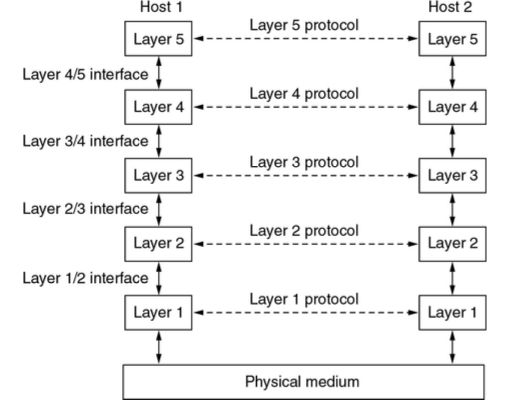
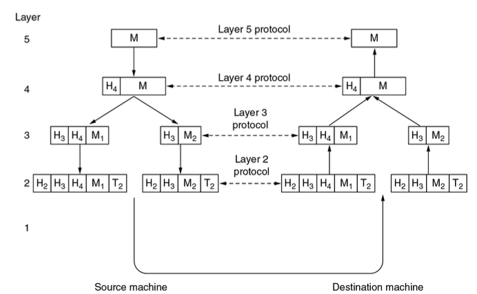
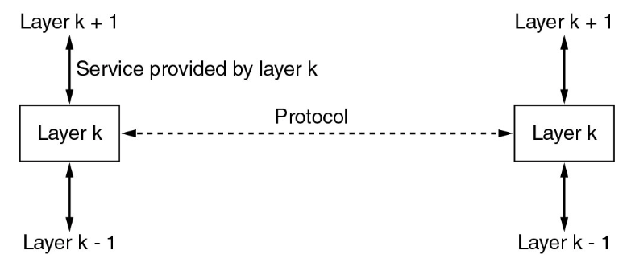

# Week 1 Introduction to Networking
## Terminologies
* A network device: E.g. PC, Router, Switch
* Server: Provider of a service. Accept requests from clients.
* Client: A network device connecting to a server and requesting a service.
* Computer Network: A collection of autonomous computers interconnected by a single technology
* Packet: A message send between two network devices.
* IP Address: A unique number identifying a network device.
## Network vs Computer Network
* Network (Noun):
    * An intricately connected system of things or people
    * An interconnected or intersecting configuration or system of components.
* Computer Network:
    * A data network with computers at one or more of nodes
    * A collection of autonomous computers interconnected by a single technology
### Internet and World Wide Web
* Neither the Internet nor the World Wide Web is a computer network
* The Internet is not a single network but a network of networks
* The World Wide Web is a distributed system that runs on top of the Internet
## Computer networks
* Usage
    * Business Applications:
        * Resources sharing
    * Home Applications:
        * Access to remote information
        * Interactive entertainment
        * E-commerce
    * Mobile Users
        * Mobility
        * Internet-of-things (E.g. parking, smart-center, vending machines)
    * Social Interactions
* Origins: Simple Client-Server Networking
    * A network with two clients and one server
> Example of Client and Server Model
>> 
## Differentiating Factors of Networks
* Types of transmission technology
    * Broadcast link
        * Broadcast networks have a single communication channel shared bu all machines on a network. Packets sent by any machine are received by all others, an address field in the packet specifies the intended recipient. Intended recipients process the packet contents others simply ignore it.
        * Broadcasting is a mode of operation which allows a packet to be transmitted that every machines in the network must process
    * Point-to-point Links
        * Data from sender machine is not seen and process by other machines
        * Point to point networks consist of connections between individual pairs of machines. Packets travelling from source to destination must visit intermediate machines to determine a route or multiple routes of variant efficiencies are available and optimization is an important principle
        * Unicasting is the term where point-to-point networks with a single sender and receiver pair can exchange data
    * Multicasting
        * Transmission to a subset of the machines
### Differentiating by Scale
> |Interprocessor Distance|Processors located in same|Example|
>|----|----|----|----|
>|1m|Square Meter|Personal Area Network|
>|10m|Room|Local Area Network|
>|100m|Building|Local Area Network|
>|1km|Campus|Local Area Network|
>|10km|City|Metropolitan Area Network|
>|100km|Country|Wide Area Network|
>|1000km|Continent|Wide Area Network|
>|10000km|Planet|The Internet|
### Mixing taxonomies
* Local Area Networks can further be distinguished by three factors:
    * Size
    * Transmission Technology: Physically wired network
    * Topology:
        * Bus: Only a single machine on the network can transmit at any point in time requires a negotiation mechanism to resolve transmission conflicts: Ethernet is the most common bus network
        > Example of Bus network structure:
        >> 
        * Ring: Each transmission bit is propagated individually and requires access control to resolve propagation queuing. E.g. Token Ring
        > Example of Ring network structure:
        >> 
## Components of the Internet
* Protocols, Layers, and Services
    * Protocol Hierarchies
    * Design of Layer Models
    * Connection-Oriented and Connectionless Service Types
    * Service Primitives
    * Service and Protocols
* Network Reference Models
    * Open Systems Interconnect
    * TCP/IP
* Network Standards
## Protocol Hierarchies
* Consider the network as a stack of layers
* Each layer offers services to layer above it
* Inter-layer exchanges are conducted according to a protocol
> Example of a protocol hierarchies
>> 
> Example of information flow supporting virtual communication in Layer 5
>> 
## Design Issues for the Layers
* Connection Oriented: Connect -> Use -> Disconnect (similar to telephone service)
    * Negotiation inherent in connection setup
* Connectionless: Just sent (similar to postal service)
* Choice of service type has corresponding impact on the reliability and quality of the service itself.
## Connection-Oriented and Connectionless services
* Six different types of services:
>|Type|Service|Example|
>|----|----|----|
>|Connection-Oriented|Reliable Message Stream|Sequence of pages|
>|Connection-Oriented|Reliable byte stream|Remote login|
>|Connection-Oriented|Unreliable connection|Digitized voice|
>|Connectionless|Unreliable datagram|Electronic junk mail|
>|Connectionless|Acknowledge datagram|Registered mail|
>|Connectionless|Request-reply|Database query|
## Service Primitives
* Primitives are formal set of operations for services
* The number and type of primitives in any particular context is dependent on nature of service itself - in general more complex services require more primitive service
* Six service primitive for implementing a simple connection-oriented service:
>|Primitive|Meaning|
>|----|----|
>|LISTEN|Block waiting for an incoming connection|
>|CONNECT|Establish a connection with a waiting peer|
>|ACCEPT|Accept an incoming connection from a peer|
>|RECEIVE|Block waiting for an incoming message|
>|SEND|Send a message to the peer|
>|DISCONNECT|Terminate a connection|
## Relationship of Services and Protocols
* Service is a set of primitives that a layer provides to a layer above it
    * Defines what operations the layer is prepared to perform on behalf of its users
    * It says nothing about how these operations are implemented
    * Interfaces between layers
* Protocol is a set of rules governing the format and meaning of packets that are exchanged by peers within a layer
    * Packets sent between peer entities
> The relationship between Services and Protocol:
>> 
## Reference Models
* Example of reference model
    * The  OSI Reference Model
    * The  TCP/IP Reference Model
* A reference model provides a common baseline for the development of many services and protocols by independent parties
* Since networks are very complex systems, a reference model can serve to simplify the design process
* It's engineering best practice to have an abstract reference model, and corresponding implementations are always required for validation purposes. 