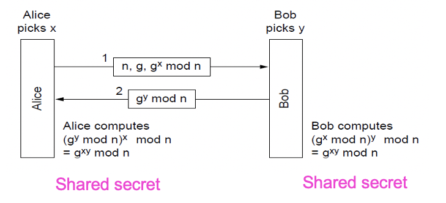
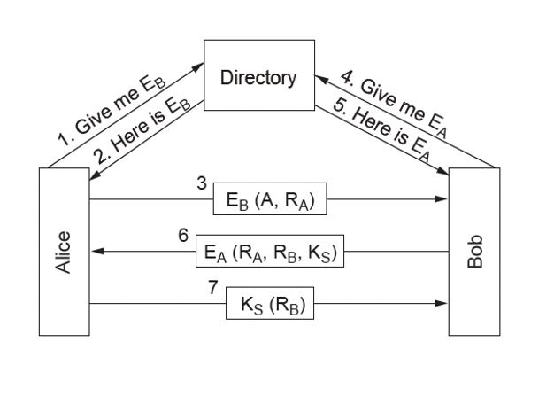
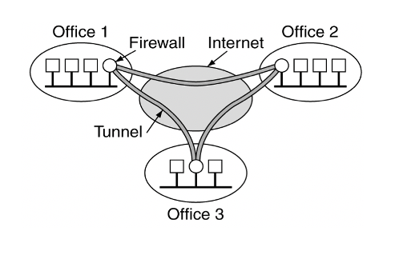

# Week 10 Security
## Public Key Algorithms
* Fundamentally different to symmetric key ones
* Difff & Hellman proposed the new mode: Asymmetric Keys:
    * Two keys are used
    * Not easily derivable from each other
    * Hence addressing a fundamental issue of key sharing 
## Asymmetric Keys
* Key 1, public key: Usable by anyone to encrypt messages to the owner of the key, this key known to all
* Key 2, private key: Required to decrypt the message and know only by the owner of this key
## The process of asymmetric keys
* C = ciphertext, P = plaintext, E = Encryption, D = Decryption, K1, K2 = keys
### RSA Algorithm
* Key generation:
    * Choose two large primes, p and q
    * Compute n = p * q and z = (p-1) * (q-1)
    * Choose d to be relatively prime to z which means no common factors
    * Find e such that: (d * e) mod z = 1
    * Public key is (e, n) and private key is (d, n)
* Encryption: C = $P^e \ mod \ n$
* Decryption: P = $C^d \ mod \ n$
### RSA Security
* RSA's security is based on the difficulty involved in factoring large numbers in math theory: Approximately $10^25$ years to factor a 500 digit number and RSA uses 1024 bits
* Disadvantage: Too slow for encrypting/decrypting large volumes of data
* RSA is widely used for other things such as secure key distribution
## Digital Signatures
* Cryptographic approaches can also be used to ensure authenticity and allow for non-repudiation
* Requirements:
    * Receiver can verify the claimed identity of the sender
    * Sender cannot deny the created contents of the message
    * Receiver cannot have derived the message themselves
* Approaches:
    * Using symmetric keys via an intermediary
    * Using public keys as individuals
## Signatures with Message Digests
* Basic concept of a message digest is to use a one-way hash function for an arbitrary length of plaintext, so that it becomes a unique small fixed-length bit string
* Thus no need to deal with huge message text and encryption just for authentication purposes
* A message digest (MD) has four important properties:
    1. Given P, it is easy to compute MD(P)
    2. Given MD(P), it is effectively impossible to find P
    3. Given P, no one can find P' such that MD(P') = MD(P)
    4. A change in even a single bit of input produces a very different output
* Famous Message Digest Algorithms:
    * MD5
    * SHA-1
## Public Key Management
* There is specific PK infrastructure to avoid compromising the security of PK's during the initial distribution process
* Certification Authority (CA): A trust intermediary who uses non-electronic identification to identify users prior to certifying keys and certificates
* X.509: An international standard for certificate expression
* PKI (Public Key Infrastructure): Hierarchically structured certificate authorities allow for the establishment of a chain of trust or certification path
## Authentication
* Authentication is a primary tenet of network security
* Authentication process itself needs to be secure also.
* A fundamental principle: Minimize the use of permanent keys in establishment of secure connections. The less packets are exchanged using such keys, the less exposure to potential attackers
* Four methods in common use:
    * Shared keys
    * Key distribution
    * Kerberos
    * Public keys
## Shared Secret Key
> Illustration of Shared Secret Key
>> 
## Key Distribution Center
* A trusted intermediary is used to facilitate
* Users each share a key with a central key distribution center, and authenticate to the KDC directly
* The KDC acts as a relay between the two parties
* Issues: Replay-attack
    * Solution: Timestamps
## Kerberos
* Similar to KDC, Kerberos is a popluar emerged and in frequent use
* A multi-component system is required:
    * Authentication Server
    * Ticket Granting Server (TGS)
    * Recipient
* Authentication is managed centrally, and then party to party communication is facilitated by single use tickets
* Disadvantages: Does not scale to large numbers. Different businesses need to trust each other's TGSs
## Public Keys Cryptography
> Illustration of public key 
>> 
## IPSec
* Position of security: Should be in multiple layers
* One can put security at application level but also other layers
* IPSec (RFC 2401) puts at the network level as well
* In the IPSec model, encryption is compulsory, but a null encryption algorithm can be used between points 
* The main IPSec framework features are secrecy, data integrity, and replay attack protection
* the IPSec framework allows multiple algorithms and multiple levels of granularity, connection-oriented
### Implementation
* IPSec has two main implementation components:
    * Things being added to packets in transit
    * ISAKMP key management: Internet Security Association and Key Management Protocol for establishing keys
* IPSec has 2 modes
    * Transport mode: Uses header insertion after IP header
    * Tunnel mode: Uses packet encapsulation
## Virtual Private Networks
* Unlike a physical network based on leased lines between locations for which secure transit is required
* A virtual private network (VPN) is a virtual layer on top of an IP network which provides a secure end-to-end connection over public infrastructure
* A common VPN implementation model:
    * Use a firewall at each end of a connection
    * Setup a SA to create an IPSec tunnel between the two end points
* Communication on this infrastructure is transparent to end users
> Illustration of VPN
>> 
## Firewalls
* While IPSec ensures security in transit, a firewall ensures security at the network perimeter
* Firewalls are positioned at the network boundary, and provide a controlled series of routes between the internal and external networks
* Three characteristics of firewalls:
    * All inbound and outbound traffic must transit the firewall
    * Only authorized traffic must pass through the firewall
    * Firewalls should be immune to penetration themselves
### Firewall scope
* Check packets for bad packets
    * Administrators can write rules for this
* Not everything is inside the wall
* Web servers and email servers need to be exposed to allow more open communication
    * Best firewall is not disconnection everything from the internet
* Through further rules packets go in-between this gray area and the LAN
* Firewalls do not provide protection against inhouse threats
* Applications can still distribute viruses via bad attachments
## Wireless Security Context
* Wired networks are relatively easy to secure because they require physical access to intercept traffic
* Wireless networks are more difficult to secure because of omnidirectional signal propagation
* Additionally by default most wireless network equipment operates in an insecure and promiscuous manner
* 802.11 has a native secure protocol, Wired Equivalency Protocol, which is a 40-bit encryption based on RC4 algorithm
* Two inherent insecurities:
    * 40 bit encryption is breakable with low-moderate computational resources
    * RC4 re-uses keys, so capturing a small volume of encrypted traffic will guarantee key identification
* Additional encryption (128 bit WEP)
    * Increased security through longer key lengths
* MAC Address Filtering
    * Only allow specified MAC interfaces to establish connection
* WPA2
* Multilayered security