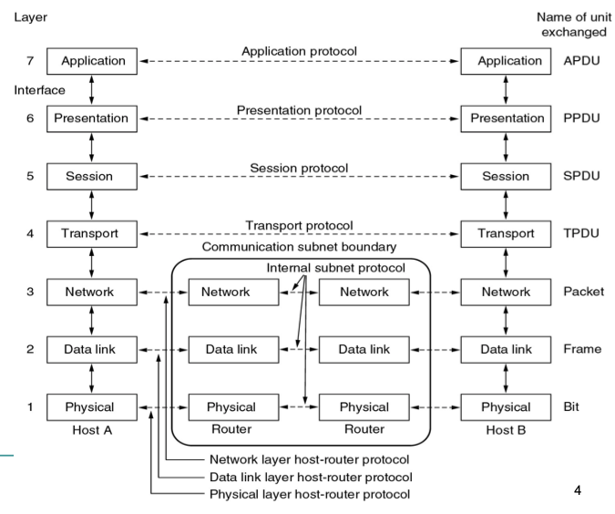
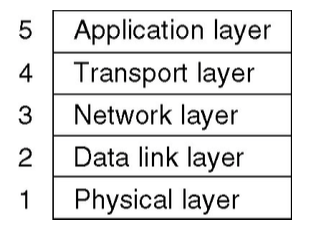
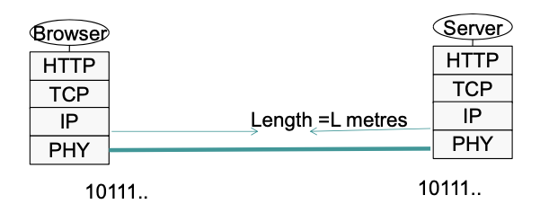
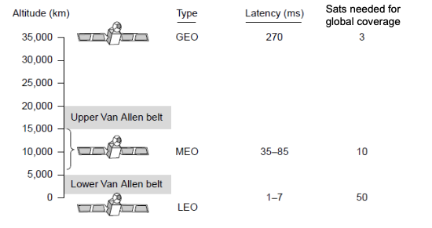
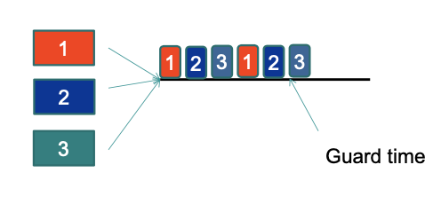
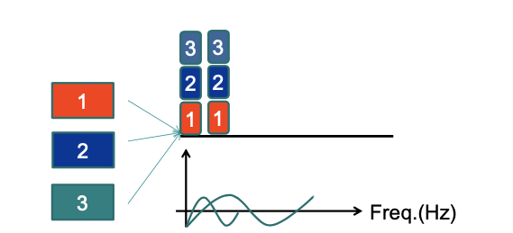
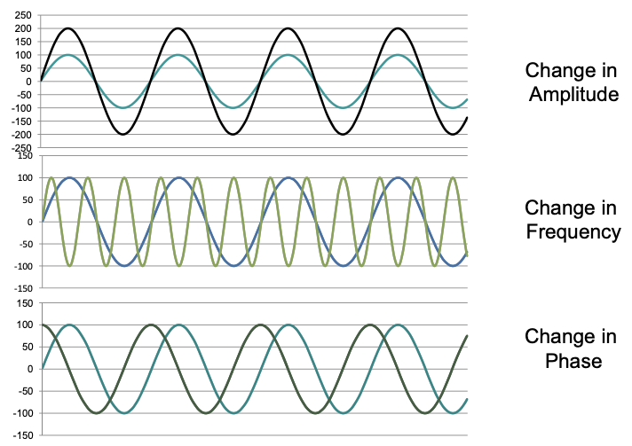
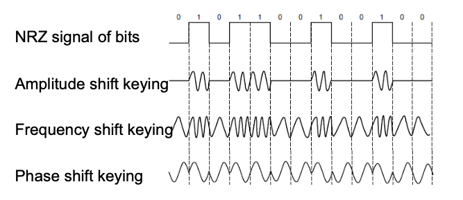
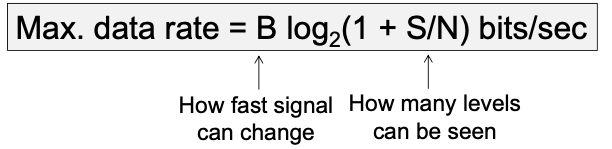

# Week 2 Introduction to Networking
## OSI Reference Model
* Open Systems Interconnection
* Has 7 layers
* Layer divisions based on principled decisions
### OSI Layer Division Principles
1. A layer should be created where a different abstraction is needed
2. Each layer should perform a well defined function
3. The function of each layer should be chosen with a view toward defining internationally standardized protocols
4. The layer boundaries should be chosen to minimize the information flow across the interfaces
5. The number of layers should be large enough that distinct functions need not to be thrown together in the same layer out of necessity, and small enough that the architecture does not become unwieldy
> Structure of OSI Model
>> 
## TCP/IP Model
* Transmission Control Protocol/Internet Protocol
* Has 4 layers
> Structure of TCP/IP Model
>> 
## Comparison of OSI and TCP/IP Models
### Critique of OSI Model
* Bad Timing
* Bad Technology
* Bad implementations
* Bad politics
### Critique of TCP/IP Model
* Service, interface and protocol not distinguished 
* Not a general model
* Host-to-Network layer not really a lay but an interface between network and data link layers
* No mention of physical and data link layers
* Minor protocols deeply entrenched, hard to replace
## Hybrid model
* An hybrid model of OSI model and TCP/IP model
> Structure of the Hybrid Model
>> 
## Network Standardization
|Body|Area|Examples|
|----|----|----|
|ITU (International Telecommunication Union)|Telecommunications|ADSL, PON, MPEG4|
|IEEE (Institute of Electrical and Electronics Engineers)|Communications|Ethernet, WiFi|
|IETF (Internet Engineering Task Force)|Internet|HTTP/1.1, DNS|
|W3C (The World Wide Web Consortium)|Web|HTML5 standard|
# Physical Layer
## What is the Physical Layer
* The physical layer is the lowest layer in OSI model
* The physical layer's properties in TCP/IP model are in the host-to-network division
* The physical layer is concerned with the mechanical, electrical and timing interfaces of the network
* Various physical media can be sued to transmit data, but all of them are affected by a range of physical properties and hence have distinct differences
### Link Model
* Simplified Link Model: Consider the network as a connected link between computers.
> Example of Link Model
>> 
* Bandwidth is usually treated as rate of transmission in bits/second
* Delay (in seconds) is the time required for the first bit to travel from computer A to computer B.
## Message Latency
* Latency is the delay associated with sending a message over a link
* This is made up of two parts related to the link model:
    * Transmission delay:
        * T-delay = Message in bits / Rate of transmission = M/R (seconds)
    * Propagation delay:
        * P-delay = Length of the channel / speed of signals 
    * Latency = M/R + P-delay
## Twisted Pair
* Construction:
    * Two insulated copper wires, twisted in helical form
    * Twisting reduces radiance of waves from effectively parallel antennae
    * Distance up to < 5km, repeaters can extend this distance
    * Twisting reduces interference
* Properties and Types of Twisted Pair:
    * Bandwidth dependent on distance, wire quality/density
    * Cat 3: 2 wires, 4 pairs in sheath, 16 Mhz
    * Cat 5: 2 wires, 4 pair in sheath, more twists, 100 Mhz
    * Cat 6: 250 Mhz
## Coaxial Cable ("Co-ax")
* Better shielding than twisted pair = higher speeds
* Copper core with insulation, mesh, and sheath
* Bandwidth approaches 1 Ghz
* Still widely used for cable TV/Internet
## Fiber Optics
* Optical transmission has three components:
    * Light source
    * Transmission medium
    * Detector
* Semantics: light = 1, no light = 0 
* Data transmission over a fiber of glass
* A detector generates electrical pulse when light hits it
* Common for high rates and long distances
* Fiber has enormous bandwidth and tiny signal loss - hence high rates over long distances
* Types of Fiber Optics:
    * Single-mode:
        * Core so narrow light can't even bounce around
        * Used with laser for long distances
    * Multi-mode:
        * Other main type of fiber
        * Light can bounce
        * Used with LEDs for cheaper, shorter distance links
* Fiber optic connections:
    * Connector and Fiber sockets (10-20% loss, but easy to configure)
    * Mechanical Splice (10% loss, labor intensive)
    * Fusion (<1% loss, but very specialized)
* Fiber optic cable is a scalable network media - LAN, WAN
* Fiber optic cable can be considered either as a ring or as a bus network type
## Comparison of Wires and Fiber
|Property|Wires|Fiber|
|----|----|----|
|Distance|Short (100s of m)| Long (10s of km)|
|Bandwidth|Moderate|Very high|
|Cost|Inexpensive|More Expensive|
|Convenience|Easy to use|Harder to use|
|Security|Easy to tap|Hard to tap|
## Wireless Transmission
* Mobile users requires a mobility enabled network
* Wireless networks can provide advantages even in fixed location environments
* There are many types of wireless data transmission networks, but they all have a common basis: radio wave propagation
* Wireless signals are broadcasted over a region
* Potential signal collisions 
### Electromagnetic Spectrum
* Number of oscillations per second of a wave is called frequency , measured in Hz
* Distance between two consecutive minima or maxima is called wavelength
* All electromagnetic waves travel at same speed
* Fundamental relationship:
    * Wavelength * Frequency = Speed of Light
## Wireless vs. Wires/Fiber
* Wireless:
    * Easy and inexpensive to deploy
    * Naturally supports mobility
    * Naturally supports broadcast
    * Transmissions interfere and must be managed
    * Signal strengths hence data rates vary greatly 
* Wires/Fiber
    * Easy to engineer a fixed data rate over point-to-point links
    * Can be expensive to deploy
    * Does not readily support mobility or broadcast
## Communication Satellites
* Satellites are effective for broadcast distribution and anywhere/anytime communications
### Kinds of Satellites
* Geostationary Satellite (GEO):
    * 35000 km above a fixed location
    * VSAT computers can communicate with the help of a hub
    * Different bands in the GHz are in use but may be crowded or susceptible to rain
* Low-Earth Orbit Satellites (LEO)
    * Systems such as Iridium use many low-latency satellites for coverage and route communications via them
> Different Satellites' high distribution
>> 
## Satellite vs. Fiber
* Satellite:
    * Can rapidly set up anywhere/anytime communications after satellites have been launched
    * Can broadcast to large regions
    * Limited bandwidth and interference to manage
* Fiber:
    * Enormous bandwidth over long distances
    * Installation can be more expensive/difficult
## Bits to a Link
* Model types:
    * Full-duplex Link: Used for transmission in both directions at once. E.g. Use different twisted pairs for each direction
    * Half-duplex Link: Both directions, but not at the same time. Senders take turns on a wireless channel
    * Simplex Link: Only one fixed directions at all times; Not very common
### Multiplexing
* When multiple sources want to put things onto a medium
    * Time Division Multiplexing:
        * Users can send according to a fixed schedule
        * Slotted access to the full speed of the media
        > Example of Time Division Multiplexing:
        >> 
    * Frequency Division Multiplexing
        * Users can only use specific frequencies to send their data
        * Continuous access with lower speed
        > Example of Frequency Division Multiplexing:
        >> 
    * Statistical Multiplexing
    * Code Division Multiple Access
## How bits look as a signal
* Information on wire transmitted by variance of a physical property
* Generating a periodic function
* Three things can change the behaviour of the function: Amplitude, Frequency, and Phase
> Change in Amplitude, Frequency, and Phase of a function:
>> 
### Modulation Types
> Modulating the amplitude, frequency or phase of a carrier signal sends bits in a frequency range:
>> 
## Maximum Data Rate of a Channel
### Nyquist's theorem
* If a function contains no frequencies higher than B Hz then it is completely determined by looking at a set of points spaced 1/2B apart
* Nyquist's theorem relates the data rate to the bandwidth (B) in Hz of a signal and the number of signal levels V used:
> 
### Shannon's Theorem
* Shannon's theorem relates the data rate to the bandwidth (B) and signal strength (S) relative to the noise (N):
> 
