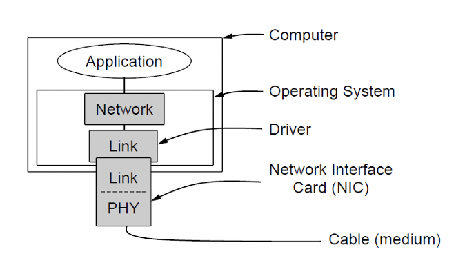
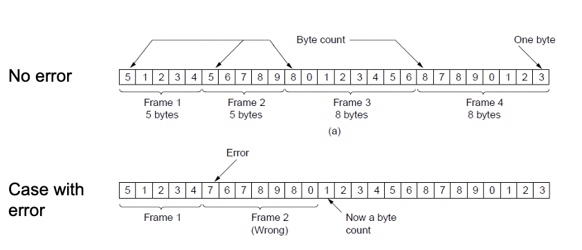
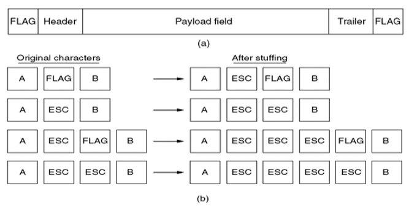
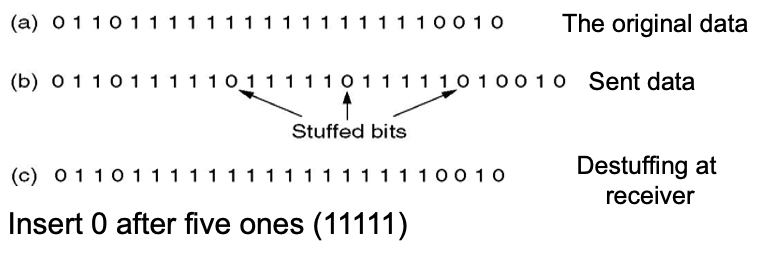
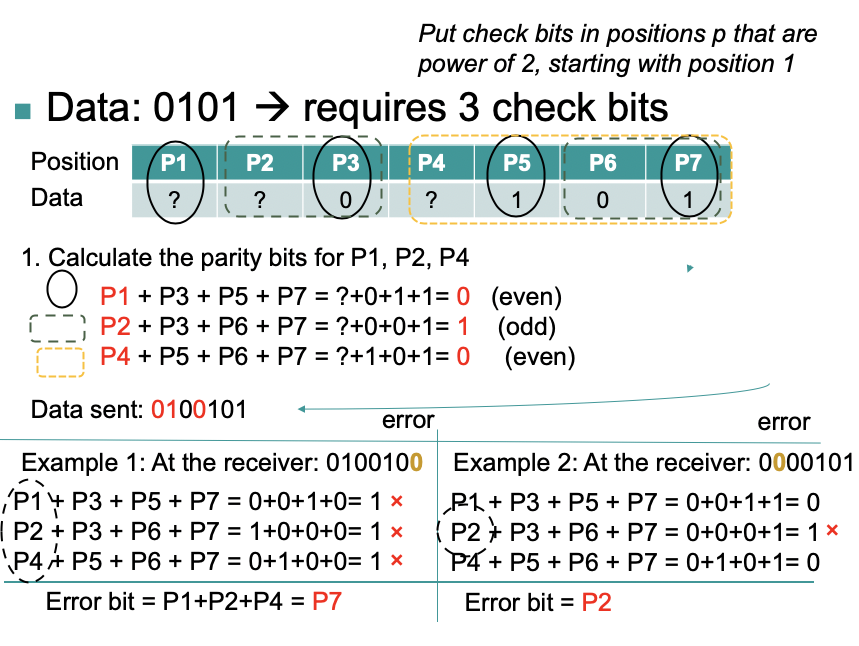

# Week 3 Data Link Layer
## The Data Link Layer in OSI and TCP/IP
* Reliable, efficient communication of frames between two adjacent machines
* Handles transmission errors and flow control
## Functions and Methods of the Data Link Layer
* Function of the data link layer:
    * Provide a well-defined service interface to network layer
    * Handling transmission errors
    * Data flow regulation
* Primary method: Take packets from network layer, and encapsulate them into frames. A frame contains a header, a payload and a trailer.
### Relationship between Packets and Frames
* Data Link layer accepts packets from the network layer, and encapsulates them into frames that it sends using the physical layer, reception is the opposite process
> Implementation of a Data Link Layer:
>> 
## Type of Services
* Connection-Oriented vs. Connectionless: Whether a connection is setup before sending a message
* Acknowledged vs Unacknowledged: Whether the service provider give the service user an acknowledgement upon delivering the message
## Service Provided to Network Layer
* Principal concern is transferring data from network layer on source host to network layer on destination host
* Services provided:
    * Unacknowledged connectionless service
        * Source host transmits independent frames to recipient host with no acknowledgement
        * No logical connection establishment or release
        * No lost frame recovery mechanism
        * E.g. Ethernet LANs
        * Real-time traffic
    * Acknowledged connectionless service
        * Source host transmits independent frames to recipient host with acknowledgement
        * No logical connection establishment or release
        * Each frame individually acknowledged and retransmission if lost or errors
        * E.g. Wireless(IEEE 802.11 WiFi)
    * Acknowledged connection-oriented service
        * Source host transmits independent frames to recipient host after connection establishment and with acknowledgement
        * Connection established and released. Communicate rate and details of message
        * Frames are numbered, counted, acknowledged with logical order enforced
        * Unreliable links such as statellite channel or long distance telephone circuit
## Framing
* Physical layer provides no guarantee a raw stream of bits is error free
* Framing is the method used by data link layer to break raw bit stream into discrete unites and generate a checksum for the unit
* Checksums can be computed and embedded at the source, then computed and compared at the destination. Checksum = f(payload)
* The primary purpose of framing is to provide some level of reliability over the unreliable physical layer
### Framing Methods
* Framing methods:
    * Character count
        * Use a field in the frame header to specify the number of characters in a frame
        > Example of character counts
        >> 
    * Flag bytes with byte stuffing
        * Each frame starts and ends with a special byte: flag byte
        > Example of flag bytes with byte stuffing
        >> 
    * Start and end flags with bit stuffing
        * Frames contain an arbitrary number of bits and allow character codes
        * With an arbitrary number of bits per character
        * Each frame begins and ends with a special bit pattern
        > Start and end flags with bit stuffing
        >> 
* Most data link protocols use a combination of character count and one other method
## Error Control
* Ensuring that a garbled message by the physical layer is not considered as the original message by the receiver by adding check bits
* Error control deals with:
    * Detecting the error 
    * Correcting the error
    * Re-transmitting lost frames
* Data link layer deals with bit errors
### Error Detection and Correction
* Physical media may be subject to errors
* Errors may occur randomly or in bursts
* Bursts of errors are easier to detect but harder to resolve
* Resolution needs to occur before handing data to network layer
* Key issues:
    * Fast mechanism and low computational overhead
    * Detection of different kinds of error
    * Minimum amount of extra bits send with the data
### Error Bounds: Hamming distance
* Code turns data of n bits into codewords of n+k 
* Hamming distance is the minimum bit flips to turn one valid codeword into any other valid one.
> Example with 4 codewords ob 10 bits (n=2, k=8)
> * 0000000000
> * 0000011111
> * 1111100000
> * 1111111111
> The Hamming distance is 5
* Bounds for a code with distance:
    * 2d+1 can correct d errors
    * d+1 can detect d errors
### Hamming Codes
* n = 2*k - k - 1 (n is the number of data, k is the check bits)
* Put check bits in positions p that are power of 2, starting with position 1.
> Example of Hamming Codes
> Data: 0101, Requires 3 check bits: n = 4, therefore:
> 4 = (2^3) - 3 - 1
> Example of Hamming Code
>> 