# Week 4 Data Link Layer
## Error Correcting Codes Key Points
* More efficient in noisy transmission media
* Challenge is that the error can be in the check bits
* Assumption on a specific number of errors occurring in transmission
## Error Detecting Codes
* More efficient in some transmission media
* Types of error detecting codes:
    * Parity (1 bit): Hamming distance = 2
    * Checksum (16 bits): Hamming distance = 2
    * Cyclical Redundancy Check (Standard 32 bit CRC): Hamming distance = 4
### How does error detecting codes works
* Sender calculates R check bits using a function of data bits
* Receiver receive the codeword and calculates the same function on the data and match the results with received data check bits
### Parity Bit
* E.g. 10001110 is data and count the number of 1s
> Received: 100011100(For even parity)/100011101(For odd parity) and then transfer
> Check the transferred data for errors on arrival and can catch:
>> 2 - 1 = 1 error bit can be detected 
>> and 
>> (2 - 1)/2 = 0.5 which not even 1 bit error can be corrected
## Checksum
* There are different variation of checksum
* Internet checksum (16-bit word): Sum modulo 2^16 and adding any overflow of high order bits back into low-order bits
> Example of Checksum for data 00110 10001 11001 01011
>> 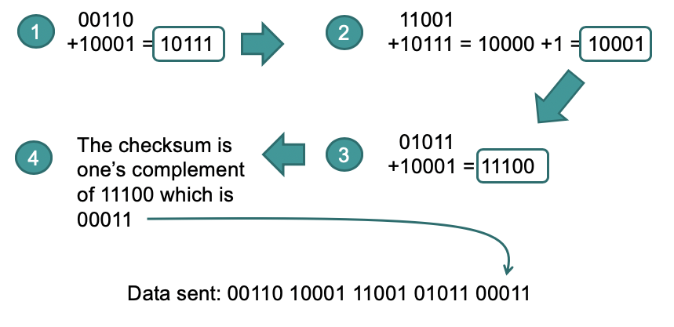
## Cyclic Redundancy Check 
* Based on a generator polynomial G(x)
> Example: G(x) = x^4 + x + 1(10011)
> * Let r be the degree of G(x) therefore r = 4. Append r zero bits to the low-order end of the frame so it now contains m + r bits and corresponds to the polynomial x^r * M(x)
> * Divide the bit string corresponding to G(x) into the bit string corresponding to x^r * M(x), using modulo 2 division
> * Subtract the remainder from the bit string corresponding to x^r * M(x) using modulo 2 subtraction. The result is the checksum frame to be transmitted. Call its polynomial T(x)
>> 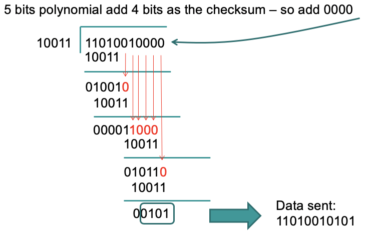
## Data Transmission
* A service to send message should have:
    * Reliability 
        * Each layer need to make sure the service provided to other layers is reliable
        * Retransmission with error detection is a way of ensuring reliability
        * Error correction is another way but has its own shortcomings
    * Flow Control
        * The fast sender vs. slow receivers requires a solution
        * Principles to control when sender can send next frame
            * Feedback based flow control is usually used in Data Link Layer
            * Rate based flow control
## Acknowledged transmission
* Data transmitted in one direction
* Time is relatively important, buffer space constrained        
> Example of Acknowledged Transmission
>> 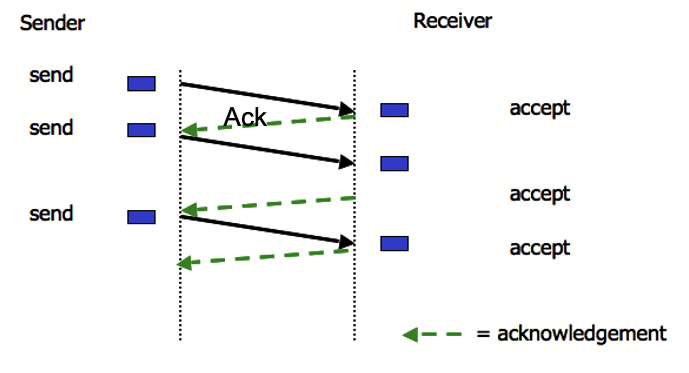
## Noisy Channel Protocol
* Frames can be lost either entirely or partially
* Requires distinction between frames already sent/received and those being re-transmitted
* Requires timeout function to determine arrival or non-arrival of complete frames
## Stop and Wait Protocol
* Concept of ARQ (Automatic Repeat reQuest)
    * Ack and Timeout
* Stop and Wait
    * One bit Ack
> Example of Stop and Wait Protocol
>> 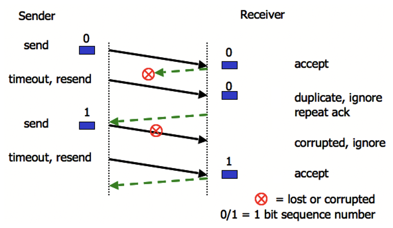
### Link Utilization 
* Principle of efficiency in communication is measured by Link Utilization (U)
> Let B be the bit-rate of the link and L be the length of the frame.
> Tf = Time needed to transmit a frame of length L
> Tp = Propagation delay of the channel
> Ta = Time for transmitting an Ack 
> So Tf = L/B. Assume that Ta = 0, Tt = Tf + 2 * Tp
> U = (Time of transmitting a frame)/(Total time for the transfer) = Tf/Tt = Tf / (Tf+2Tp) = (L/B)/(L/B + 2Tp) = L/(L + 2 * Tp * B)
## Sliding Window Protocols
* Data is commonly transmitted in both direction simultaneously
* Sender maintains a set of sequence numbers corresponding to frames it is allowed to send
* Receiver maintains a set of sequence numbers corresponding to frames it is allowed to accept
* Stop and Wait can be seen as a special case with window size 1
### Protocol Using Go-Back-N
* Long transmission times need to be taken into account when programming timeouts
* Senders don't need to wait for acknowledgement for each frame before sending next frame
> Example of Go-Back-N protocol
>> 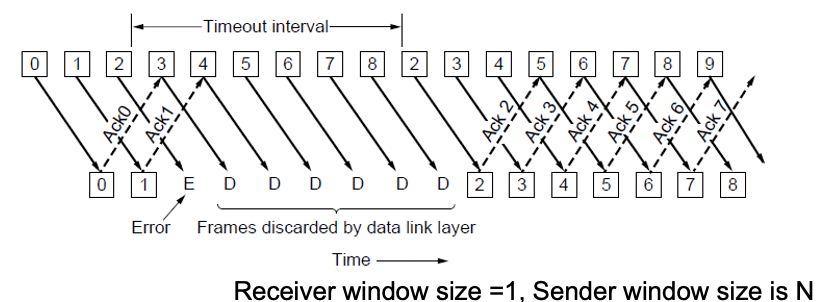
### Selective Repeat
* Receiver accepts frames anywhere in receive window
    * Cumulative ack indicate highest in-order frame
    * NAK (negative ack) causes sender retransmission of missing frame before a timeout resend window
> Example of Selective Repeat
>> 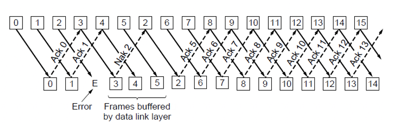
### Go-Back-N vs. Selective Repeat
* Go-Back-N: Receiver discards all subsequent frames from error point, sending no acknowledgement, until the next frame in sequence
* Selective Repeat: Receiver buffers good frames after an error point, and relies on sender to resend oldest unacknowledged frames
* Trade-off between efficient use of bandwidth and data link layer buffer space
## Packet over SONET
* Packer over SONET is the method used to carry IP packets over SONET optical fiber links
    * Uses PPP (Point-to-Point Protocol) for framing
> Structure of Packet over SONET
>> 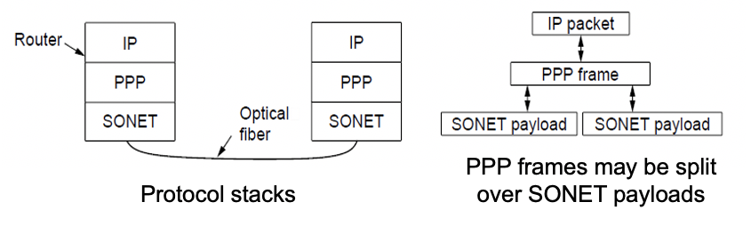
### PPP
* PPP (Point-to-Point Protocol) is a general method for delivering packets across links
    * Framing uses a flag (0x7E) and byte stuffing
    * Unnumbered mode (connectionless unacknowledged service) is used
    * Errors are detected with checksum
> Example of a PPP packet
>> 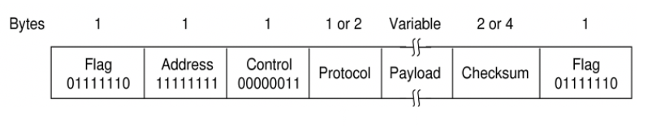
## ADSL
* Widely used for broadband Internet over local loops
    * ADSL runs from modem to DSLAM
    * IP packets are sent over PPP and AAL5/ATM
> Example structure of ADSL
>> 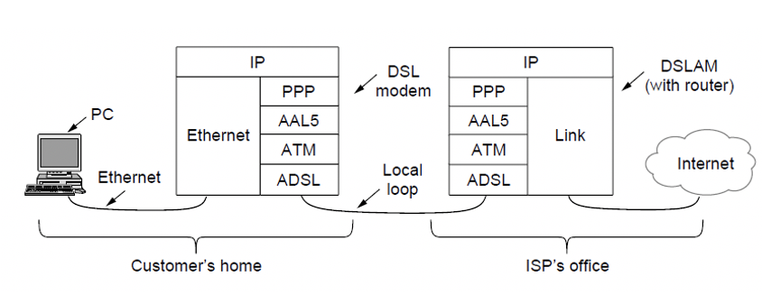
* PPP data is sent in AAL5 frames over ATM cells: 
    * ATM is a data link layer that uses short, fixed-size cells and each cell has a virtual circuit identifier
    * ALL5 is a format to send packets over ATM
    * PPP frame is converted to a AAL5 frame (PPPoA)
> Example of AAL5 Frame
>> 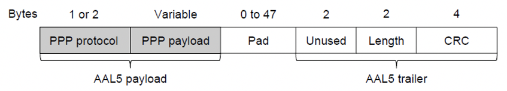
# MAC Sub-layer
## MAC Sub-layer
* On point to point networks, there are only singular sender and receiver pairs, eliminating transmission contention
* On broadcast networks, determining right to transmit is a complex problem
* Medium Access Control (MAC) sub-layer is used to assist in resolving transmission conflicts
## Channel Allocation Mechanisms
* Various methods exist for allocation a single broadcast channel amongst competing users
    * Static Channel Allocation
    * Dynamic Channel Allocation
### Static Channel Allocation
* Arbitrary division of a channel into segments and each user allocated allocated a dedicated segment for transmission
* Frequency Division Multiplexing (FDM) is typically used
* Significant inefficiencies arise when:
    * Number of senders is greater than allocated segments
    * Number of senders is not static
    * Traffic is bursty
* Downfalls:
    * Usually good for fixed number of users
    * Network traffic is busty
        * TDM and FDM try to give consistent access to the network leading to inefficiency in the use of network resources
## Dynamic Channel Allocation
* Channel segmentation is dynamic, segment allocation is dynamic
* Assumption for dynamic channel allocation:
    * Independent transmission stations
    * Single channel for all communication
    * Simultaneous transmission results in damaged frames
* Time
    * Transmission can begin at any time
    * Transmission can begin only within discrete intervals
* Carrier Sense
    * Detection of channel use prior to transmission
    * No detection of channel use prior to transmission
## Multiple Access Protocols
### ALOHA
* Users transmit frames whenever they have data. Users retry after a random time if there are collision
* Requires no central control mechanism
* Efficient under low load but inefficient under high traffic loads
* Slotted ALOHA: Allows the users to start sending only at the beginning of defined slots. Increase efficiency of pure ALOHA by reducing possibility of collisions
### Carrier Sense Multiple Access Protocols (CSMA)
* In networks which require transmission state detection to determine transmission rights dynamically, there are specific protocols which are used:
    * Persistent and Non-persistent CSMA
    * CSMA with Collision Detection
#### Persistent and Non-Persistent CSMA
* When a sender has data to transmit, first check channel to detect other active transmission
* 1-persistent CSMA: Wait until channel idle. Transmit one frame and check collisions. If collision, wait for a random time and repeat.
* Non-persistent CSMA: If channel busy, wait random period and check again. If not, start transmitting.
* P-persistent CSMA: If channel idle, transmit with probability p, or wait with probability (1-p), and check again
> Example binary tree of 1-persistent, non-persistent and p-persistent
>> 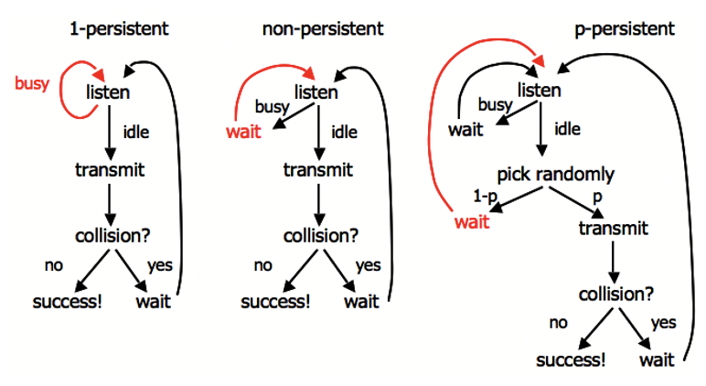