# Week 5 MAC Sub-Layer
## CSMA with Collision Detection
* Principle that transmission aborted when collision detected:
    * After collision detected, abort, wait random period, try again
* Channel must be continually monitored
* Used in half-duplex system
## Classic Ethernet Minimum Packet Size
* Collisions can occur and take as long as 2 $\tau$ to detect 
    * $\tau$ is the time it takes to propagate over the ethernet
    * Leads to minimum packet size for reliable detection
> Illustration of the collision detecting time
>> 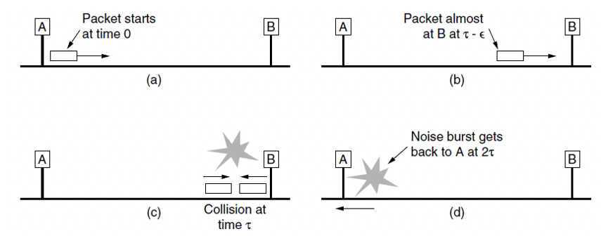
## Collision Free Protocols
### Bit Map Protocol
* Reservation-based protocol
* 1 bit per station overhead
* Division of transmission right, and transmission event. No collisions as this is a reservation based protocol
> Example of Bit Map Protocol
>> 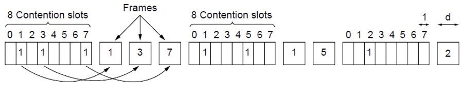
### Binary Countdown Protocol
* Avoid the 1 bit per station scalability problem by using binary station addressing
* No collisions as higher-order bit positions are used to arbitrate between stations wanting to transmit
* Higher numbered stations have a higher priority
* Process:
    * Stations send their address in contention slot (log N bits instead of N bits)
    * Channel medium ORs bits, stations give up when they send a 0 but see a 1
    * Station that ses its full address in next to send
> Example of Binary Countdown Protocol
>> 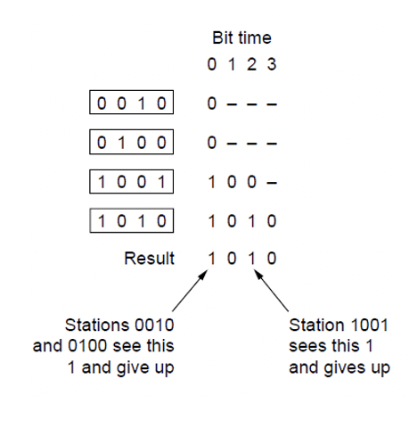
## Limited Contention Protocols
* Both contention and collision free become inefficient at different points
* Under low loads, collision free is less attractive because of a higher delay between transmissions
* Under higher loads, contention is less attractive because overhead associated with channel arbitration becomes greater
* Limited content protocols increase the probability of stations acquiring transmission rights by arbitrarily dividing stations and using a binary algorithm to determine rights allocation
### Adaptive Tree Walk Protocol
* All stations compete for right to transmit, if a collision occurs, binary division is used to resolve contention
* Tree divides stations into groups of nodes to pull
    * Depth First Search under nodes will poll collisions
    * Start search at lower levels if more than one station expected
> Example of Adaptive Tree Walk Protocol
>> 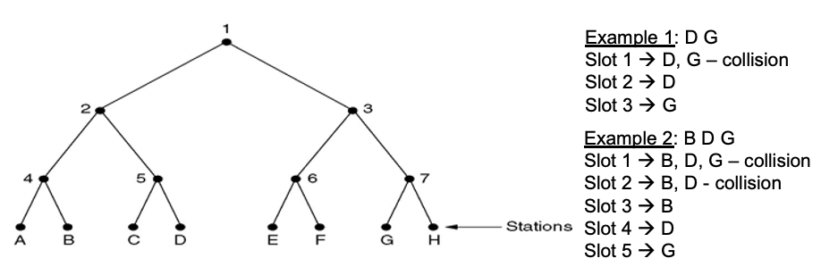
### Wireless LAN Protocols
* Wireless Complications: When a station is in the range of two transmitters or relays, interference affects signal reception
* This leads to hidden and exposed terminal problems
* Require detection of transmissions to receiver, not just carrier sensing
* Transmission Protocols for Wireless LANs (802.11)
    * Multiple Access with Collision Avoidance for Wireless (MACAW)
### Hidden and Exposed Terminals
* Hidden terminals are senders that cannot sense each other but nonetheless collide at intended receiver
* Want to prevent but will leads to loss efficiency
> Illustration of Hidden Terminals
>> 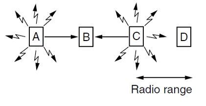
> A and C are hidden terminals when sending to B
* Exposed terminals are senders who can sense each other but still transmit safely to different receivers
> Illustration of Exposed Terminals
>> 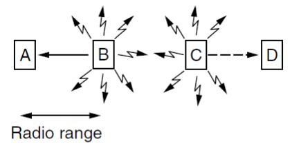
> B -> A and C -> D are exposed terminals
### Multiple Access with Collision Avoidance (MACA)
* Sender asks receiver to transmit short control frame
* Stations near receiver hear control frame
* Sender can then transmit data to receiver
> Illustration of MACA
>> 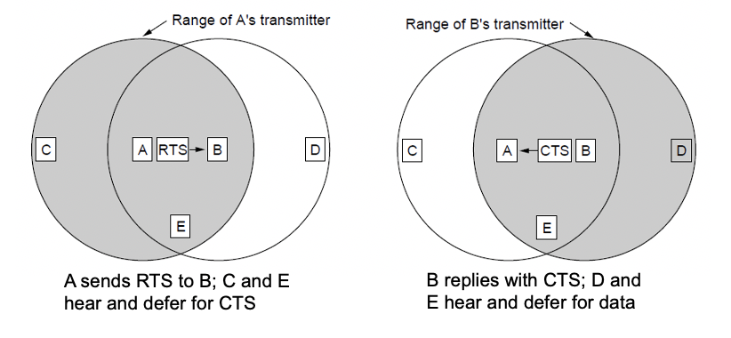
> MACA protocol grants access for A to send to B
> * A sends RTS to B; B replies with CTS
> * A can send with exposed but no hiddent terminals
## Classic Ethernet
* Each type of Ethernet has a maximum cable length per segment
* Multiple cable lengths can be connected by repeaters - a physical device which receives, amplifies and retransmits signals in both directions
> Construction of a classic Ethernet
>> 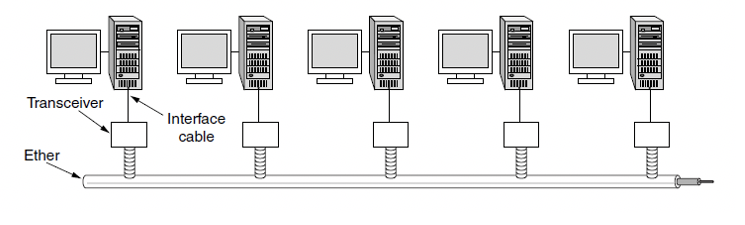
## Ethernet Frame Format
* MAC protocol is 1-persistent CSMA/CD
    * Random delay after collision is computed with BEB (Binary Exponential Backoff)
    * Frame format is still used in modern Ethernet
    > Example of Ethernet Frame Format
    >> 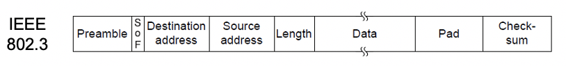
    > * Preamble (7B): Synchronization between sender and receiver
    > * Start of Frame (1B): FLAG bytes
    > * Destinations and Source Addresses: Identify who send, who receive
    > * Type and Length (2B): Specifies which process to give the frame to 
    > * Pad (0-46B): Minimum size of the message of the Ethernet
    > * CRC (4B): 32 bits checksum
## MAC Addressing
* Sources and destination addressing can be done at a local or global levels
* The MAC Address provides the unique identifier for a physical interface
* MAC Address is a 48-bit number encoded in the frame
* E.g. 00:02:2D:66:7C:2C
## Ethernet Performance
$$ Channel \ Efficiency = \frac{1}{1+\frac{2BLe}{cF}}$$
    * F: Frame Length
    * B: Band Width
    * L: Cable Length
    * c: Speed of Light 
    * Optimal case of e contention slow per frame
* When cF is large, the channel efficiency will be high
* Increasing network bandwidth or distance reduces the efficiency for a given frame size
## Switched Ethernet
* Hubs wire all lines into a single CSMA/CD domain
* Switches isolate each port to a separate domain
    * Much greater throughput for multiple ports
    * No need for CSMA/CD with full-duplex lines
> Illustration of Hubs and Switches
>> 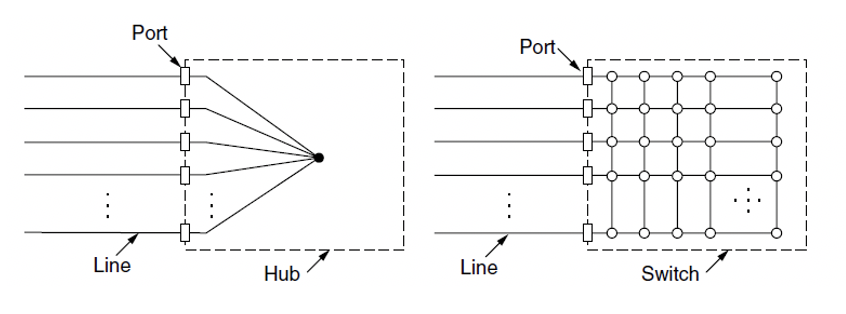
# Network Layer
## Principles of Internet Design
1. Make sure it works
2. Keep it simple
3. Make clear choices
4. Exploit modularity
5. Expect heterogeneity
6. Avoid static options and parameters
7. Choose a good, but not necessarily perfect design
8. Be strict in sending and tolerant in receiving 
9. Consider scalability
10. Consider performance vs costs
## Network Layer in the Internet
* Internet is an interconnected collection of many networks of Autonomous systems that is held together by the IP protocol
## Internet Protocol (IP)
* The glue that holds the whole Internet together in the Network layer protocol, IP
* Provides a best-effort service to route datagrams from source host to destination host
* These hosts may be on the same network or different networks
* Each network is called an Autonomous System(AS)
## Service Provided to the Transport Layer
* Design goals:
    * Services should be independent of router technologies
    * Transport layer should be shielded from number, type, and topology of routers
    * Network addressing should use a uniform numbering plan
## Store and Forward Packet Switching
* Hosts generate packets and injects into the network
* Routers treat packets as messages, receiving them and then forwarding them based on how the message is addressed
* Router routes packets through the network
> Example of packets routing with datagram subnet
>> 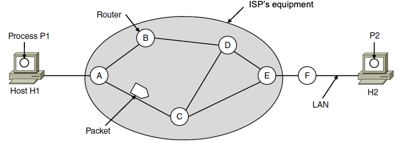
## Routing within a datagram subnet
* Post office model: Packets are routed individually based on destination addresses in them. Packets can take different paths
* Routing table can be fixed or change over time
* Routing algorithm manages the routing table
> Example of P1 sends a long message to P2
>> 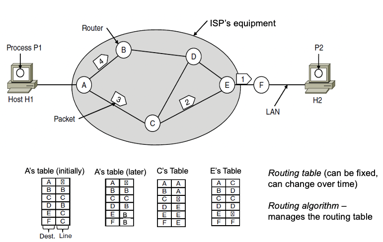
## Routing with virtual-circuit subnet
* Model is like a telephone network
    * Packets are routed through virtual circuits based on tag number (not full address but unique at a given link) in them.
    * Packets take the same path to avoid having to choose a new route for every packet sent
    * E.g. Multi-protocol Label Switching Network
> Example of routing with virtual-circuit subnet
>> 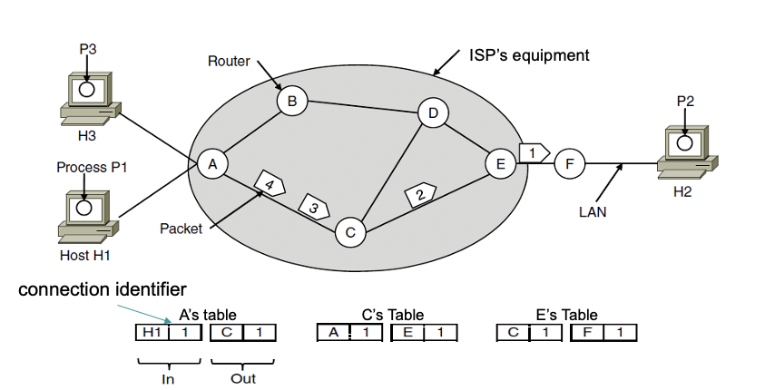
## Difference in Virtual Circuit and Datagram Subnets
|Issue|Datagram Network|Virtual-circuit Network|
|----|----|----|
|Circuit Setup|Not needed|Required|
|Addressing|Each packet contains the full source and destination address|Each packet contains a short VC number|
|State Information|Routers do not hold state information about connections|Each VC requires router table space per connection|
|Effect of router failures|Each packet is routed independently|Route chosen when VC is set up; All packets follow it|
|Quality of Service|Difficult|Easy if enough resources can be allocated in advance for each VC|
|Congestion control|Difficult|Easy if enough resources can be allocated in advance for each VC|
## Compromises of VC and Datagram Subnets
* Memories vs Bandwidth
    * VC require more space in router memory but save potential overhead in full addressing of each packet and computation of path
* Setup time vs Address Parsing Time
    * VC require setup time and resources, but packet transmission is very fast
* Amount of memory
    * Datagram subnets require large tables of every possible destination routes, whereas VC requires entry per link
* QoS and Congestion avoidance
    * VC can use tighter QoS to be able to reserve CPU, bandwidth, and buffer in advance
* Longevity
    * VC can exist for a long time 
* Vulnerability
    * VC particularly vulnerable to hardware/software crashes - all VC aborted and no traffic until they are rebuilt. Datagram uses an alternative route
## Issue of Internetworking
* Internetworking joins multiple, different networks into a single larger network
* Issues when connecting networks:
    * Different network types and protocols
    * Different motivations for network choices
    * Different technologies at both hardware and software levels
## Different Dealt at the Network Layer
|Item|Some Possibilities|
|----|----|
|Service Offered|Connectionless vs connection oriented|
|Addressing|Different sizes, flat or hierarchical|
|Broadcasting|Present or absent|
|Packet size|Every network has its own maximum|
|Ordering|Ordered and unordered delivery|
|Quality of service|Present or absent|
|Reliability|Different levels of loss|
|Security|Privacy rules, encryption|
|Parameters|Different timeouts, flow specifications|
|Accounting|By connect time, packet, byte or not at all|
## Tunneling
* Tunneling is a special case used when the source and destination are on the same network, but there is a different network in between
    * Source packets are encapsulated over the packets in the connecting network
> Example of Tunneling IPv6 packets through IPv4
>> 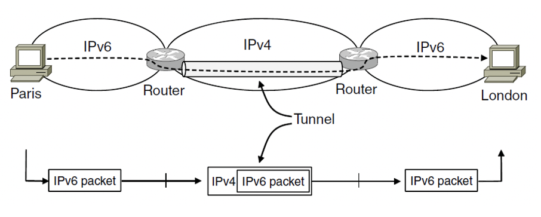
## Fragmentation
* All networks have a maximum size for packets, could be motivated by:
    * Hardware
    * Operating system
    * Protocols
    * Standards compliance
    * Desire to reduce transmissions due to errors
    * Desire for efficiency in communication channel
* Fragmentation is the division of packets into fragments. It allows network gateways to meet size constraints
## Types of Fragmentation
* Transparent: Packets fragmented and reassembled in each network. 
    * Route constrained, need more work
    > Example of transparent fragmentation
    >> 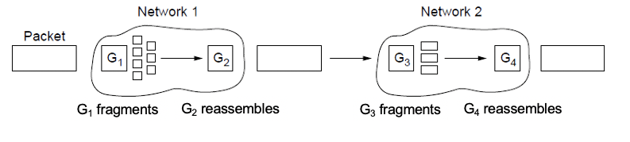
* Non-transparent: Fragments are reassembled at destination
    * Less work: packet number, byte offset, end of packet flag
    > Example of non-transparent fragmentation
    >> 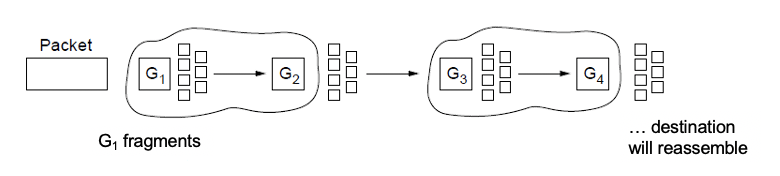
> Example of IP style fragmentation
>> 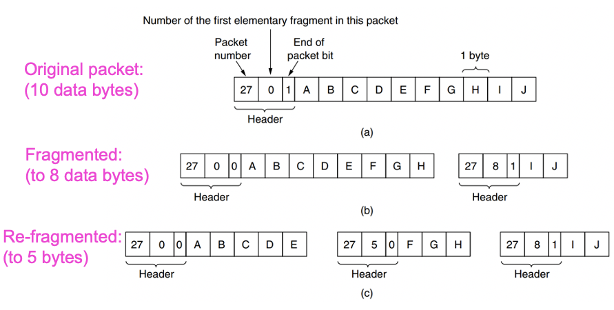
## Path MTU Discovery
* An alternative to fragmentation
* Advantage: The source now knows what length packet to send but if the routes and path MTU change, new error packets will be triggered and the source will adapt to the new path.
> Example of Path MTU Discovery
>> 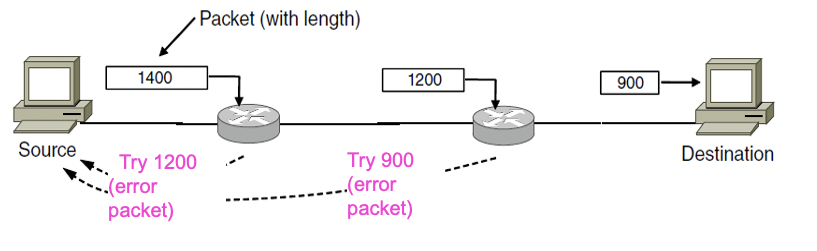
## IP Datagram
* IPv4 header is carried on all packets and has fields for the key parts of the protocol
> Example of IPv4 Datagram header
>> 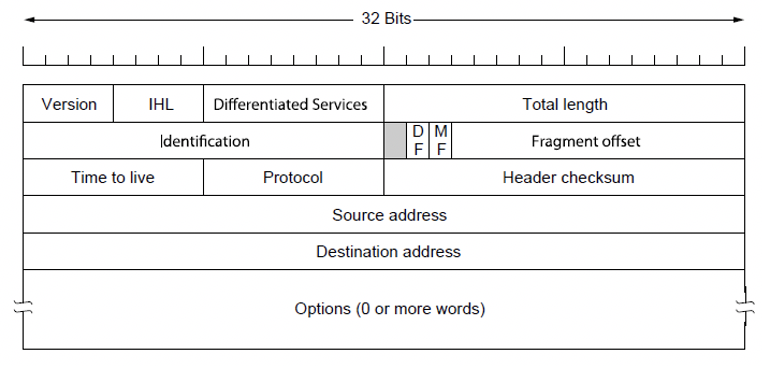
* IPv4 datagram consists of a header and some text
* Header is 20 byte fixed part + variable length optional part
* Version: IPv4 or IPv6
* IHL: Header Length, in 32bits units, min 5 and max 15
* Type: Differentiates different classes of service
* Total Length: Header and payload, maximum length 65535 bytes
* Identification: Allows host to determine which datagram the new fragment belongs to - all fragments of same datagram have same ID
* DF: Don't Fragment Byte
* MF: More Fragment Byte, determine whether it is the last one or not
* Fragment offset: Where in the datagram the current fragment belongs
* TTL: Limits packet lifetimes, hops or seconds
* Protocol: TCP, UDP, or others
* Header Checksum: verifies the header only
* Source Address: IP, host/network
* Destination Address: IP, host/network
* Options: Security, strict vs loose source routing, record route, timestamp
## Routing Algorithms
* Consider the network as a graph of nodes and links:
    * Decide what to optimize
    * Update routes for changes in topology
    * Routing is the process of discovering network path
* The routing algorithm is responsible for deciding on which output line an incoming packet should be transmitted
* Non-adaptive Algorithms
    * Static decision making process
* Adaptive Algorithms
    * Dynamic decision making process
    * Changes in network topology, traffic
## Sink Tree/Spanning Tree
* Sink Tree/Spanning Tree: The set of optimal routes from all sources to a given destination form a tree rooted at the destination 
* The goal of a routing algorithm is to discover and utilize the spanning trees for all routers
> Example of a spanning for a graph of routers
>> 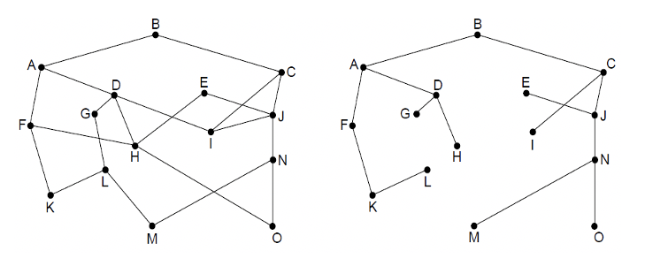
## Shortest Path Routing
* A non-adaptive algorithm
* Shortest path can be determined by building a graph with each node representing a router, and each edge representing a communication link
* To choose a path between 2 routers, the algorithm finds the shortest path between them on the graph
## Dijkstra Algorithm
* Dijkstra algorithm computes a spanning tree on the graph:
    * Each link is assigned a non-negative weight/distance
    * Shortest path is the one with lowest total weight
    * Using weights of 1 gives paths with fewest hops
* Algorithm:
    * Start with sink, set distance at other nodes to infinity
    * Relax distance to other nodes
    * Pick the lowest distance node, add it to the spanning tree
    * Repeat until all nodes are in the spanning tree
> Example to Dijkstra Algorithm
>> 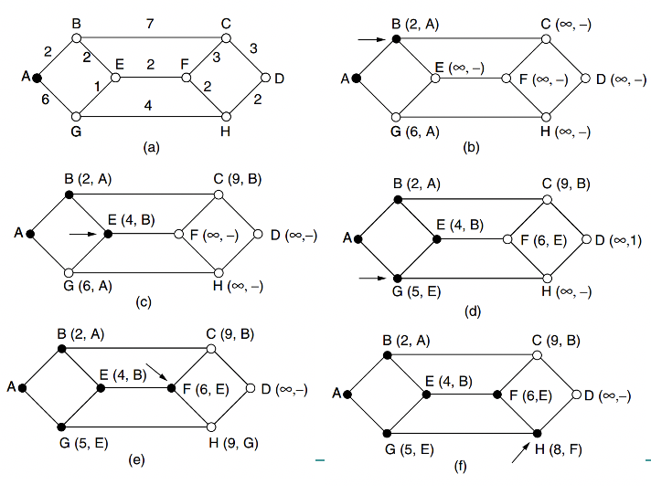