# Week 6 Network Layer
## Flooding
* A non-adaptive algorithm
* Every incoming packet is sent out on every outgoing line except the one on which it arrived
* Generates a large number of duplicate packets, so it is inefficient
* Selective flooding is routers send packets only on links which are in approximately the right direction. This is an improved variation.
> Example of Flooding
>> 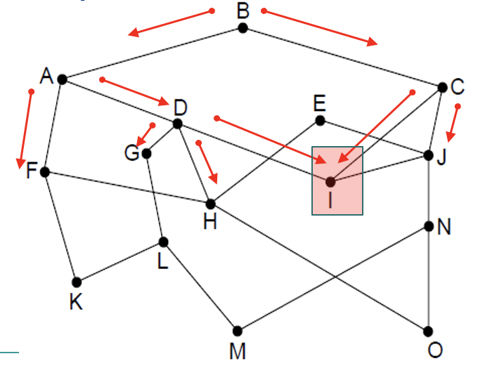
## Distance Vector Routing
* A dynamic algorithm
* Each router maintains a table which includes the best known distance to each destination and which line to use to get there
* Tables are exchanged with neighboring routers
* Global information shared locally
* Algorithm:
    * Each node knows distance of links to its neighbors
    * Each node advertises vector of lowest known distances to all neighbors
    * Each node uses received vectors to update its own
    * Repeat periodically
> Example of Distance Vector Routing
>> 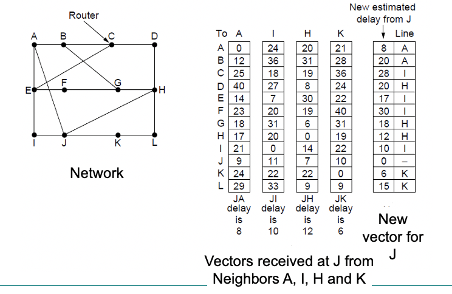
## Link State Routing
* A dynamic algorithm
    * An alternative to distance vector
    * DV: primary problem that caused its demise was that the algorithm often took too long to converge after the network topology changed
    * Widely used in the Internet
    * More computation but simpler dynamics
* Each router has to do 5 steps:
    1. Discover neighbors  and learn network addresses
    2. Measure delay or cost to each neighbors
    3. Construct packet resulting from previous steps
    4. Send this packet to all other routers
    5. Compute the shortest path to every other router
### Building link state packets
* LSP for a node lists neighbors and weights of links to reach them
* The hard part is determining when to build LSP
* Periodically at regular intervals
* Build them when some significant event occurs, such as a line or neighbor going down or coming back up again or changing its properties appreciably
> Example of Link State Packet
>> 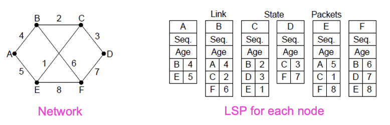
## Hierarchical Routing
* As networks grow in size, routing tables expand but this impacts CPU and memory requirements
* Dividing all routers into regions allows efficiencies
    * Each router knows everything about other routers in its region but nothing about routers in other regions
    * Router which connect to two regions act as exchange points for routing decisions
* Hierarchical routing reduces the work of route computation but may result in slightly longer paths than flat routing 
> Example of Hierarchical Routing
>> 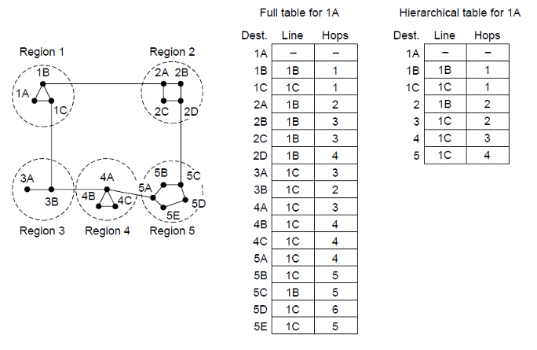
## Broadcast Routing
* Broadcast routing allows hosts to send messages to many or all other hosts
    * Single distinct packet 
        * Inefficient, sources, needs all destination addresses
    * Flooding
    * Multi-destination routing
        * Efficient but source needs to know all the destinations
    * A router receives a single packet which encapsulates the list of destinations, and then constructs a specific packet for each one
        * Acts as a relay
* Reverse path forwarding
    * When a broadcast packet arrives at a router, the router checks to see if the packet arrived on the line normally used for sending packets to use broadcast. If so there is a high probability that the route used to transmit the received packet is the best route. The router then to forwards the packet onto all other lines.
    * If the broadcast packet arrived on a link other than the preferred one for reaching the source, the packet is discarded as a likely duplicate. 
## Multicast Routing
* A routing algorithm used to send a message oto a well-defined group within the whole network
* Each router computes a spanning tree covering all other routers: The first router to receive the packet prunes the spanning tree to eliminate all lines which do not lead to members of the group
## Addressing
* Routing tables needs addressing to work/route
* IP addresses are used for this purpose
* They are hierarchical 
* There is a network portion to an address
* And also a host portion
* The network portion is same for all hosts on a network
* The host portion grabs a continuous block of addresses and is called the prefix
## IP Addresses
* Addresses are allocated in prefixes
    * Prefix is determined by a LAN
    * IP addresses are written in dotted decimals
    * 4 bytes * 4 = 32 bit addresses
    * Written as lowest address + length
        * E.g. 18.0.31.0/24
        * /24 states the length of the network part in bits, so here 8 bits are left for hosts
* Overall IP allocation responsibility of Internet Corporation for Assigned Names and Numbers (ICANN) by delegation to Internet Assigned Numbers Authority (IANA) and Regional Internet Registries (RIR's)
> Example of IP Address
>> 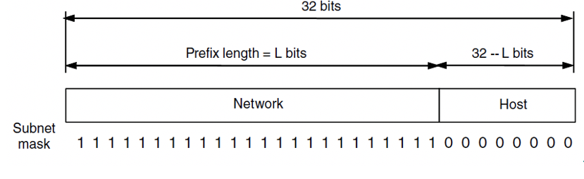
## Subnets
* Subnetting allows networks to be split into several parts for internal used whilst acting like a single network for external use
> Example of Subnets
>> 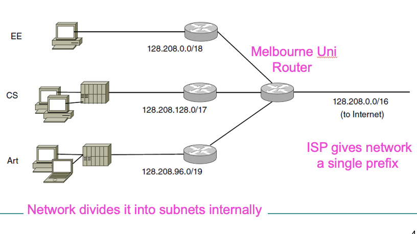
## IP Addressing and Routing Tables
* Routing tables are typically based around a triplet:
    * IP Address
    * Subnet Mask
    * Outgoing Line (Physical or virtual)
> Example of a routing table
>> 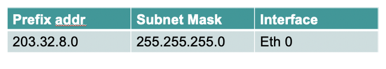
## Aggregation of IP addresses
* Backbone router connection networks around the world 
* Aggregation: Process of joining multiple IP prefixes into a single larger prefix to reduce size of routing table
> Example of Aggregation of IP Addresses
>> 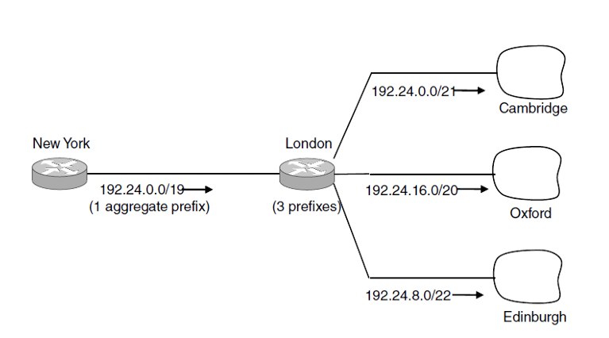
### Longest Matching Prefix
* Packets are forwarded to the entry with the longest matching prefix or smallest address block
    * Complicates forwarding but adds flexibility
* Processes:
    1. Check address whether matches the longest prefix
    2. If not then see if it matches others
> Example of Longest Matching Prefix
>> 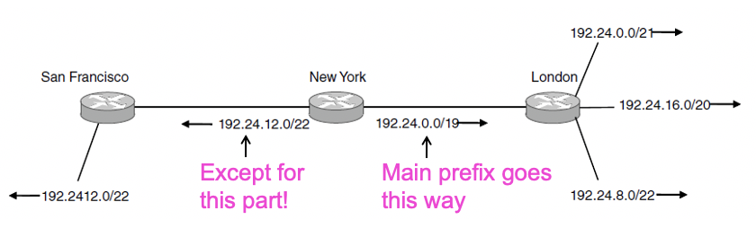
## Classful Addressing
* Part of history now-old addresses came in blocks of fixed size (A, B, C)
    * Carries size as part of address, but lacks flexibility
    * Called classful addressing
> Class of Addresses
>> 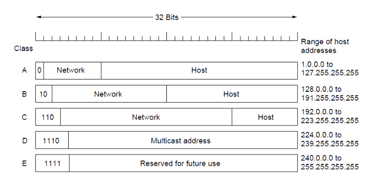
## Private IP Ranges
* Range of IP addresses that cannot appear in the Internet
* Only for private networks
    * 10.0.0.0/8
    * 172.16.0.0/12
    * 192.168.0.0/17
## Network Address Translation (NAT)
* NAT box maps one external IP address to many internal IP addresses
    * Uses TCP/UDP port to tell connections apart
    * Violates layering; Very common in homes
> Example of NAT
>> 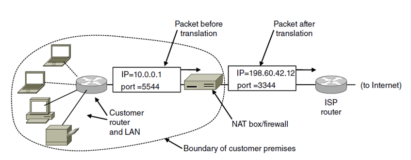
## Internet Control Protocols
* IP works with the help of several control protocols:
    * ICMP is a companion to IP that returns error info
        * Required and used in many ways
    * ARP finds MAC address of a local IP address
        * Glue that is needed to send any IP packets
        * Host queries an address and the owner replies
    * DHCP assigns a local IP address to a host
        * Gets host started by automatically configuring it
        * Host sends request to server, which grants a lease
## Mobile IP
* Handle it at data link layer
* For IPv4 the solution is through ICMP
## ICMP
* Internet Control Message Protocol
* Used for testing and monitoring ambient conditions between hosts and routers
>|Message Type|Description|
>|----|----|
>|Destination unreachable|Packet could not be delivered|
>|Time exceeded|Time to live field hit 0|
>|Parameter problem|Invalid header field|
>|Source quench|Choke packet|
>|Redirect|Teach a router about geography|
>|Echo and Echo reply|Check if a machine is alive|
>|Timestamp request/reply|Same as Echo, but with timestamp|
>|Router advertisement/solicitation|Find a nearby router|
## Other Considerations
* Congestion Control Algorithms
* Quality of Service
# Transport Layer
## Transport Layer Function
* Main function: Provide efficient, reliable and cost-effective data transmission service to the processes in the application layer. Independent of physical and data networks
# Transport Layer services
* Transport layer services provide interfaces between the application lay and the network layer
* Transport entities is the hardware or softeware which actually does the work. It can exist in multiple locations:
    * OS kernel
    * System Library
* But not so much in:
    * User process
    * Network interface card
* Transport layer adds reliability to the network layer
    * Offers connectionless in addition to connection-oriented services to applications
> Relationship between network, transport and application layes:
>> 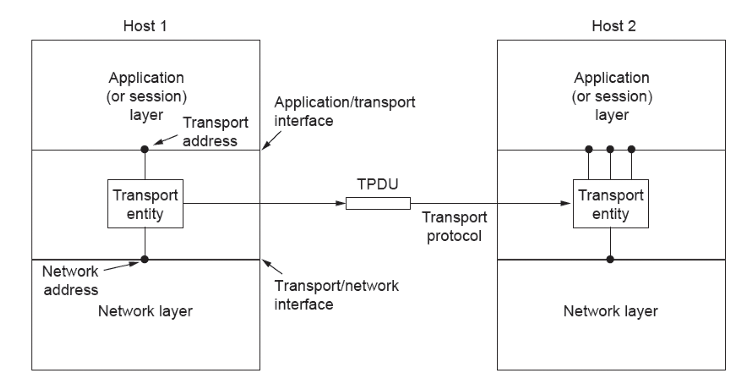
## Transport Layer and Network Layer Service Comparison
* Transport layer code runs entirely on hosts. Network layer code runs almost entirely on routers
* Users have no real control over the network layer. But can improve QoS in transport layer.
* Transport layer fixes reliability problems caused by the network layer
## Position of the Transport Layer
* The transport layer occupies a key position in the layer hierarchy because it clearly delineates
    * Providers of data transmissions services are at the network, data link, and physical layers
    * Users of reliable data transmission services are at the application layer
* In particular, users commonly access connection-oriented transport services for a reliable service on top of an unreliable network
## Features of a simple transport layer
* Abstraction and primitives provide a simpler API for application developers independent of network layer
> |Primitive|Meaning|
> |----|----|
> |LISTEN|Block waiting for an incoming connection|
> |CONNECT|Establish a connection with a waiting peer|
> |RECEIVE|Block waiting for an incoming message|
> |SEND|Send a message to the peer|
> |DISCONNECT|Terminate a connection|
## Transport Layer Encapsulation
* Abstract representation of messages sent to and from transport entities: Transport Protocol Data Unit (TPDU)
* Encapsulation of TPDUs transport layer unites to network layer units to frames in data layer units
> Example of Transport Layer Encapsulation
>> 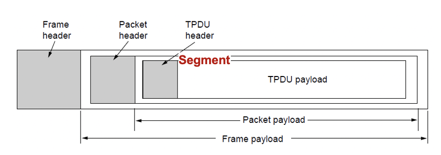
## Transport Services Primitives/Segments
* Primitives that applications might call to transport data for a simple connection-oriented service:
    * Server executes LISTEN
    * Client executes CONNECT
        * Sends CONNECTION REQUEST TPDU to server
        * Receives CONNECTION ACCEPTED TPDU to client
    * Data exchanged using SEND and RECEIVE
    * Either party executes DISCONNECT
> |Primitive|Segment sent|Meaning|
> |----|----|----|
> |LISTEN|(none)|Block until some process tries to connect|
> |CONNECT|CONNECTION REQ|Actively attempt to establish a connection|
> |SEND|DATA|Send Information|
> |RECEIVE|(none)|Block until a DATA packet arrives|
> |DISCONNECT|DISCONNECTION REQ|This side wants to release the connection|
> Illustration of a Simple Connection
>> 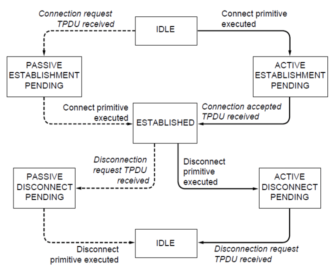
> * Solid lines show client state sequence
> * Dashed lines show server state sequence
> * Transitions in italics are due to segments arrivals
## Elements of Transport Protocols
* Connection establishment
    * When networks can lose, store and duplicate packets, connection establishment can be complicated:
        * Congested networks may delay acknowledgements
        * Incurring repeated multiple transmissions
        * Any of which may not arrive at all or out of sequence: Delayed duplicates
        * Application degenerate with such congestion
* Reliable Connection Establishment
* Key challenge is to ensure reliability even though packets may be lost, corrupted, delayed and duplicated
    * Don't treat an old or duplicate packet as new
* Approach:
    * Don't reuse sequence numbers within maximum segment lifetime
    * Use a sequence number space large enough that it will nor wrap, even when sending at full rate
    * Three-way handshake for establishing connection
    ### Three Way Handshake
    * Three-way handshake used for initial packet
        * Since no state from previous connection
        * Both hosts contribute fresh sequence numbers
        * CR = Connect Request
    > Example of Three Way Handshake
    >> 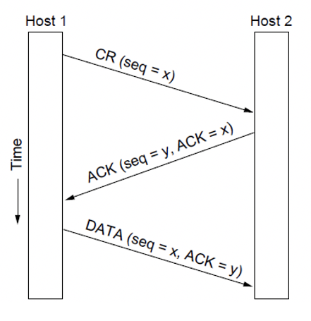
* Connection Release
    * Asymmetric Disconnection
        * Either party can issue a DISCONNECT, which results in DISCONNECT TPDU and transmission ends in both directions
    * Symmetric Disconnection
        * Both parties issue DISCONNECT, closing only one direction at a time. Allows flexibility to remain in receive mode.
    * Asymmetric release may result in data loss hence symmetric release is more attractive
    * Symmetric release works well where each process has a set amount of data to transmit and knows when it has been sent. 
    