# Week 7 Transport Layer
## Strategies for Connection Release
* Three way handshake
* Finite retry
* Timeouts
* Normal release sequence initiated by transport user on sender host
    * DR = Disconnect Request
    * Both DRs are ACKed by the other side
> Examples of error cases for Connection Releases
>> 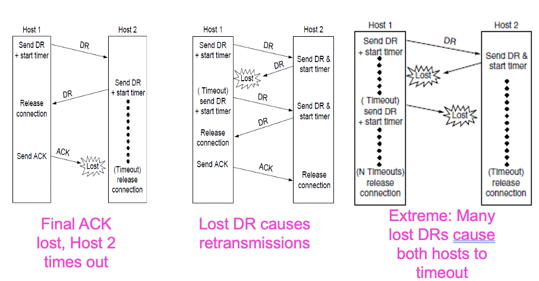
## Addressing
* Specification of remote process to connect to is required at application and transport layers
* Addressing in transport layer is typically done using Transport Service Access Points (TSAPs)
    * On the Internet, a TSAP in commonly referred to as a port
* Addressing in the network layer is typically done using Network Service Access Points (NSAPs)
    * On the Internet, the concept of an NSAP is commonly interpreted as simply an IP address
> Illustration of TSAP and NSAP
>> 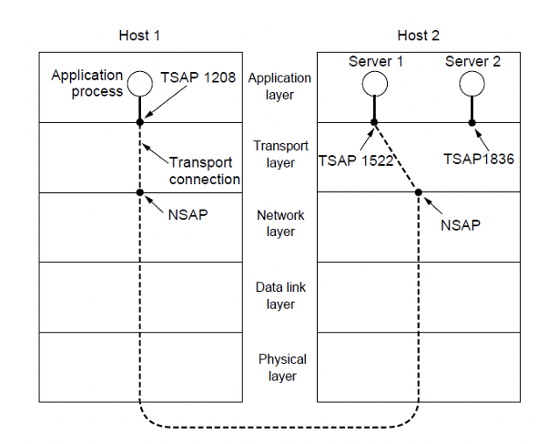
### Type of TSAP Allocation
* Static: Well known services have standard allocated TSAPs/ports, which are embedded in OS
* Directory Assistance - Port-mapper:
    * A new service must register itself with the portmapper, giving both its services name and TSAP
* Mediated:
    * A process server intercepts inbound connections and spawns requested server and attaches inbound connection
## Sockets
* Sockets widely used for interconnections
    * Berkeley sockets are predominant in internet applications
    * Notion of sockets as transport endpoints
    * Like the simple set plus SOCKET, BIND, ACCEPT
>|Primitive|Meaning|
>|----|----|
>|SOCKET|Create a new communication end point|
>|BIND|Associate a local address with a socket|
>|LISTEN|Announce willingness to accept connections; give queue size|
>|ACCEPT|Passively establish an incoming connection|
>|CONNECT|Actively attempt to establish a connection|
>|SEND|Send some data over the connection|
>|RECEIVE|Receive some data from the connection|
>|CLOSE|Release the connection|
## UDP
* User Datagram Protocol 
* Does not add much to the Network Layer functionality
* TCP just does the realiability for this layer
* UDP remove connection primitives to use it in a program
* UDP is good for apps like video streaming and gaming regularly
* The reliability issue is left to the application layer. Retransmission decision as well as congestion control
* Provides a protocol whereby applications can transmit encapsulated IP datagrams without a connection establishment
* UDP transmits in segments consisting of an 8-byte header followed by the payload
* UDP headers contain source and destination ports
* Payload is handed to the process which is attached to the particular port at destination
* The main advantage of using UDP over raw IP is the ability to specify ports for source and destination pairs
* Both source and destination ports are required. Destination allows for incoming segments, sources allows reply for outgoing segments
> Example of a UDP header
>> 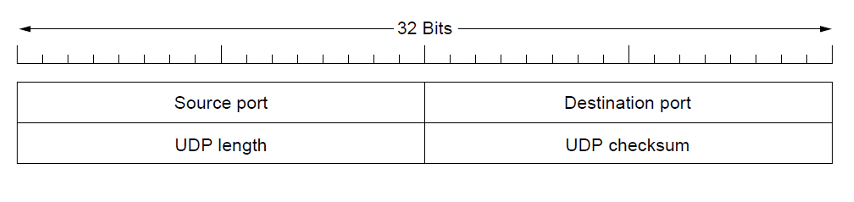
### Strengths and Weakness of UDP
* Strength: Provides an IP interface with multiplexing/de-multiplexing capabilities and related transmission efficiencies
* Weakness: UDP does not include support for flow control, error control/retransmission of bad segments
* Where applications require a precise level of control over packet flow/error/timing, UDP is good choice as application layer can make choices. 
## Remote Procedure Call
* Sending a message and getting a reply back in analogous to making a function all in programming languages
* To call a remote procedure, the client is bound to a small library call the client stub that represents the server procedure in the client's address space
* Similarly the server is bound with a procedure call the server stub
* These stubs hide the fact that the procedure itself is not local
> Illustration of RPC
>> 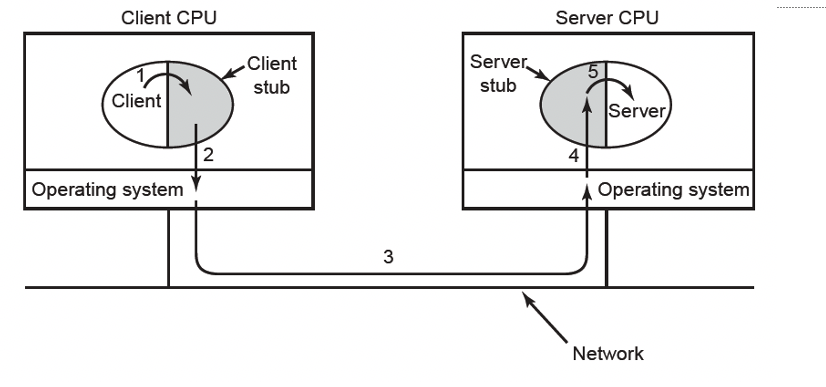
## Transmission Control Protocol (TCP)
* Provides a protocol by which application can transmit IP datagrams within a connection-oriented framework, thus increasing reliability
* TCP transport entity manages TCP streams and interfaces to the IP layer - can exist in numerous locations (kernel, library, user process)
* TCP entity accepts user data streams, and segments them into pieces < 64KB (Often at a size in order so that the IP and TCP headers can fit into a single Ethernet frame), and sends each piece as a separate IP datagram.
* Recipient TCP entities reconstruct the original byte streams from the encapsulation
## The TCP service Model
* Sender and receiver both create sockets, consisting of the IP address of the host and a port number.
* For TCP Service to be activated, connections must be explicitly established between a socket at a sending host and a socket at a receiving host
* Special one-way server sockets may be used for multiple connections simultaneously
> Example of TCP Service model
>> 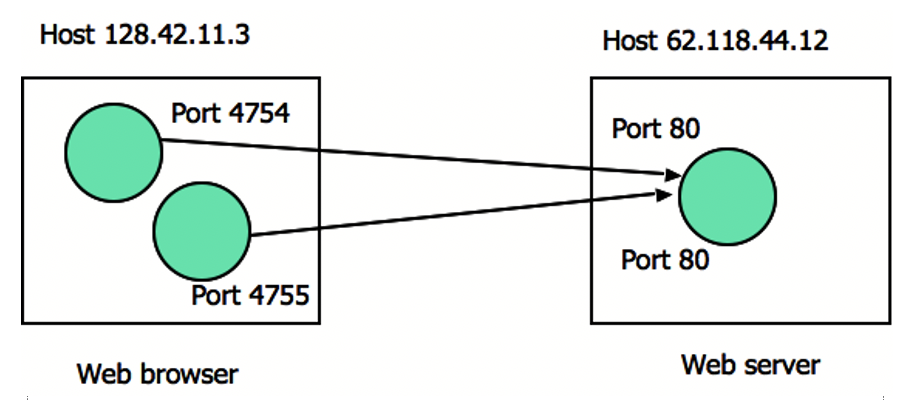
### Port Allocations
* Port numbers can range from 0 to 65535
* Port numbers are regulated by IANA
* Ports are classified into segments
    * Well Known Ports (0-1023)
    * Registered Ports (1024-49151)
    * Dynamic Ports (49152-65535)
>|Port|Protocol|Use|
>|----|----|----|
>|20, 21|FTP|File transfer|
>|22|SSH|Remote login, replacement for Telnet|
>|25|SMTP|Email|
>|80|HTTP|World Wide Web|
>|110|POP-3|Remote email access|
>|143|IMAP|Remote email access|
>|443|HTTPS|Secure Web|
>|543|RTSP|Media Player Control|
>|631|IPP|Printer|
### Socket Library: Multiplexing
* Socket library provides a multiplexing tool on top of TSAPs to allow servers to service multiple clients
* It simulate the server using a different port to connect back to the client
> Example of Socket Library
>> 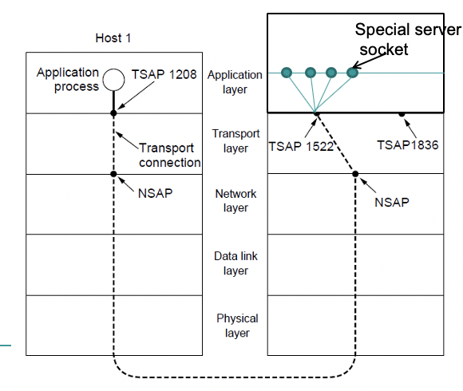
### Features of TCP Connections
* Full duplex: Data in both directions simultaneously
* Point to point: Exact pairs of senders and receivers
* Byte streams, not message streams: Message boundaries are not preserved
* Buffer options: TCP entity can choose to buffer prior to sending or not depending on the context
### TCP entities
* Data sent between TCP entities in segments: a 20 byte header plus zero or more data bytes
* TCP entities decide how large segments should be mainly with 2 constraints:
    * 65515 byte IP payload
    * Ethernet unit size, generally 1500 bytes
* Sliding window:
    * Sender transmits and starts a timer
    * Receiver sends back an acknowledgement which is the next sequence number expected. If sender's timer expires before acknowledgement, then the sender transmits the original segment again
### TCP Segment Header
* TCP header includes addressing (ports), sliding window (seq/ack), flow control (window), error control (checksum) and more
> Example of TCP header
>> 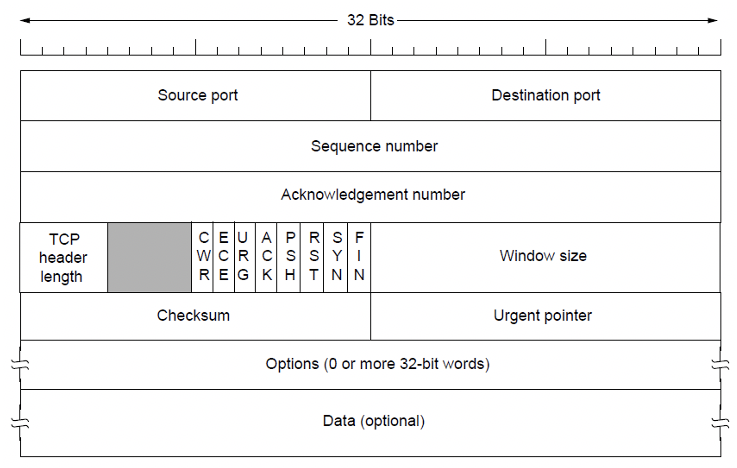
> * Source port and destination port: Identify the local end points of the connection
> * Sequence number and Acknowledgement number: Perform their usual functions
> * TCP header length: Tells how many 32-bit words are contained in the TCP header
> * Window size: Tells how many bytes may be sent starting at the byte acknowledged
> * Checksum: Provided for extra reliability. It checksums the header, the data
> * Options: Provides a way to add extra facilities not covered by the regular header
> * URG: Set to 1 if the Urgent pointer is in use. The Urgent pointer is used to indicate a byte offset from the current sequence number at which urgent data are to be found
> * CWR and ECE: Used to signal congestion when ECN (Explicit Congestion Notification) is used
> * ECE: Set to signal an ECN-Echo to a TCP sender to tell it to slow down when the TCP receiver gets a congestion indication from the network
> * CWR: Set to signal Congestion Window Reduced from the TCP sender to the TCP receiver so that it knows the sender has slowed down can stop sending the ECN-Echo
> * ACK: Set to 1 to indicate that the Acknowledgment number is valid. This is the case for nearly all packets. 0 means ignore ACK number field
> * PSH: Indicates PUSHed data. The receiver is hereby kindly requested to deliver the data to application upon arrival and not buffer it until a full buffer has been received
> * RST: Used to abruptly reset a connection that has become confused due to a host crash or some other reason. It is also used to reject an invalid segment or refuse an attempt to open a connection
> * SYN: Used to establish connections. The connection request has SYN=1 and ACK=0. The connection reply does bear an acknowledgement, so it has SYN=1 and ACK=1. The SYn bit is used to denote both CONNECTION REQUEST and CONNECTION ACCEPTED, with the ACK bit used to distinguish between these two possibilities
> * FIN: Used to release a connection. It specifies that the sender has no more data to transmit. However, after closing a connection, the closing process may continue to receive data. 
### TCP Connection Establishment and Release
* Connections established using three-way handshake
* Two simultaneous connection attempts reults in only one connection uniquely identified by end points
* Connections released with symmetric release
* Timers used for lost connection release
### TCP Connection Management
* The full TCP connection finite state machine has more states than the simple example from earlier
>|State|Description|
>|----|----|
>|CLOSED|No connection is active or pending|
>|LISTEN|The server is waiting for an incoming call|
>|SYN RCVD|A connection request has arrived; Wait for ACK|
>|SYN SENT|The application has started to open a connection|
>|ESTABLISHED|The normal data transfer state|
>|FIN WAIT 1|The application has said it is finished|
>|FIN WAIT 2|The other side has agreed to release|
>|TIME WAIT|Wait for all packets to die off|
>|CLOSING|Both side have tried to close simultaneously|
>|CLOSE WAIT|The other side has initiated a release|
>|LAST ACK|Wait for all packets to die off|
### TCP Transmission Policy
* TCP acknowledges bytes
* Receiver advertises window based on available buffer space
> Example of TCP Transmission
>> 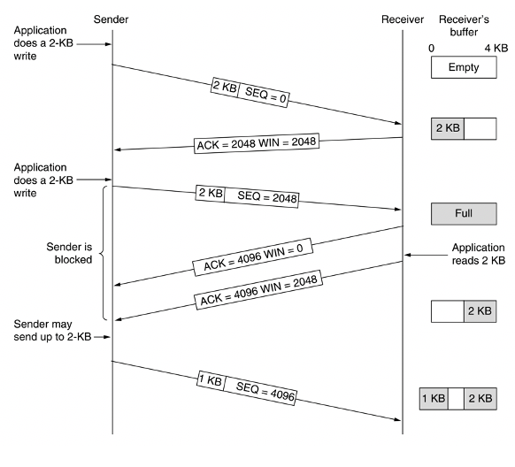
## Congestion
* Congestion results when too much traffic is offered; Performance degrades due to loss/retransmissions
> Illustration of Congestion
>> 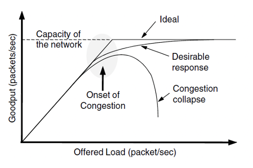
### Congestion Control vs. Flow Control
* Flow control is an issue for point to point traffic, primarily concerned with preventing sender transmitting data faster than receiver can receive it
* Congestion control is an issue affecting the ability of the subnet to actually carry the available traffic in a global context
## Load Shedding
* When congestion control mechanisms fail, load shedding is the key remaining possibility.
* In order to ameliorate impact, applications can mark certain packets as priority to avoid discard policy
## Key problem if network is not delivering properly
* Quality of Service becomes low
* Expected network performance is an important criterion for a wide range of network applications
* Some engineering techniques are available to guarantee QoS
* Four things to watch out for: Bandwidth, reliability, delay, jitter
## Jitter
* Jitter is the variation in packet arrival times
> Example of High Jitter
>> 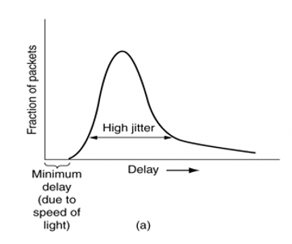
> Example of Low Jitter
>> 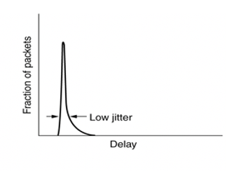
* Jitter is an issue for some applications
* Jitter can be contained by determined the expected transit time of a packet
* Packets can be shuffled at each hop in order to minimize jitter: Slower packets sent first, faster packets wait in a queue.
* For certain applications jitter control is extremely important as it mainly directly affects the quality perceived by the application user
## QoS Requirements
* Different applications care about different properties
>|Application|Bandwidth|Delay|Jitter|Loss|
>|----|----|----|----|----|----|
>|Email|Low|Low|Low|Medium|
>|File Sharing|High|Low|Low|Medium|
>|Web Access|Medium|Medium|Low|Medium|
>|Remote Login|Low|Medium|Medium|Medium|
>|Audio on demand|Low|Low|High|Low|
>|Video on demand|High|Low|High|Low|
>|Telephony|Low|High|High|Low|
>|Videoconferencing|High|High|High|Low|
## Techniques for Achieving QoS
* Over-provisioning: More tha adequate buffer, router CPU, and bandwidth
* Buffering: Buffer received flows before delivery: Increase delay, but smoothes out jitter, no effect in reliability or bandwidth
* Traffic Shaping: Regulate the average rate of transmission and burstiness of transmission
    * Leaky Bucket
    * Token Bucket
* Resource reservation: Reserve bandwidth, buffer space, CPU in advance
* Admission Control: Routers can decide based on traffic patterns whether to accept new flows, or reject/reroute them
* Proportional routing: Traffic for same destination split across multiple routes
* Packet scheduling: Create queues based on priority. 
    * Fair queuing, weighted fair queuing
### Leaky Bucket
* Large bursts of traffic is buffer and smoothed while sending
> Illustration of Leaky Bucket
>> 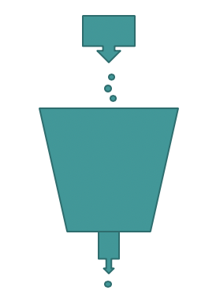
## TCP Congestion Control
* When networks are overloaded, congestion occurs, potentially affecting all layers. Although lower layers attempt to ameliorate congestion, in reality TCP impacts congestion most significantly because TCP offers best methods to reduce the data rate, and hence reduce congestion 
* TCP adopts a defensive stance:
    * At connection establishment, a suitable window size is chosen by the receiver based on its buffer size
    * If the sender is constrained to this size, then congestion problems will not occur due to overflow at the receiver itself, but may still occur due to congestion within the network
### Design of Congestion Control
* Two different problems exist
    * Network capacity and receiver capacity
    * These should be dealt with separately, but compatibly
* Sender maintains two windows:
    * Window described by the receiver
    * Congestion window
* Each regulates the number of bytes the sender can transmit. The maximum transmission rate is the minimum of the two windows
## Slow Start
* On connection establishment, the sender initializes the congestion window to a size, and transmits one segment
* If this segment is acknowledged before the timer expires, the sender adds another segment's worth of bytes to the congestion window, and transmits two segments
* As each new segment is acknowledged, the congestion window is increased by one more segment
* In effect, each set of acknowledgements doubles the congestion window which grows until either a timeout occurs or the receiver's specified window is reached.
> Illustration of Slow Start
>> 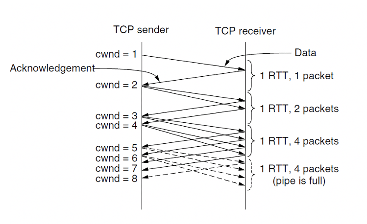
### Additive Increase
> Illustration of Additive Increase
>> 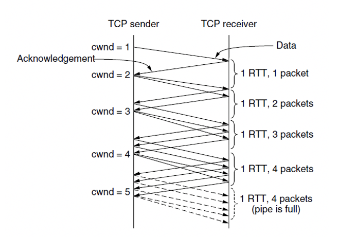
### TCP Tahoe
* Slow start followed by additive increase.
* Threshold is half of previous
> Illustration of TCP Tahoe
>> 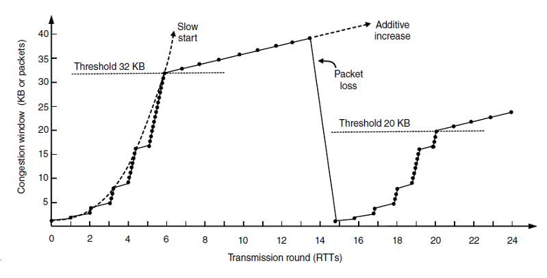
### TCP Reno
> Illustration of TCP Reno
>> 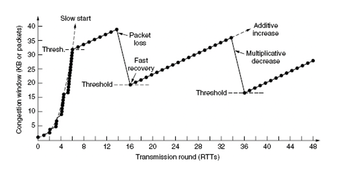
## Congestion Control and Wireless
* Much harder to deal with:
    * Things are increasingly wireless
    * Not everything is wireless, but parts of a path
    * More variety on wireless links as well
    * SNR varies when people more
    * Delay is different if it is WiFi
## TCP Timer
* A key worry is when timers go out
* Too early means too many resends
* Too late means reliability comes with more additional cost
* Solutions rely on dynamicity as network conditions change
* One needs to measure network performance and adapt timers