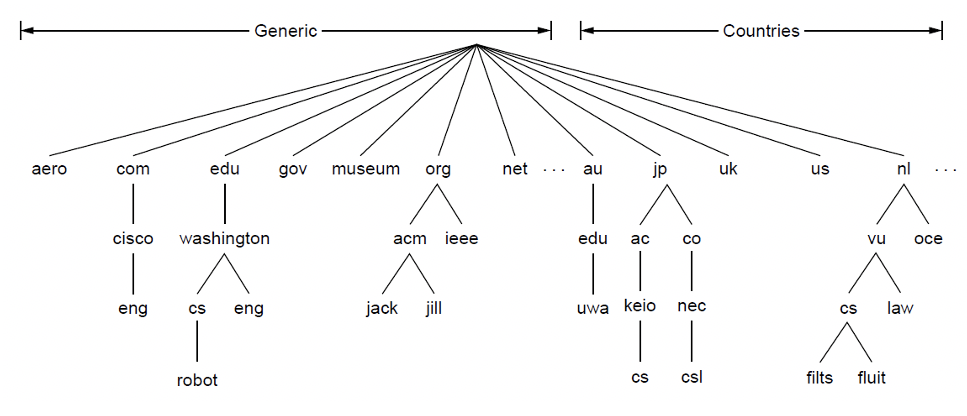
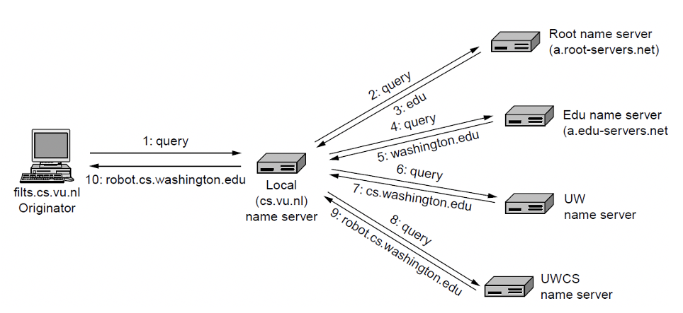
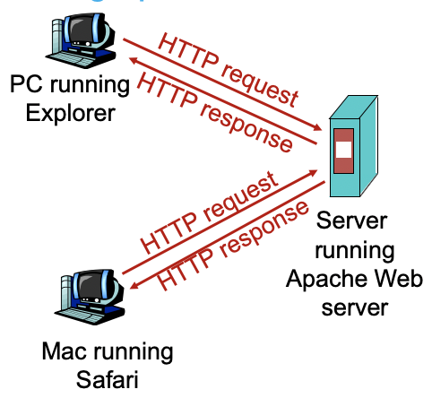
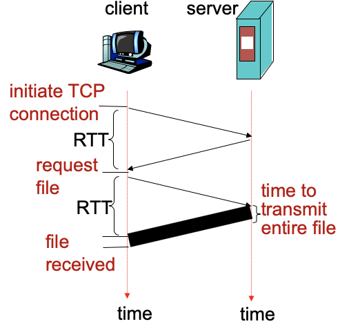
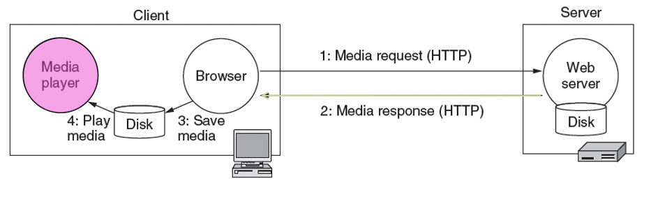
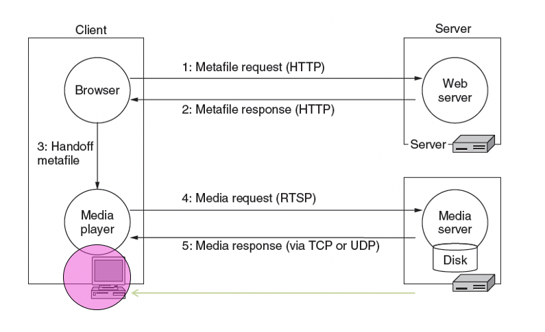
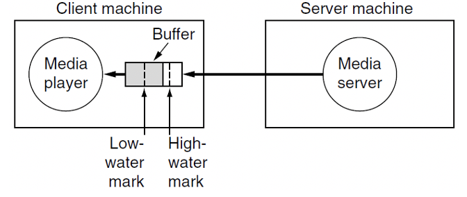
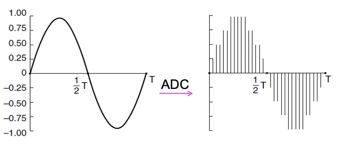

# Week 8 Application Layer
## Domain Name System (DNS)
* Distributed database implemented in a hierarchy of many name servers
* Application Layer protocol that allows a host to query the database in order to resolve names
* Used by application layer protocols (http, ftp, smtp)
### DNS Defined
* Number of RFSs are directly related to DNS:
    * RFC 1034: Domain Names: Concepts and Facilities
    * RFC 1035: Domain Names: Implementation and Specification
    * RFC 1519: Domain Name System Structure and Delegation
    * RFC 2219: Use of DNS Aliases for Network Services
    * RFC 2606: Reserved Top Level DNS Names
    * RFC 3647: Role of the Domain Name System
### Conceptual Divisions of DNS Namespace
* A hierarchical naming convention
* The top of the hierarchy is managed by ICANN (The Internet Corporation for Assigned Names and Numbers)
> Example of DNS Namespace
>> 
### Why note centralize DNS
* Single point of failure
* Traffic volume
* Distant centralized database
* Maintenance
* Doe not scale well
### DNS Services
* Hostname to IP address translation
* Host aliasing: Alias names for canonical names
    * E.g. Canonical relay1.westcoast.enterprise.com -> www.enterprise.com
* Mail server aliasing
    * E.g. Bob@relay1.westcoast.hotmail.com -> Bob@hotmail.com
* Load distribution
    * Busy sites are replicated over multiple servers
    * A set of IP addresses is associated with one canonical name
    * DNS server rotates the order of the addresses to distribute the load
## Domain Name Characteristics
* Domain Name:
    * Are case insensitive
    * Can have up to 63 characters per constitute
    * Can have up to 255 chars per path
    * Can be internationalized
* Naming conventions usually follow either organizational or physical boundaries
* Absolute domain names ends in a .
* Relative domain names partially specify the location and can be used only within the context of an absolute domain name
## Zone Name Servers
* DNS namespace divided non-overlapping zones
* Each zone contains a part of the DNS tree and also name servers authoritative for that zone
    * Usually 2 name servers for a zone
    * Sometimes secondary is actually outside the zone
* Name servers are arranged in a hierarchical manner extending from a set of root servers
## Root Name Servers
* The root servers form the authoritative cluster for enquiry in the event of locally unresolvable name queries
* There are 13 root servers globally
## Resource Records
* The resources records are the key objects in the Domain Name System
* A RR consists of a domain name, TTL, class, type, value
    * Domain name: Which domain this record applies to
    * TTL: Indicates stability or temporal extent of the record
    * Class: IN for internet
    * Type: a closed vocabulary of the following:
        * A: The Internet address of the host
        * CNAME: The canonical name of an alias
        * MX: The mail exchanger
        * NS: The name server
        * PTR: The host name if the query is in the form of an Internet address; Otherwise the pointer to other information
        * SOA: The domain's start-of-authority information
    * Value: data
### Example of asking for domain name
1. User machine runs the client side of the DNS software
2. Browser extracts the hostname from the URL, and passes it to the client-side of the DNS application
3. DNS client send a query containing the hostname to a DNS server
4. DNS client eventually receives a reply containing the IP address for the hostname
5. Browser initiates a TCP connection to the process located at port 80 at the IP address
## DNS in Action
* Finding the IP address for a given hostname is called name resolution and is done with the DNS protocol
* Resolution:
    * Computer requests local name server to resolve
    * Local name server asks the root name server
    * Root returns the name server for a lower zone
    * Continue down zones until name server can answer
* DNS protocol:
    * Runs on UDP port 53, retransmits when lost messages
    * Caches name server answers for better performance
> Example of resolution
>> 
* Iterated query: Contacted server replies with name of server to contact
* Recursive query: Server obtains mapping on client's behalf
## DNS Caching and Updating Records
* Once name server learns a mapping, it caches the mapping
    * IP addresses of TLD servers typically cached in local name servers
    * Cache entries timeout after some time
## World Wide Web (WWW)
* Client and server software:
    * Firefox is the client software for web access where Apache is on the  server side
* Web markup languages:
    * HTML is how webpages are coded
* Web scripting languages:
    * Javascript adds more dynamicity to web webpages
* HTTp is about how to transfer
## Web Access
* A web page consists of objects
* An object can be HTML file but also JPEG image, Java applet, audio file
* A web page consists of a base HTML file which includes several referenced objects
* Each object is addressable by a URL (Uniform Resource Locator)
> Example of a URL:
>> 
## Hypertext Transfer Protocol (HTTP)
* HTTP is at the application layer
* Client/Server Model
    * Client: Browser that requests, receives and displays Web objects
    * Server: Web server sends object in response to requests
> Illustration of HTTP
>> 
### HTTP Connections
* Non-persistent HTTP: at most one object sent over a TCP connection
* Persistent HTTP: Multiple objects can be sent over a single TCP connection between client and server
### Non-persistent HTTP
* Example of visiting www.someSchool.edu/someDepartment/home.index:
    1. a) HTTP clients initiates TCP connection to HTTP server process at www.someSchool.edu on port 80 \
    b) HTTP server at host www.someSchool.edu waiting for TCP connection at port 80. Accepts connection and notify client
    2. HTTP client sends a HTTP request message, containing URL, into TCO connection socket. Message indicates that client wants object someDepartment/home.index
    3. HTTP server receives request message, form response message containing requested object, and sends message into its socket
    4. HTTP client receives response message containing HTML file
    5. HTTP server closes TCP connection
    6. Parses HTML file and finds 10 referenced jpeg objects
    7. Steps 1-6 repeated for each pf the 10 jpeg objects
### Response Time
* Round Trip Time (RTT): Time for a small packet to travel from client to server and back
* Response time: 
    * One RTT to initiate TCP connection
    * One RTT for HTTP request and first few bytes of HTTP response to return
    * File transmission time
* Total Response time = 2 RTT + file transmission time
> Illustration of HTTP response 
>> 
### Non-persistent HTTP issues
* Requires new connection per requested object
* OS overhead for each TCP connection
* Delivery delay of 2 RTTs per requested object
### Persistant HTTP
* Server leaves connection open after sending response
* Subsequent HTTP messages between same client/server sent over open connection
* Pipelining: Client sends request as soon as it encounters a referenced object
    * As little as one RTT for all the referenced objects
* Server closes a connection if it hasn't been used for some time
### HTTP Request Methods
|Method|Description|
|----|----|
|GET|Request to read a web page|
|HEAD|Request to read a web page's header|
|PUT|Request to store a web page|
|POST|Append to a named resource|
|DELETE|Remove the web page|
|TRACE|Echo the incoming request|
|CONNECT|Reserved for future use|
|OPTIONS|Query certain options|
### HTTP Error Codes
|Code|Meaning|Examples|
|----|----|----|
|1xx|Information|100 = server agrees to handle client's request|
|2xx|Success|200 = request succeeded; 204 = no content present|
|3xx|Redirection|301 = page moved; 304 = cached page still valid|
|4xx|Client error|403 = forbidden page; 404 = page not found|
|5xx|Server error|500 = internal server error; 503 = try again later|
## Cookies
* The http servers are stateless
* Cookies to place small amount of info on users computer and reuse deterministically
* Questionable mechanism for tracking users
* Advantages:
    * Authorization
    * Shopping carts
    * Recommendations
    * User session state
### Cookies vs. Sessions
|Sessions|Cookies|
|----|----|
|Sessions information regarding visitor's interaction stored at the server side: upto some hours|Cookies are transferred between server and client|
|When user closes the website, the session ends|Cookie information stored at both client and server|
|Sessions information size can be large|Maintain client information until deleted|
||Cookies information size limited|
## Web Caches (Proxy Server)
* Goal is to satisfy client request without involving origin server
* User sets browser to access web via cache
    * Browser sends all HTTP requests to cache
    * If object in cache, cache returns object, else cache requests object from origin server, then returns object to client
* Cache acts as both client and server
* Typically cache in installed by ISP
* Causes problems for frequently changing data
* Advantages:
    * Reduce response time for client request
    * Reduce traffic on an institution's access link
## Dealing with Multimedia Data
* Higher bandwidth requirements
* Higher QoS requirement
* Separate providers
    * Not all communication is one-to-one. Many is multicast/broadcast which is different to most traffic
    * Specialized infrastructure also needs special attention
## A basic model for multimedia on the web
> Illustration of the multimedia basic model
>> 
* Problems:
    * The entire media file must be transmitted over the network before playback starts
    * Basic model assumes mainly point-to-point data distribution rather than a point-to-multipoint distribution model
    * Basic model relies on simple browser/plugin/helper integration and traditional service types
## Streaming Media Protocols
* HTTP
* RTP: Real-time Protocol
* MPEG-4
* Microsoft's Windows Media
## Specialized Multimedia Software
* 4 main tasks of the multimedia playback software:
    * To deal with the user interface side:
        * Functions such as volume control, playback, next
    * Handle transmission errors in conjunction with transport protocols
        * Using RTP/UDP errors will likely occur, playback software must manage/mask them gracefully
    * Eliminate jitter
        * Small buffer, quick playback but susceptible to jitter/delay
        * Large buffer, delay at start of playback while buffer fills, but less susceptible to delay/jitter
    * Sometimes compress and almost always decompress the multimedia files to reduce size
> Specialized Model
>> 
## Handling Errors
* Forward Error Correction: The error-correcting encoding of data. For every X data packets Y new packets are added similar to methods. These contains redundant bits that are used to deal with errors
    * Methods used parity or exclusive-OR sums of the bits in each of the data packets but are more complex
* Error Resilience: Remarking for re-sync so that a packet loss does not create a total loss, mainly on sender side
* Error Concealment: Done by the receiver
* Retransmission: Less meaningful for streaming data but for watching a movie. This can be deployed for lost packets of the movie.
## Jitter management
* Jitter happens because of variable bandwidth and loss/retransmissions. Therefore, we use buffers.
> Illustration of buffers
>> 
## Compression
* ADC (Analog-to-Digital Converter) produces digital data
> Example of ADC
>> 
### Audio compression
* Use Nyquist and Shannon theorems to convert analog data to digital. Then apply techniques to eliminate some data
* E.g. 
    * Perceptual coding is that some data can mask other data
    * Frequency masking: Some sounds mask/hide others so there is no point encoding them
    * Temporal masking: Human ears can miss soft sounds immediately after loud sounds, takes time for ear to adjust, no need to store them.
### MP3
* MP3 is MPEG Audio Player 3
* MP3's compression is based on perceptual coding
* MP3 audio compression results in significant file size savings without a perceived loss of audio quality
* Typical MP3 audio compression rates for CS quality audio reduce the need for bandwidth for 1.4 Mbps for stereo down to 96-128 Kbps
### For digital video
* Video is digitized as pixels
* Video is sent compressed due to its large bandwidth requirements
    * Lossy compression exploits human perception
    * Large compression ratios achieved
### JPEG
* JPEG is lossy compression
* JPEG often provides compression ratios of 20:1
* JPEG compression is symmetric, decoding takes as long as encoding
### MPEG 
* MPEG is Motion Picture Experts Group
* MPEG can compress both audio and video together
* The evolution of MPEG:
    * MPEG-1: VCR quality at 1.2 Mbps (40:1)
    * MPEG-2: Broadcast quality at 4-6Mbps (200:1)
    * MPEG-4: DVD quality at 10Mbps (1200:1)
