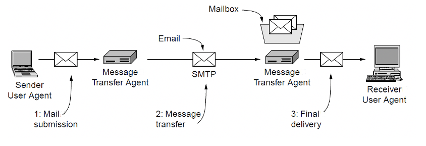
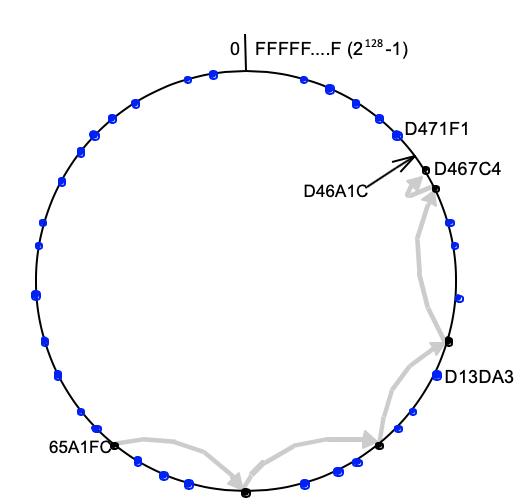
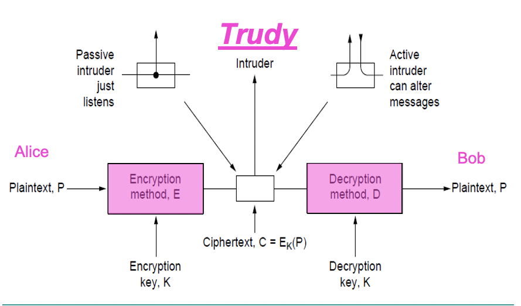
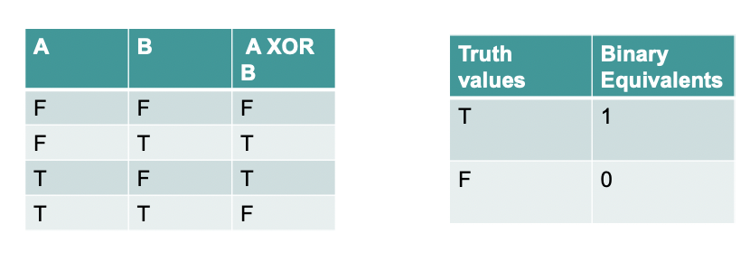
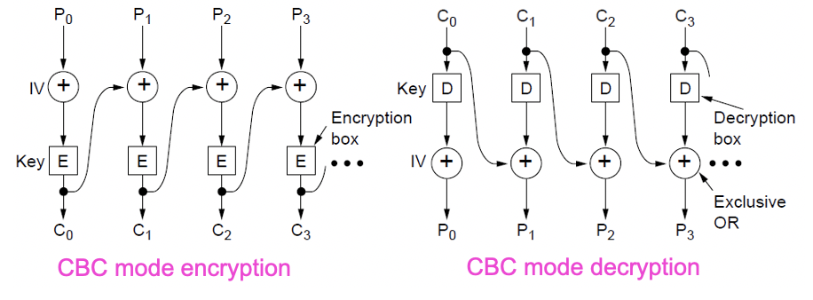
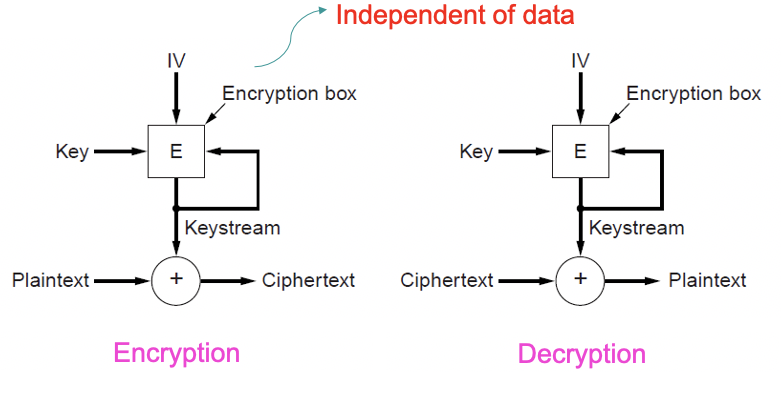
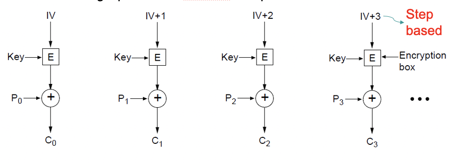

# Week 9 Application Layer
## Email 
* User Agent: Thunderbird
* Message Transfer Agent: Exchange
* Message Transfer Protocol
## Email Services
* Standards for Internet-enabled email are based on 2 RFC's
    * RFC 821 (transmission)
    * RFC 822 (message format)
    * RFC 2821 and RFC 2822 (revised versions of earlier RFCs)
## Architecture and Services of Email
* User agents: Allow user to read and send mail
* Message transfer agents: Transport messages from source to destination
* Simple Mail Transfer Protocol (SMTP): Used to send messages from the sender
    * Mail server to the receiver's mail server
    * User agent to the sender's mail server
> Architecture of Email Service
>> 
## User agent
* Basic functions: compose, report, display and dispose
* Envelope and contents: encapsulation of transport related information
    * Envelope: Destination address, priority, and security level, all of which are distinct from the message itself
    * Mail servers use the envelope for routing
* Header and body:
    * Header: User agent control info
    * Body: For human recipient
    * Contains contains control information for the user agents
* User must provide message, destination, optional other parameters
## RFC 822: Message
* RFC 822 doesn't distinguish header and envelope fields
* RFC 822 allows users to invent new headers for private use but they must start with X-
## Multipurpose Internet Mail Extensions (MIME)
* RFC822  was enough for these simple constraints
* In time the inadequacy of RFC822 became apparent
    * Languages with accents
    * Non-Latin alphabets
    * Non-alphabetic language
    * Messages with content other than text
* As a result, MIME (RFC 1341) was written
* MIME retains RFC822 format but adds structural elements to the message body and defines encoding rules for non-ASCII messages
* MIME has 5 additional message headers:
    * MIME-Version: Identifies the MIME version
    * Content-Description: Human readable describing contents
    * Content-Id: Unique Identifier
    * Content-Transfer-Encoding: How body is wrapped for transmission
    * Content-Type: Type and format of content
### MIME Types and Subtypes
|Type|Example subtypes|Description|
|----|----|----|
|text|plain, html, xml, css|Text in various formats|
|image|gif, jpeg, tiff|Pictures|
|audio|basic, mpeg, mp4|Sounds|
|video|mpeg, mp4, quicktime|Movies|
|model|vrml|3D model|
|application|octet-stream, pdf, javascript, zip|Data produced by applications|
|message|http, rfc822|Encapsulated message|
|multipart|mixed, alternative, parallel, digest|Combination of multiple types|
## Message Transfer
* Transfer: SMTP (Simple Message Transfer Protocol)
* Delivery:
    * POP3 (Post Office Protocol 3): Download to a single device
    * IMAP (Internet Message Access Protocol): Designed with multiple devices in mind
## SMTP
* Simple Message Transfer Protocol
* Simple ASCII protocol, operating on TCP port 25
* RFC 821: Simple Mail Transfer Protocol
* RFC 2821: Extended Simple Mail Transfer Protocol
* Basic steps:
    * User agent submits to mail transfer agent on port 587
    * One mail transfer agent to the next one on port 25
    * Other protocols used for final delivery (IMAP, POP3)
## IMAP
* Used for final delivery
* Internet Message Access Protocol
* RFC 3501 defines version 4
* User agent runs an IMAP client for this
* Protocol has command like: Login, List, Copy, Create, Delete
* Main difference with POP3 is mail remains on server
* Complex protocol but makes mail machine independent
## POP3
* Email is taken into the user computer
* Simpler protocol
* Ties emails to one's machine
## Webmail
* Gmail and alike
* A service run by a company server
* An interface to managing email over the Web
* Mainly it is an user interface
## Spam
* Unwanted email
* Main countermeasures are:
    * Filters based on email content
    * Blacklisting known spam addresses
    * Parking email from unknown sources
    * Collection spam and creating a knowledge-base
    * Detecting mass emails
# Other Layers
## Two more layers from the OSI model
* Presentation layer
* Session layer
* They did not see a distinct use and labeling
## Presentation Layer
* Formatting related issues
* Encryption and Decryption
    * Should be done in presentation layer as well although it is commonly done at application layer
* Compression
    * It should be done at this layer rather than in application layer
### Why not have an explicit presentation layer
* Internet does not have this clear distinction
* A key reason is many presentation layer list of things to do that is considered to be application specific. Thus, application layer and presentation layer is not explicitly separated for internet
## Session layer
* Common service of this layer:
    * Authentication
    * Session management
        * Monitoring connections
        * Disconnect if not used
        * Reconnect if needed
* These are also seen as a part of the application layer duties today depending on different requirements of applications of today's Internet
* A few are done at Transport layer
* Especially session management in a simple client server architecture is trivial
## Existence of these layers
* If you have need to do compression, session management, then think before implementing
* You should probably create a better software design by creating your own little session layer as a separate layer in your software architecture
* This is what most software architects do: Create a middleware layer in their software
## P2P systems
* Client server systems dominated the Internet for a while because they are simple to implement
* Peer-to-Peer systems (P2P) are more complex:
* A P2P system:
    * Does not have client and server but just peers
    * Does not have a central point of control
    * Advantages:
        * No central point of control or failure
        * Potential to scale without a bottleneck
    * Disadvantages:
        * Harder to develop applications on a dynamic platform where PCs come and go
    * Not all peers can know about all others in a large system. 
> Example P2P system
>> 
> * The black dots depict live nodes. The blue ones are files. The address space is considered as circular: node 0 is adjacent to node $(2^{128}-1)$. The diagram illustrates the routing from node 65A1FC to D46A1C. This happens at application layer at each PC
# Network Security
## What is network security
* Network security is a combo of 4 related areas:
    * Secrecy: Keep information hidden from a general audience
    * Authentication: Ensuring the user you are giving content to has valid credentials
    * Non-repudiation: Prove a content was created by a named user
    * Integrity control: Ensure that a content has not been tampered with
* All of those are equally valid and has been around for all systems for some time, but have different and sometimes more challenging implications in a networked environment
* Aspects of security can be found at all layers of a protocol stack, there is no way to secure a network by building security into one layer only
* Most security implementations are based on common cryptographic principles and appear on almost all layers
## Cryptography
* A key area/set of algorithms for creating secrets, authenticating users, making sure messages are not tampered with, and edits are not denied by the original author
## Encryption
> Encryption Model
>> 
### Key Cryptography Concepts
* Three foundations:
    * Plaintext: Messages to be encrypted can be transformed by a function.
    * Key: A function that parameterized the transformation
    * Ciphertext: The output of the transformation process
* Kerckhoff's principle: Cryptographic algorithms and related functions (E, D) are public; Only the keys (K) are secret
### The notations
* C = Ciphertext
* P = plaintext
* E = Encryption
* D = Decryption
* K = Key
### Keys
* A key is a string that allows the selection of one of many potential encryptions
* The key can be changed as often as required
* Algorithms are more likely to be at the hands of attackers anyhow, not changed as frequently
* Cipher is a term commonly used as the term for algorithm
* The size of the overall key space is determined by the number of bits in the key string
* The longer the key, the more effort is required to break a given encryption
### XOR
* An XOR is an exclusive or function used regularly
* A XOR B means A or B, but not both
* XOR is commonly used in cryptography
> Exclusive ORs
>> 
## Main Types of Ciphers
* Substitution cipher: Each letter of group of letters is replaced systematically by other letters or groups of letters
* Transposition cipher: All letters are re-ordered without disguising them
* One-time pad: 
    * Uses a random bit string as the key: convert the plaintext into a bit string, then XOR the two strings bit by bit
    * Harder to break
# Key-based Algorithms
* Symmetric key algorithms: Use the same key for both encryption and decryption. Symmetric key algorithms can use permutation, substitution and a combination of both to encrypt and decrypt
    * 2 Symmetric Key Algorithms:
        * Data Encryption Standard (DES)
            * Uses 64 bit blocks and 56 bit keys
            * $2^{56}$ key space
            * Triple DES has a $3*2^{56}$ key space
        * Advance Encryption Standard(AES)
            * Uses 128 bit blocks and 128 bit keys
            * $2^{128}$ key space
            * Still substitution and permutation based with multiple rounds
## Cipher Block Chaining Mode
* Same text leads to same ciphertext unless something else is done
* In block chaining mode, each plaintext block is XOR with the previous ciphertext block being encrypted
> Example of CBC
>> 
## Cipher Feedback Mode
* In cipher feedback mode, byte-by-byte encryption is used rather than block-by-block encryption
* Good for things like encryption someones key strokes on a keyboard where a lot of data is not immediately available
## Stream Cipher Mode
* In stream cipher mode, recursive sequential block encryption is sued has one-time pad, and XOR with plaintext to generate ciphertext
> Illustration of Stream Cipher Mode
>> 
## Counter mode
* In counter mode, plaintext is not directly encrypted, but an initialization parameter plus an arbitrary constant is encrypted and the resulting ciphertext is XOR with plaintext
> Illustration of Counter Mode
>> 
## Symmetric Key Algorithms
|Cipher|Author|Key Length|Comments|
|----|----|----|----|
|Blowfish|Bruce Schneier|1-448 bits|Old and Slow|
|DES|IBM|56 bits|Too weak to use now|
|IDEA|Massey and Xuejia|128 bits|Good, but patented|
|RC4|Ronald Rivest|1-2048 bits|Some keys are weak|
|RC5|Ronald Rivest|128-256 bits|Good, but patented|
|Rijndael|Daemen and Rijmen|128-256 bits|Best choice|
|Serpent|Anderson, Biham, Knudsem|128-256 bits|Very strong|
|Triple DES|IBM|168 bits|Second best choice|
|Twofish|Bruce Schneier|128-256 bits|Very strongly; Widely used|